# 实验一：HyperLedger/Fabric

## 参考链接

https://github.com/yy158775/blockchain-exp

本文是上述仓库的更详细使用说明

## 任务一：环境搭建

- Ubuntu 20.04 LTS 64 位
- git 2.25.1
- curl 7.68.0
- Docker 20.10.21
- Docker Compose 1.25.5
- Golang 1.19.3
- jq 1.6
- Fabric 1.4 的可执行文件

### 安装git

`sudo apt install git`

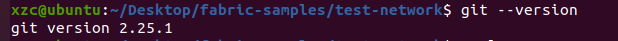

### 安装curl

`sudo apt install curl`

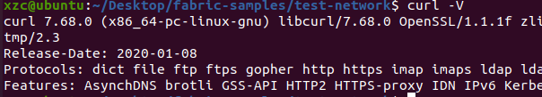

以下的安装都按照指导手册来即可

### Docker 和 docker-compose 安装

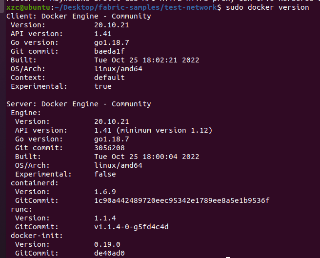

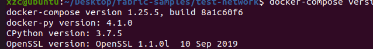

### 安装Golang

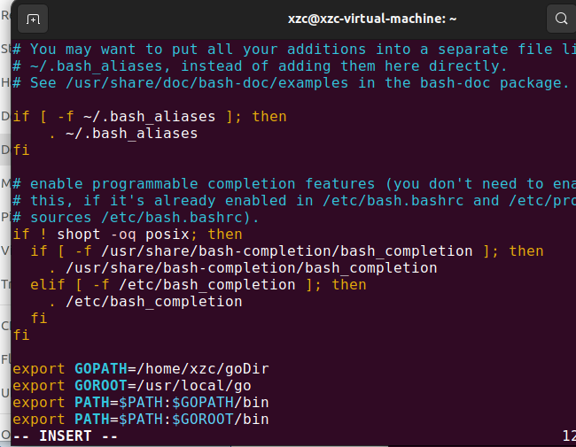

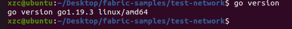

还需要保证root权限能执行go命令

```bash
sudo vim /etc/profile
#在最后一行添加
export PATH=$PATH:/usr/local/go/bin
```

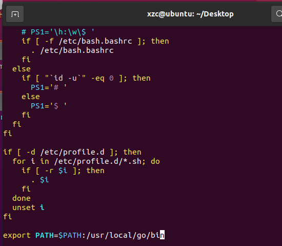

执行

```bash
sudo su
source /etc/profile
go version
```

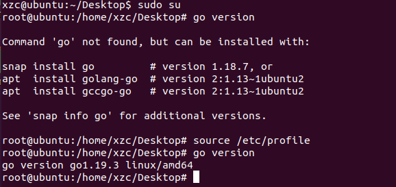

注意每启动一个终端都要先

```bash
sudo su
source /etc/profile
```

### 安装jq

`sudo apt install jq`

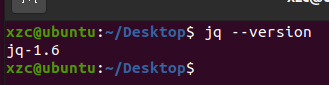

### 搭建fabric环境

随便找个目录 执行

`git clone https://github.com/hyperledger/fabric-samples`

去网址`https://raw.githubusercontent.com/hyperledger/fabric/main/scripts/install-fabric.sh`

ctrl+s保存`install-fabric.sh`并放到刚才clone的`fabric-samples`目录录

然后进入目录`fabric-samples`执行

```bash
sudo chmod +x install-fabric.sh
sudo ./install-fabric.sh docker
./install-fabric.sh b
cd test-network
sudo ./network.sh up
```

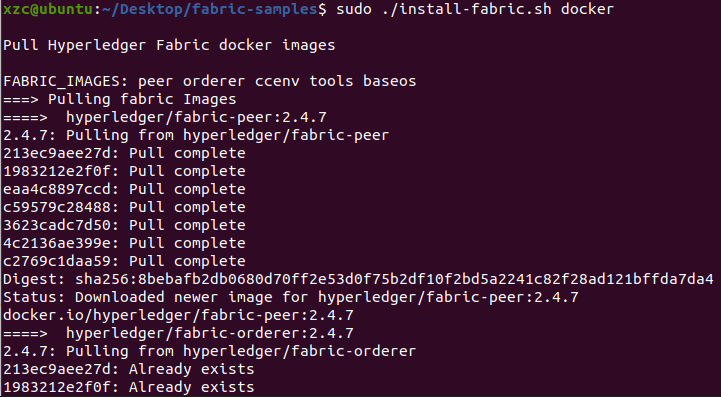

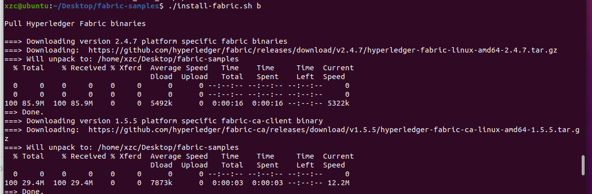

然后

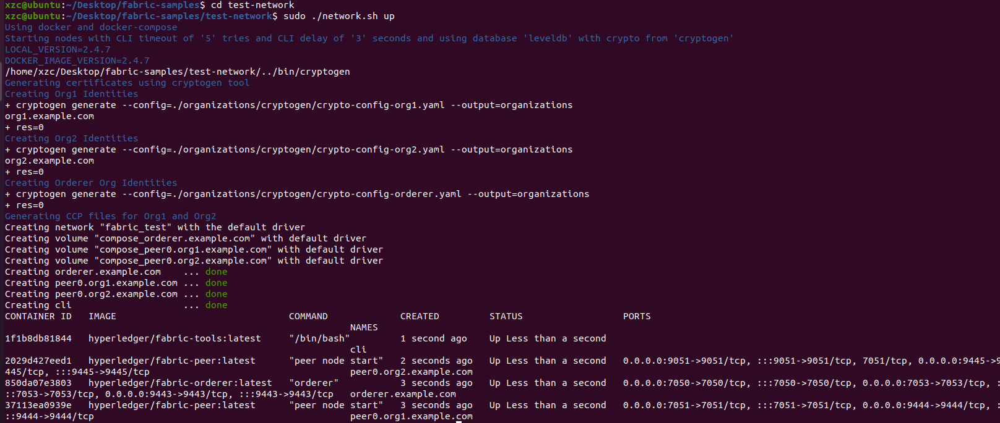

区块链网络搭建成功。

## 任务二：投票程序

接着任务一 执行

`sudo ./network.sh createChannel`（每次启动网络都要创建频道）

创建channel

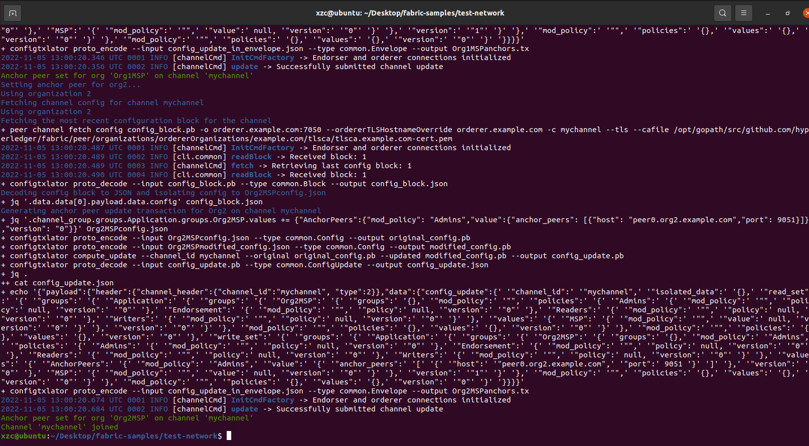

将代码clone下来

```bash
git clone https://github.com/yy158775/blockchain-exp
cd vote-smartcontract
go mod tidy
```

两个文件夹目录相对位置

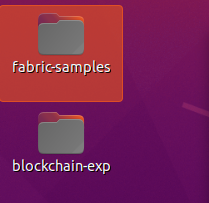

```bash
sudo ./network.sh deployCC -ccn basic -ccp $<dir to vote-smartcontract> -ccl go
# 替换$<dir to vote-smartcontract>为vote-smartcontract代码的目录
# 比如我的命令就是
sudo ./network.sh deployCC -ccn basic -ccp ../../blockchain-exp/vote-smartcontract -ccl go
```

执行这个命令会遇到两个错误

解决方法的链接如下

错误一

```bash
# Error: error getting endorser client for channel: endorser client failed to connect to peer0
# https://blog.csdn.net/lakersssss24/article/details/118369300

sudo vim /etc/resolv.conf
# 然后注释掉 options edns0一行
```

错误二

```bash
# Error: chaincode install failed with status: 500 - failed to invoke backing...
# https://blog.csdn.net/lakersssss24/article/details/119491099

cd fabric-samples/asset-transfer-basic/chaincode-go
go env -w GOPROXY=https://goproxy.cn,direct
go env -w GO111MODULE=on
go mod vendor
```

如果没安装jq这一步就会报错

`sudo apt-get install jq`安装即可

执行完这个命令截图如下

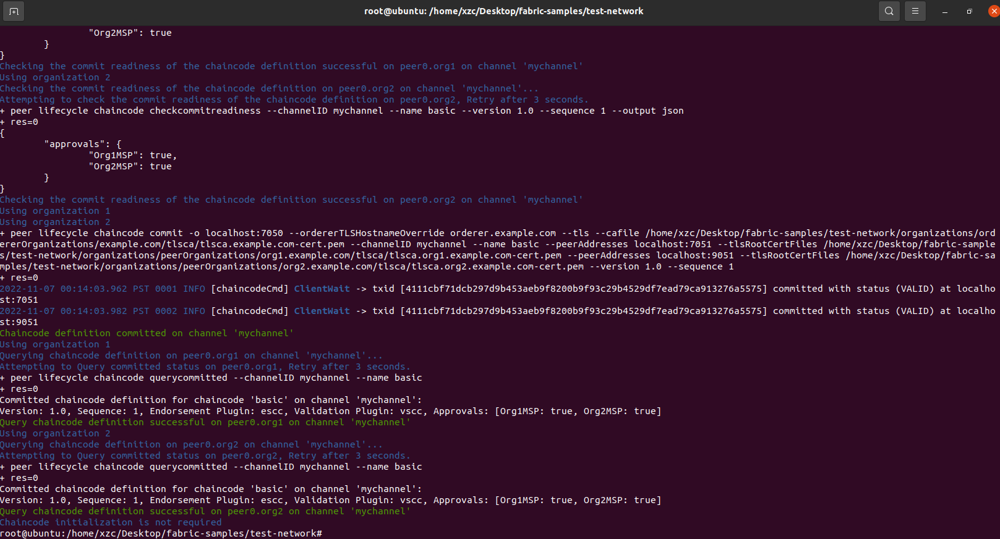

这时我们就可以运行app了

运行之前需要先修改`main.go`里的一些地方

```go
const (
	mspID         = "Org1MSP"
	cryptoPath    = "../../fabric-samples/test-network/organizations/peerOrganizations/org1.example.com"
	certPath      = cryptoPath + "/users/User1@org1.example.com/msp/signcerts/User1@org1.example.com-cert.pem"
	keyPath       = cryptoPath + "/users/User1@org1.example.com/msp/keystore/"
	tlsCertPath   = cryptoPath + "/peers/peer0.org1.example.com/tls/ca.crt"
	peerEndpoint  = "localhost:7051"
	gatewayPeer   = "peer0.org1.example.com"
	channelName   = "mychannel"
	chaincodeName = "basic"
)

```

修改`cryptoPath`和`certPath`即可

`cyptoPath`注意`main.go`和`fabric-samples`的相对路径写对

`certPath`最后的`User1@org1.example.com-cert.pem`每个人可能不一样

修改完后运行app

```bash
cd vote-app
go mod tidy
go run main.go
```

就可以开始投票了

刚开始输入1是没有用户的

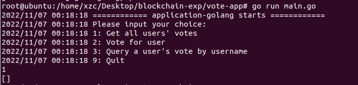

然后输入2再输入xzc给xzc投票，再输入1可以看到xzc有一票

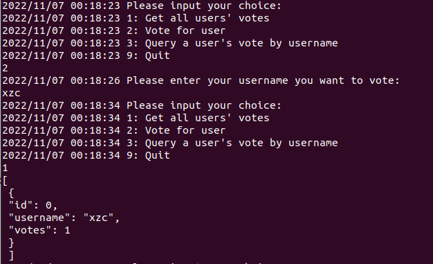

给yy投一票，给xzc投一票，再输入1查看结果

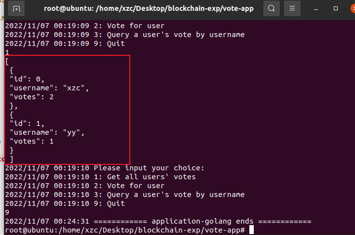

按指示操作即可。
