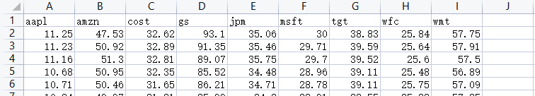

# 在线机器学习

结课分为4个作业（80）分和一个project（20分），是一个非常困难的选修课，慎选。四次作业都是University of Washington的Online Learning的作业，如果数学一般而且没有认真学过肯定是不会做的。

## Homework

作业答案我综合了往届学长的，并且问了很多人，不保证对，这里加水印主要是防止有人直接拿我的作业交了。

作业在`作业.zip`中，答案在`作业答案.pdf`。

## Project

要求在`项目说明与要求.pdf`。运行的代码在`pyBandits`。运行代码的命令如下：

```bash
cd pyBandits
python demo.py
```

最后的运行结果就是一个图，四个算法跑这个数据集regret的大小，你去比较。

注意这里的代码没数据集，需要你自己替换，没换是肯定运行不起来的

**替换后记得修改arm目录下MyArm.py中的一行，改下名字，这里是程序读取数据集的目录**

`self.csv=pandas.read_csv("data\\YourDataset.csv")`

运行的关键主要是替换数据集，在里面的data下面的`YourDataset.csv`，自行替换你自己的数据集，因为数据集重复会判断抄袭，导致两个人都出问题。这里主要说下数据集格式。



介绍数据集之前说下多臂老虎机问题。一个赌徒面前有N个老虎机,事先他不知道每台老虎机的真实盈利情况，他如何根据每次玩老虎机的结果来选择下次拉哪台或者是否停止赌博，来最大化自己的从头到尾的收益。

所以数据集格式一般就是N列，代表几个老虎机，也就是你要选择的东西，然后几千行或者更多，N可以变，比如我这里就是9列，里面的数据就是这个东西在每一步的价值，说通俗一点就是，我这里9个东西，程序每运行一步，我就在这九个里面选一个东西，获得它的收益，接着下一步。比如在第一步的时候，我可能随机选到了msft，获得了30收益，大致意思是这样。

所以这个代码能运行的数据集就是这样N列几千行的数据，列代表选择的对象，也就是ARM，行就代表每一步，数值代表收益

**必须每个人自己找**

**必须每个人自己找**

**必须每个人自己找**
