# 第一次实验


# 环境

- VMware Workstation Pro 16

- UbuntuKylin 20.04

# 一、用NASM编写MBR引导程序 在BOCHS虚拟机中测试  

## 安装Nasm

```Bash
sudo apt install nasm
```

## 创建引导扇区

首先编写汇编代码。使用命令`vim boot.asm`创建 **boot.asm** 文件
写入以下代码：

```asm
org 07c00h
mov ax, cs
mov ds, ax
mov es, ax
call DispStr
jmp $
DispStr:
mov ax, BootMessage
mov bp, ax
mov cx, 16
mov ax, 01301h
mov bx, 000ch
mov dl, 0
int 10h
ret
BootMessage: db "Hello, OS world!"
times 510 - ($-$$) db 0
dw 0xaa55
```

输入 `:wq`保存并退出。再使用命令`nasm boot.asm -o boot.bin`生成 **boot.bin** 文件。

## 安装Bochs

使用命令`sudo apt-get install vgabios bochs bochs-x bximage`

## 使用bximage创建虚拟软盘

输入命令`bximage`,显示如下画面：

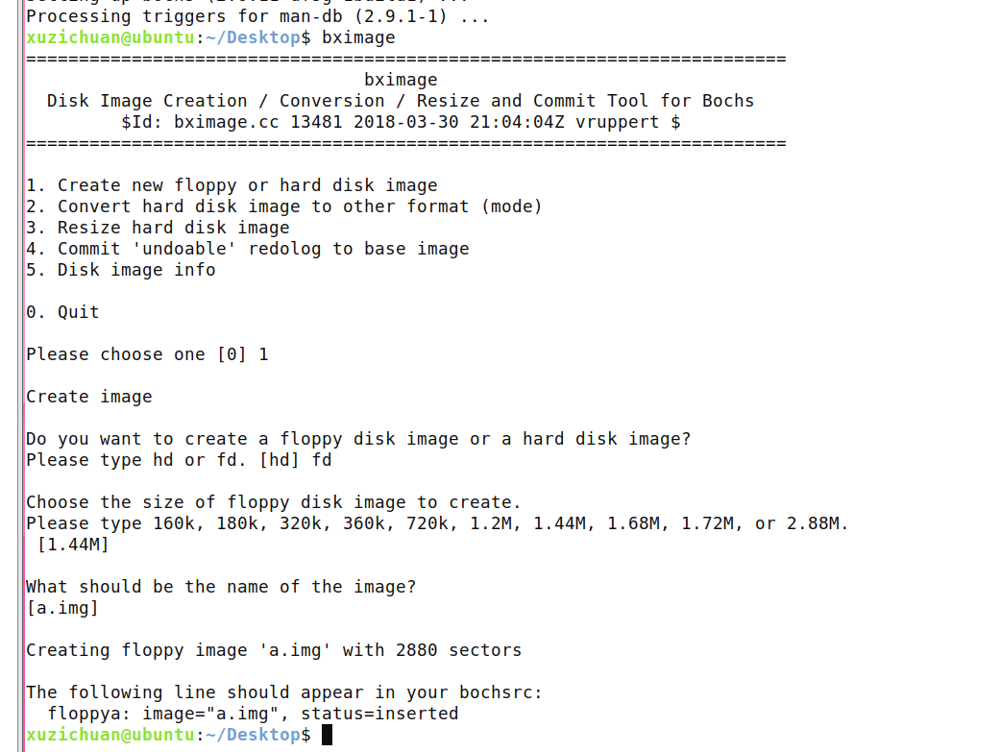

选择生成 **fd（软盘）**，其他选择可以使用默认值，直接按回车。完成这一步后，当前目录就生成了软盘映像 **a.img** 。

## 将引导扇区写入软盘

使用命令`dd if=boot.bin of=a.img bs=512 count=1 conv=notrunc`

## 编写Bochs的配置文件

使用命令 `vim bochsrc`,将以下内容写入

```
megs: 32

romimage: file=/usr/share/bochs/BIOS-bochs-latest
vgaromimage: file=/usr/share/vgabios/vgabios.bin

floppya: 1_44=a.img, status=inserted

boot: floppy

log: bochsout.txt

mouse: enabled=0
```

## 启动Bochs 虚拟机

输入命令`bochs -f bochsrc`进入后，返回终端，输入c按回车，则会直接显示出 *Hello，OS world*。


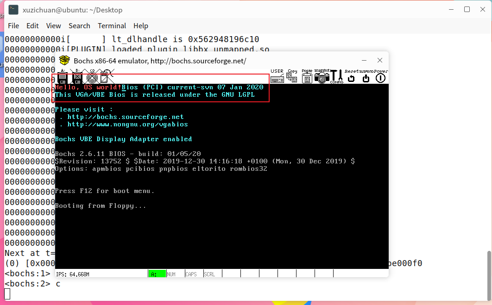

# 二、在Linux下裁剪和编译Linux内核并启用新内核 


`dpkg --list | grep linux-image`查看当前linux安装了哪些内核

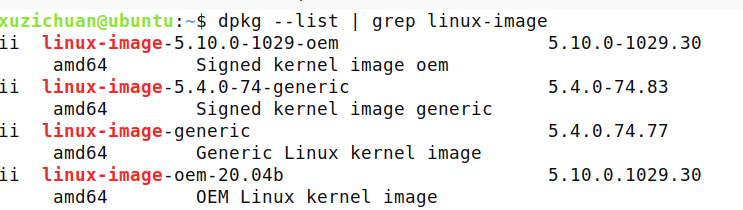

`uname -r`查看自己的linux内核为5.10.0-1029-oem


从官网下载linux-5.10.81内核源码到/usr/src

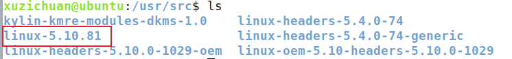

安装需要的包

```BASH
apt-get install lib32ncurses5-dev
apt-get install gcc gdb bison flex
apt-get install libncurses5-dev libssl-dev
apt-get install libidn11-dev libidn11
apt-get install zlibc minizip
apt-get install build-essential openssl
apt-get install libelf-dev
```


先执行

> **1. sudo make mrproper** #清除残留的.config和.o文件
> **2. sudo make clean**
> **3. sudo make menuconfig** #打开配置内核的图形窗口

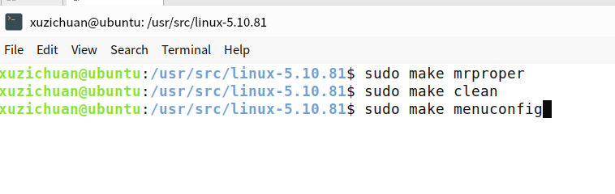

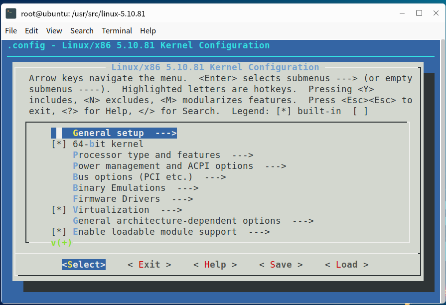

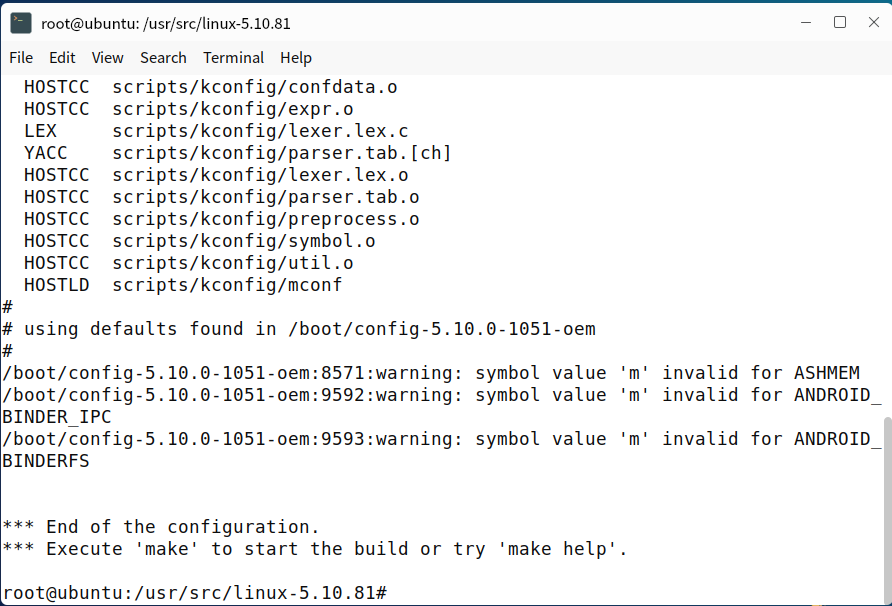

在.config里

把两个CONFIG_SYSTEM设置改为**空字符串**

`CONFIG_SYSTEM_TRUSTED_KEYS=""` 

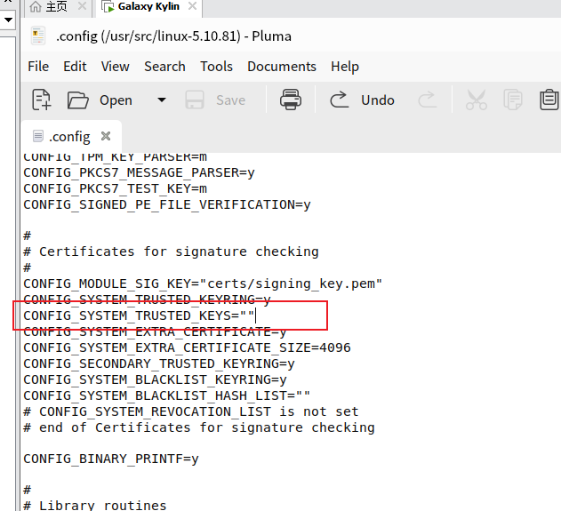

然后开始编译 输入下列命令

` make -j16`

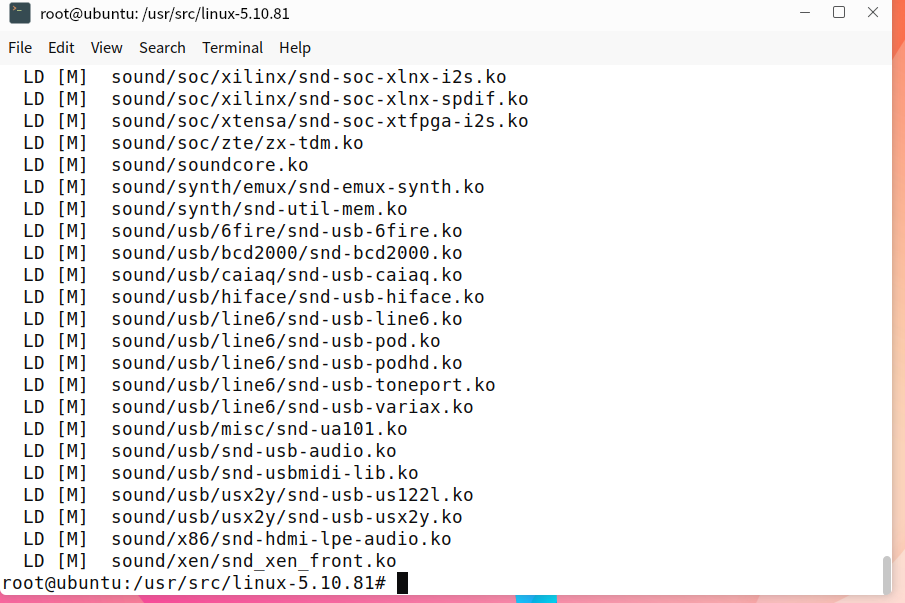

`make modules`

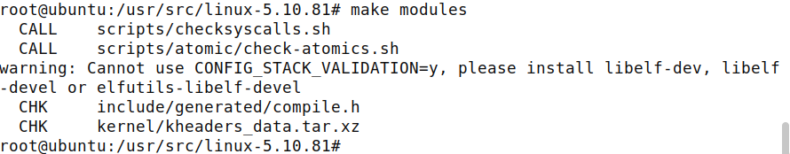

`make modules_install`

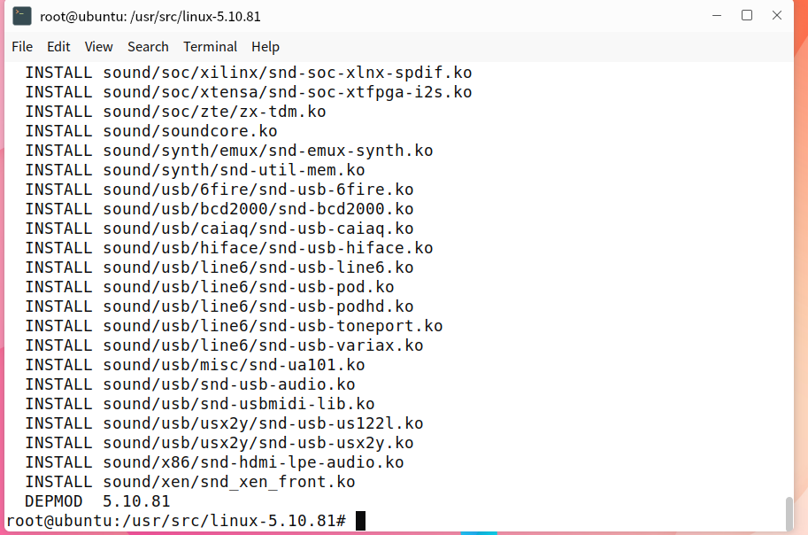

`make install`

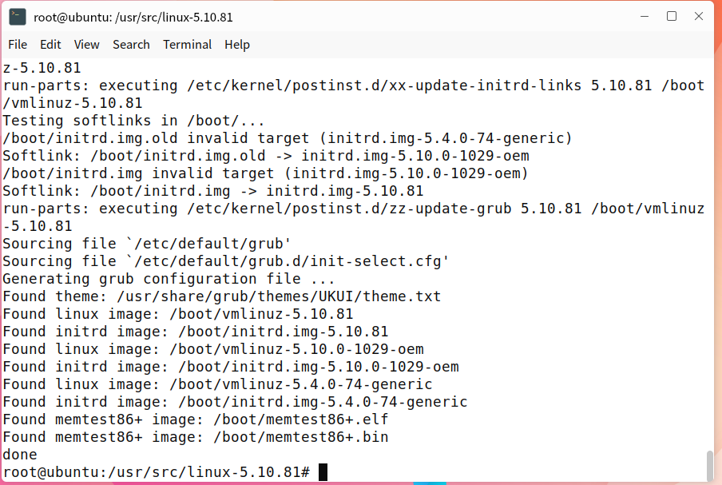

`update-grub2`

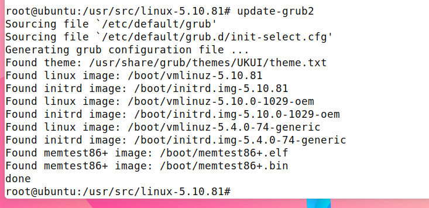

重启之后选择内核5.10.81

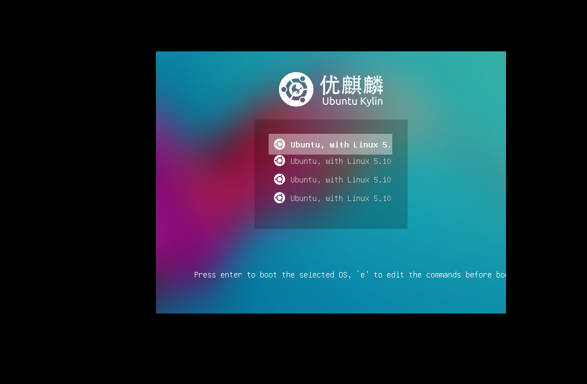


输入`uname -r`查看当前内核发现是5.10.81 成功

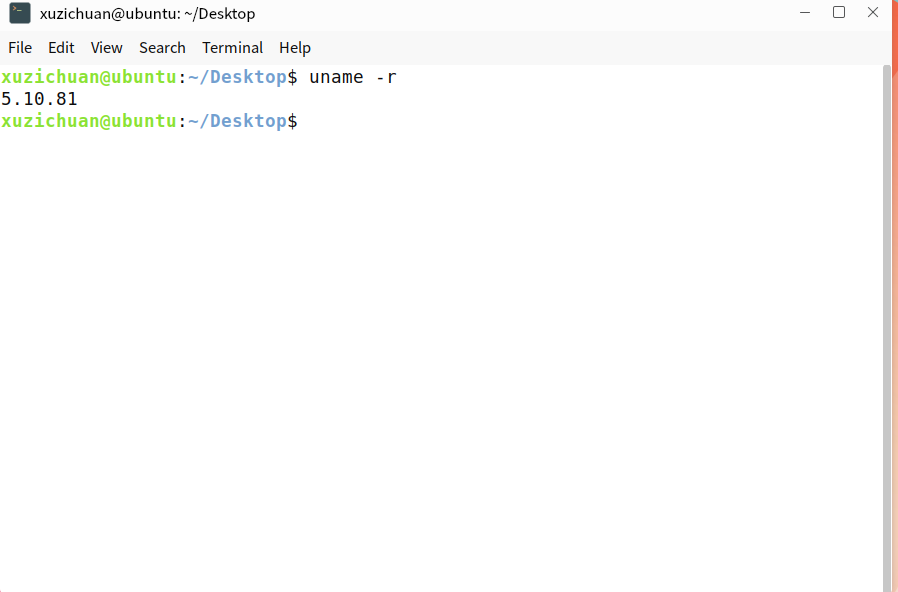

# 三、为Linux内核增加2个系统调用，并启用新的内核，并编写应用程序测试 

查看内核版本

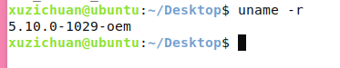

## 修改系统调用表


## 声明系统调用服务例程


## 实现自己的系统调用服务例程

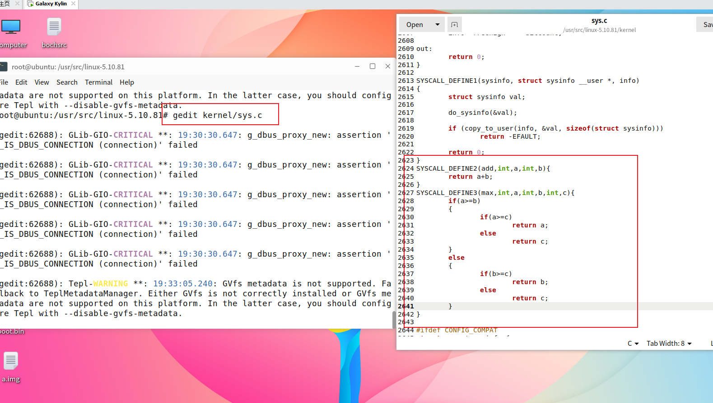

## 利用任务二的过程 编译 然后切换内核


## 验证系统调用

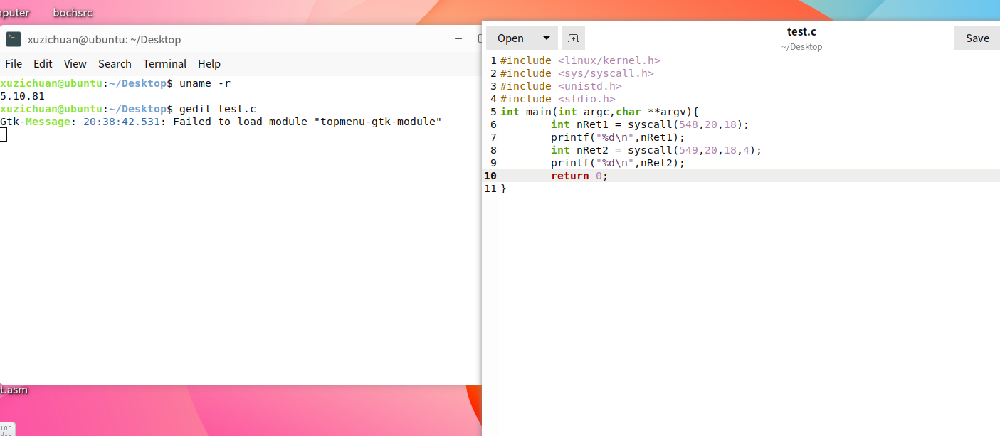


可以看到成功调用了系统调用中的add和max。

# 四、在Linux  或Windows下，编写脚本或批处理，在指定目录中的全部txt文件末尾追加或更新：用户名:日期和时间

在/home/xuzichuan/test文件夹下，有三个txt文件，一个log文件

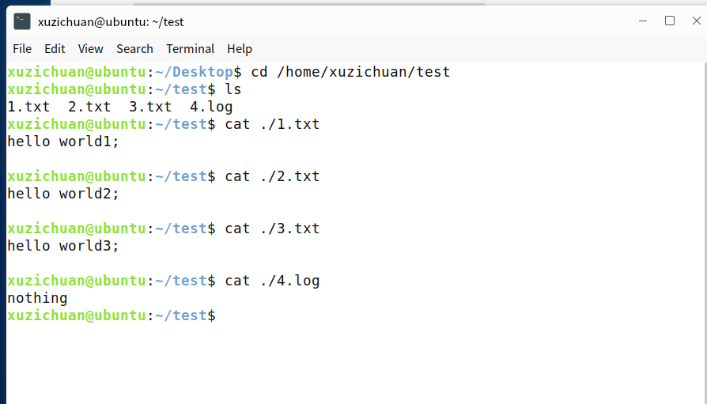

在桌面编写脚本如下：

```bash
#!/bin/bash
post_fix="txt"
echo "Please input the absolute path of the folder:"
read Path
for file in $(ls ${Path})
do
        if [ ${file#*.} == ${post_fix} ]
        then
                count=$(wc -l ${Path}"/"${file}  | awk '{print $1}' )

                if grep -q "$USER" ${Path}"/"${file}
                then
                sed -i "${count},${count}d" ${Path}"/"${file}
                fi

                cur_dateTime="`date "+%Y-%m-%d %H:%M:%S"`"
                echo "$USER:${cur_dateTime}">> "${Path}/${file}"
        fi
done
```

编写保存后运行

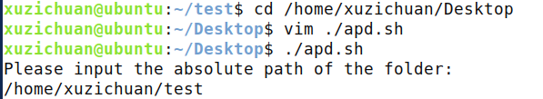

效果如下


可以看到只有txt被追加了`用户名:时间戳`，我们再执行一次

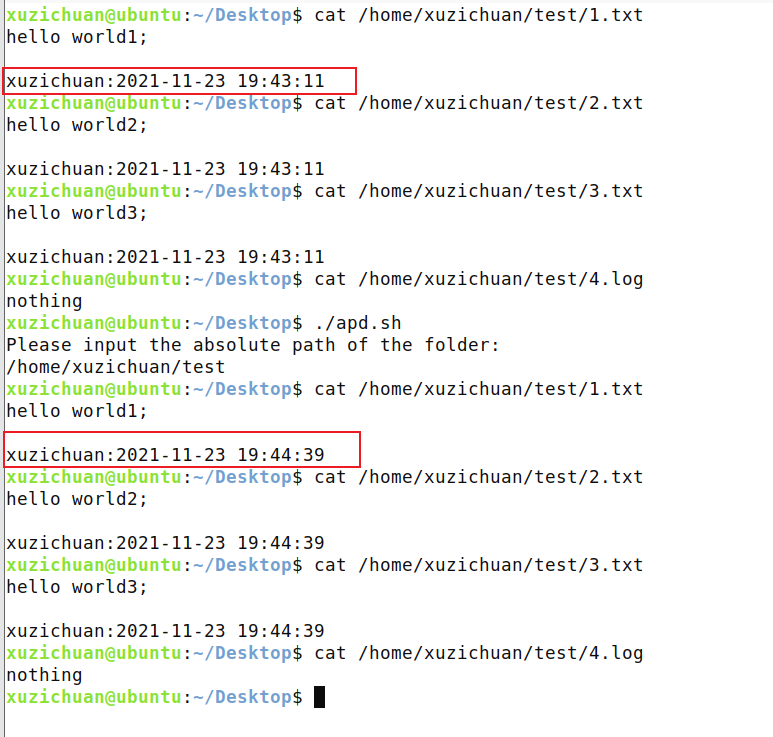

可以看到只有一行`用户名:时间戳`，并且被更新了，任务完成。

