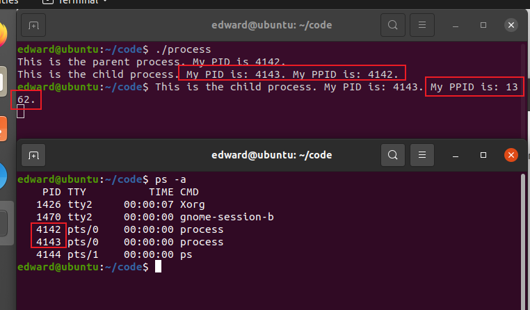
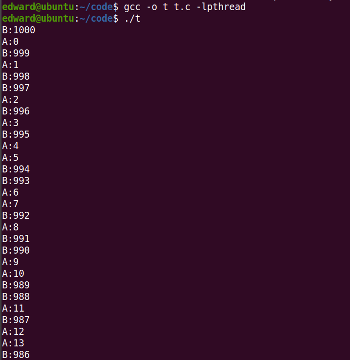
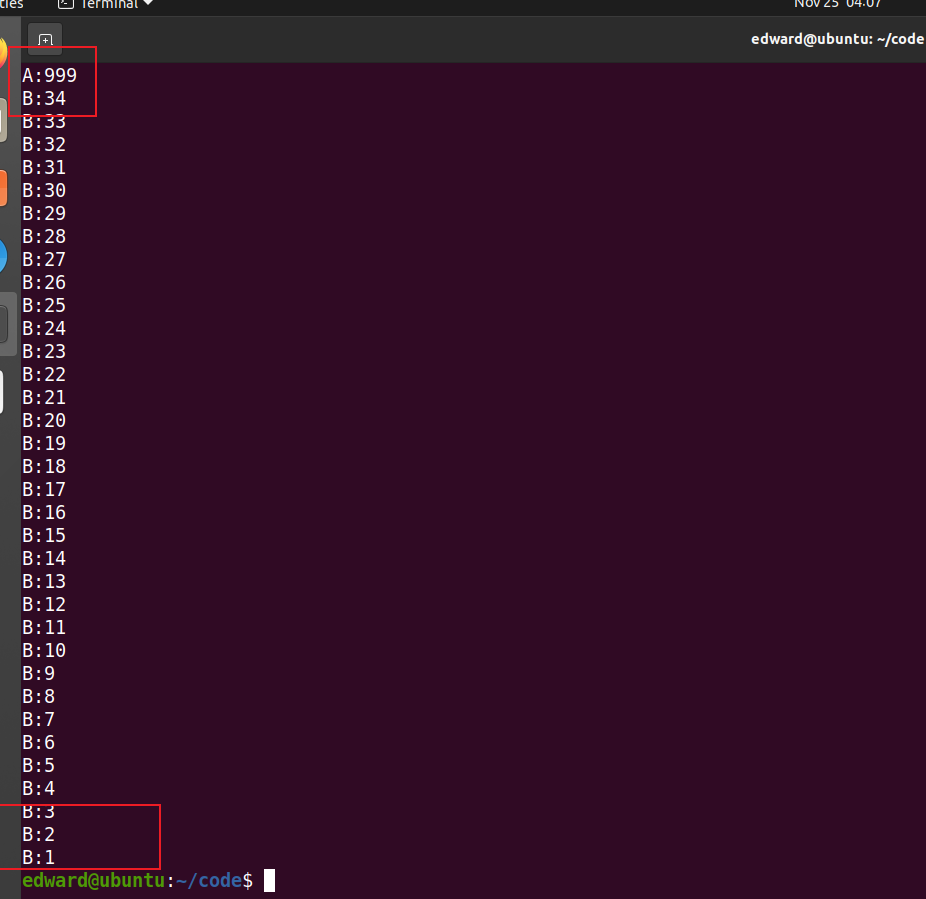
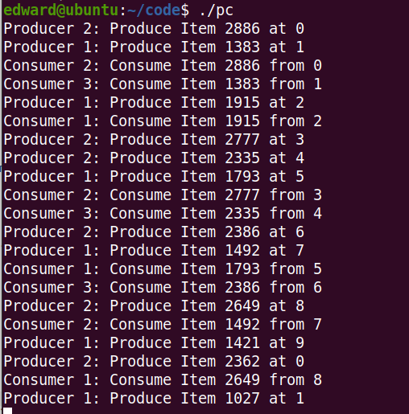
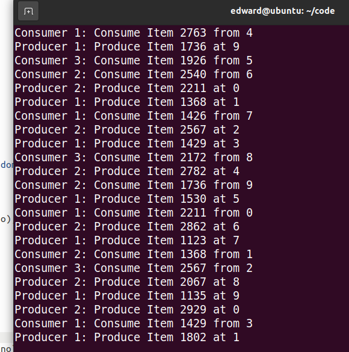
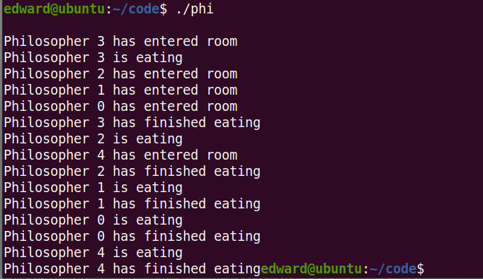
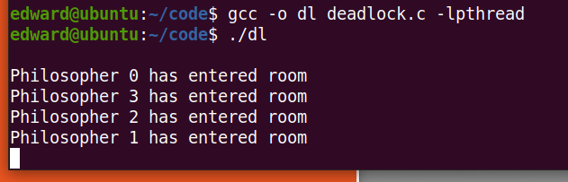

# 第二次实验

# 1）在Linux下创建一对父子进程  

创建代码如下，先让子进程打印提示语句，进程号和父进程号，然后休眠五秒，父进程同时打印提示语句，进程号，休眠两秒，父进程先结束，然后子进程休眠完后再打印进程号和父进程号。

```C
#include <sys/types.h>
#include <sys/wait.h>
#include <unistd.h>
#include <stdio.h>
#include <stdlib.h>

int main(void)
{
    pid_t pid;
    char *message;
    int n;
    pid = fork();
    if(pid < 0)
    {
        perror("fork failed");
        exit(1);
    }
    if(pid == 0)
    {
        printf("This is the child process. My PID is: %d. My PPID is: %d.\n", getpid(), getppid());	
		sleep(5);
		printf("This is the child process. My PID is: %d. My PPID is: %d.\n", getpid(), getppid());	
    }
    else
    {
        printf("This is the parent process. My PID is %d.\n", getpid());
		sleep(2);
    }
    return 0;
}
```

可以发现使用ps可以看到两个进程，4142和4143，是父子进程，然后让父进程提前结束。



# 2）在Linux下创建2个线程A和B，循环输出数据或字符串 

- 提示1：使用pthread线程库
- 提示2：线程A递增输出1-1000；线程B递减输出1000-1。为避免输出太快，每隔0.2秒（可自行调节）输出一个数。
- 提示3：输出数据时，同时输出A或B以标示是哪个线程输出的，并注意格式化输出信息。  

```C
#include<stdio.h>
#include<stdlib.h>
#include<string.h>
#include<unistd.h>
#include<assert.h>
#include<pthread.h>

void* pthread_A(void* arg)
{
    for(int i = 0; i < 1000; i++)
    {
        printf("A:%d\n",i);
        sleep(0.2);
    }
}

int main()
{

    pthread_t tid;
    int res = pthread_create(&tid,NULL,pthread_A,NULL);
   
    for(int i = 1000; i > 0; i--)
    {
        printf("B:%d\n",i);
        sleep(0.2);
    }

}


```

`gcc -o t t.c -lpthread`





可以看到我们A进程先结束，输出999，最后B单独执行。

# 6）在Windows或Linux下利用线程实现“生产者-消费者”同步控制  

- 提示1：使用数组（10个元素）代替缓冲区。2个输入线程产生产品（随机数）存到数组中；3个输出线程从数组中取数输出。
- 提示2：Linux使用互斥锁对象和轻量级信号量对象，主要函数：
  `sem_wait( )`，`sem_post( )`，`pthread_mutex_lock( )`，`pthread_mutex_unlock( )`
- 提示3：生产者1的数据：1000-1999 (每个数据随机间隔100ms-1s)，生产者2的数据：2000-2999 (每个数据随机间隔100ms-1s)
- 提示4：消费者每休眠100ms-1s的随机时间消费一个数据。
- 提示5：屏幕打印（或日志文件记录）每个数据的生产和消费记录。  

```C
#include <pthread.h>
#include <semaphore.h>
#include <stdlib.h>
#include <stdio.h>


#define BufferSize 10 // Size of the buffer
#define countOfProducer 2
#define countOfConsumer 3

sem_t empty;
sem_t full;
int in = 0;
int out = 0;
int buffer[BufferSize]={0};

pthread_mutex_t mutex;

void *producer(void *pno)
{   
    int item;
    while(1){
        item = rand()%1000+1000*(*((int *)pno)); // Produce an random item
        sleep(1);
        sem_wait(&empty);
        pthread_mutex_lock(&mutex);
        buffer[in] = item;
        printf("Producer %d: Produce Item %d at %d\n", *((int *)pno),buffer[in],in);
        in = (in+1)%BufferSize;
        pthread_mutex_unlock(&mutex);
        sem_post(&full);
    }
}
void *consumer(void *cno)
{   
    while(1){
        sem_wait(&full);
        pthread_mutex_lock(&mutex);
        int item = buffer[out];
        printf("Consumer %d: Consume Item %d from %d\n",*((int *)cno),item, out);
        out = (out+1)%BufferSize;
        pthread_mutex_unlock(&mutex);
        sem_post(&empty);
        sleep(2);
    }
}

int main()
{   

    pthread_t pro[countOfProducer],con[countOfConsumer];
    pthread_mutex_init(&mutex, NULL);
    sem_init(&empty,0,BufferSize);
    sem_init(&full,0,0);

    int a[3] = {1,2,3}; //Just used for numbering the producer and consumer

    for(int i = 0; i < countOfProducer; i++) {
        pthread_create(&pro[i], NULL, (void *)producer, (void *)&a[i]);
    }
    for(int i = 0; i < countOfConsumer; i++) {
        pthread_create(&con[i], NULL, (void *)consumer, (void *)&a[i]);
    }

    for(int i = 0; i < countOfProducer; i++) {
        pthread_join(pro[i], NULL);
    }
    for(int i = 0; i < countOfConsumer; i++) {
        pthread_join(con[i], NULL);
    }

    pthread_mutex_destroy(&mutex);
    sem_destroy(&empty);
    sem_destroy(&full);

    return 0;
    
}
```





因为consumer比producer多一人，所以让consumer休眠时间长一些，否则就会刚生产出来就被消耗掉

# 8）在Windows或Linux下模拟哲学家就餐，提供死锁和非死锁解法 

- 提示1：同时提供提供可能会带来死锁的解法和不可能死锁的解法。

- 提示2：可能会带来死锁的解法参见课件。

  Linux尝试使用互斥锁(`pthread_mutex_lock`, `pthread_mutex_unlock`)

- 提示3：完全不可能产生死锁的解法，例如：尝试拿取两只筷子，两只都能拿则拿，否则都不拿。

  Linux尝试使用互斥锁`pthread_mutex_lock`，`pthread_mutex_trylock`等函数。

- 提示4：[可选]图形界面显示哲学家取筷，吃饭，放筷，思考等状态。

- 提示5：为增强随机性，各状态间维持100ms-500ms内的随机时长。  

### 阻塞调用

```
pthread_mutex_lock(&mtx);
```

这个操作是阻塞调用的，也就是说，如果这个锁此时正在被其它线程占用， 那么 `pthread_mutex_lock() `调用会进入到这个锁的排队队列中，并会进入阻塞状态， 直到拿到锁之后才会返回。

### 非阻塞调用

如果不想阻塞，而是想尝试获取一下，如果锁被占用咱就不用，如果没被占用那就用， 这该怎么实现呢？可以使用 `pthread_mutex_trylock()` 函数。 这个函数和 `pthread_mutex_lock() `用法一样，只不过当请求的锁正在被占用的时候， 不会进入阻塞状态，而是立刻返回，并返回一个错误代码 EBUSY，意思是说， 有其它线程正在使用这个锁。

## 非死锁(使用信号量)

这里注意设置了room，因为5个人同时进入会可能产生死锁，所以限定最多4个人同时进入并是未吃完的状态。

```C
#include<stdio.h>
#include<stdlib.h>
#include<pthread.h>
#include<semaphore.h>
#include<unistd.h>

sem_t room;
sem_t chopstick[5];

void * philosopher(void *);
void eat(int);
int main()
{
	int i,a[5];
	pthread_t tid[5];
	
	sem_init(&room,0,4);
	
	for(i=0;i<5;i++)
		sem_init(&chopstick[i],0,1);
		
	for(i=0;i<5;i++){
		a[i]=i;
		pthread_create(&tid[i],NULL,philosopher,(void *)&a[i]);
	}
	for(i=0;i<5;i++)
		pthread_join(tid[i],NULL);
}

void * philosopher(void * num)
{
	int phil=*(int *)num;

	sem_wait(&room);
	printf("\nPhilosopher %d has entered room",phil);
	sem_wait(&chopstick[phil]);
	sem_wait(&chopstick[(phil+1)%5]);

	eat(phil);
	sleep(1);
	printf("\nPhilosopher %d has finished eating",phil);

	sem_post(&chopstick[(phil+1)%5]);
	sem_post(&chopstick[phil]);
	sem_post(&room);
}

void eat(int phil)
{
	printf("\nPhilosopher %d is eating",phil);
}
```




## 死锁(使用阻塞调用的互斥锁)

```C
#include<stdio.h>
#include<stdlib.h>
#include<pthread.h>
#include<unistd.h>

pthread_mutex_t chopstick[5];
void * philosopher(void *);
void eat(int);
int main()
{
	int i,a[5];
	pthread_t tid[5];
	
	for(i=0;i<5;i++)
		pthread_mutex_init(&chopstick[i], NULL);
		
	for(i=0;i<5;i++){
		a[i]=i;
		pthread_create(&tid[i],NULL,philosopher,(void *)&a[i]);
	}
	for(i=0;i<5;i++)
		pthread_join(tid[i],NULL);
	for(i=0;i<5;i++)
		pthread_mutex_destroy(&chopstick[i]);
}

void * philosopher(void * num)
{
	int phil=*(int *)num;
	printf("\nPhilosopher %d has entered room",phil);
	pthread_mutex_lock(&chopstick[phil]);
	sleep(1);
	pthread_mutex_lock(&chopstick[(phil+1)%5]);	
	eat(phil);
	sleep(2);
	printf("\nPhilosopher %d has finished eating",phil);
	pthread_mutex_unlock(&chopstick[(phil+1)%5]);
	pthread_mutex_unlock(&chopstick[phil]);
}

void eat(int phil)
{
	printf("\nPhilosopher %d is eating",phil);
}
```



发生死锁。

注意我们拿完筷子休眠一秒更容易发生死锁

```C
pthread_mutex_lock(&chopstick[phil]);
sleep(1);
pthread_mutex_lock(&chopstick[(phil+1)%5]);	
```

