# 第四次实验

# 1 编写一个Linux内核模块，并完成安装/卸载等操作

## MAKEFILE

```makefile
obj-m:=xzc.o
KDIR:=/usr/src/linux-headers-5.10.60-amd64-desktop
PWD:=$(shell pwd)

default:
	make -C $(KDIR) M=$(PWD) modules
clean:
	make -C $(KDIR) M=$(PWD) clean

```

## xzc.c

```c
#include <linux/init.h>
#include <linux/module.h>
#include <linux/moduleparam.h>


static char *name = "xuzichuan";
static int times = 1;

module_param(times,int,0644);
module_param(name, charp,0644);

static int hello_init(void)
{
    int i;
    for(i = 0 ; i < times; i++)
        printk(KERN_ALERT "(%d) hello, %s!\n", i, name);
    return 0;
}
static void hello_exit(void)
{
    printk(KERN_ALERT"Goodbye, %s!\n",name);
}
MODULE_LICENSE("Dual BSD/GPL");
module_init(hello_init);
module_exit(hello_exit);
```

## 执行命令


`make`

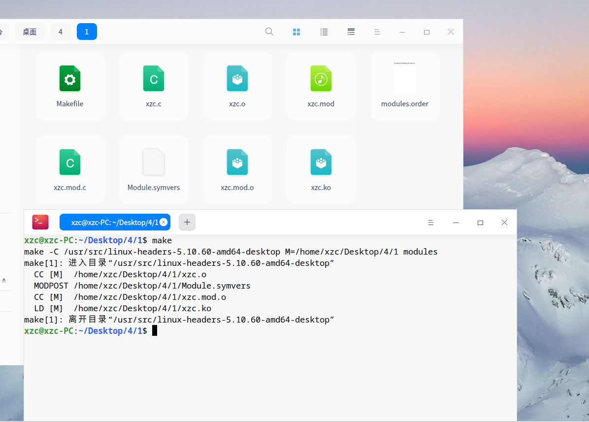

`sudo insmod xzc.ko name="xzc" times=7`

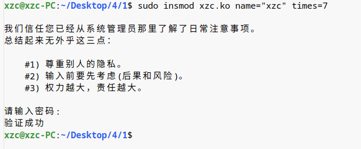

` sudo rmmod xzc`

`dmesg | tail -8`

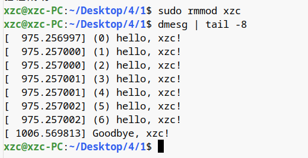

# 2 编写Linux驱动程序并编程应用程序测试。功能：write几个整数进去，read出其和或差或最大值

## MAKEFILE

```MAKEFILE
ifneq ($(KERNELRELEASE),)
obj-m := xzcDrive.o
 
else
KVER := $(shell uname -r)
KDIR := /lib/modules/$(KVER)/build
PWD  := $(shell pwd)
all:
	$(MAKE) -C $(KDIR) M=$(PWD) modules
	gcc -o test2 test2.c
clean:
	rm -rf .*.cmd *.o *.mod.c *.ko .tmp_versions modules.*  Module.*
	rm -rf test2
endif
```

## xzcDrive.c

```C
#include <linux/module.h>
#include <linux/kernel.h>
#include <linux/fs.h>
#include <linux/cdev.h>
#include <linux/string.h>
#include <linux/uaccess.h>

static struct cdev drv;
static dev_t ndev;
static char xzc[32];

static int drv_open(struct inode *nd, struct file *fp) 
{
    int major;
    int minor;
    major = MAJOR(nd->i_rdev);
    minor = MINOR(nd->i_rdev);
    printk(KERN_EMERG "hello open, major = %d, minor = %d\n", major, minor);
    return 0;
}

static ssize_t drv_read(struct file* fp, char __user* u, size_t sz, loff_t* loff)
{
    char res[32];
    int i = 0;
    int num1 = 0;
    int num2 = 0;
    bool flag = true;
    printk(KERN_EMERG "hello read.\n");
    while (xzc[i] != '+'&& xzc[i] != '-')
    {
        num1 = 10 * num1 + (xzc[i] - '0');
        i++;
    }
    if (xzc[i] == '-') flag = false;
    i++;
    while (xzc[i] != '\0') 
    {
        num2 = 10 * num2 + (xzc[i] - '0');
        i++;
    }
    if (flag == true) 
    {
        printk(KERN_EMERG "%d + %d = %d\n", num1, num2, num1 + num2);
        sprintf(res, "%d + %d = %d\n", num1, num2, num1 + num2);
        copy_to_user(u, res, strlen(res));
    }
    else
    {
        printk(KERN_EMERG "%d - %d = %d\n", num1, num2, num1 - num2);
        sprintf(res, "%d - %d = %d\n", num1, num2, num1 - num2);
        copy_to_user(u, res, strlen(res));
    }
    return 0;
}

static ssize_t drv_write(struct file* fp, const char __user * u, size_t sz, loff_t* loff){
    printk(KERN_EMERG "hello write.\n");
    copy_from_user(xzc, u, sz);
    return 0;
}

static struct file_operations drv_ops = 
{
    .owner  =   THIS_MODULE,
    .open   =   drv_open,    
    .read   =   drv_read, 
    .write  =   drv_write,
};

static int xuzichuanDrv_init(void)
{
    int ret;
    cdev_init(&drv, &drv_ops);
    ret = alloc_chrdev_region(&ndev, 0, 1, "xuzichuanDrv");
    if (ret < 0)
    {
        printk(KERN_EMERG " alloc_chrdev_region error.\n");
        return ret;
    }
    printk(KERN_EMERG "xuzichuanDrv_init(): major = %d, minor = %d\n", MAJOR(ndev), MINOR(ndev));
    ret = cdev_add(&drv, ndev, 1);
    if (ret < 0)
    {
        printk(KERN_EMERG " cdev_add error.\n");
        return ret;
    }
    return 0;
}

static void xuzichuanDrv_exit(void)
{
    printk("exit process!\n");
	cdev_del(&drv);
	unregister_chrdev_region(ndev, 1);
}

module_init(xuzichuanDrv_init);
module_exit(xuzichuanDrv_exit);

MODULE_LICENSE("GPL");
MODULE_AUTHOR("u201916322@hust.edu.cn");
MODULE_DESCRIPTION("xuzichuan's Driver Demo");
```

## test2.c

```C
#include <stdio.h>
#include <fcntl.h>
#include <unistd.h>
#include <errno.h>
#define CHAR_DEV_NAME "/dev/xzcDrive"

char calc[32];
char res[32];
int main()
{
	int ret;
	int fd;
	extern int errno;
	fd = open(CHAR_DEV_NAME, O_RDWR | O_NDELAY);
	if(fd < 0)
	{
		printf("open failed! error %d\n", errno);
		return -1;
	}
	scanf("%s", calc);
	write(fd,calc,32);
	read(fd, res, 32);
	printf("%s\n", res);
	close(fd);
	return 0;
}
```


## 执行命令

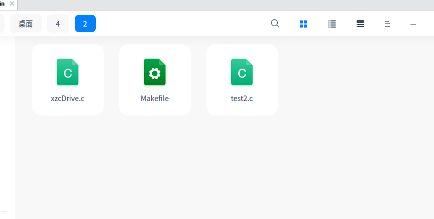


`make`

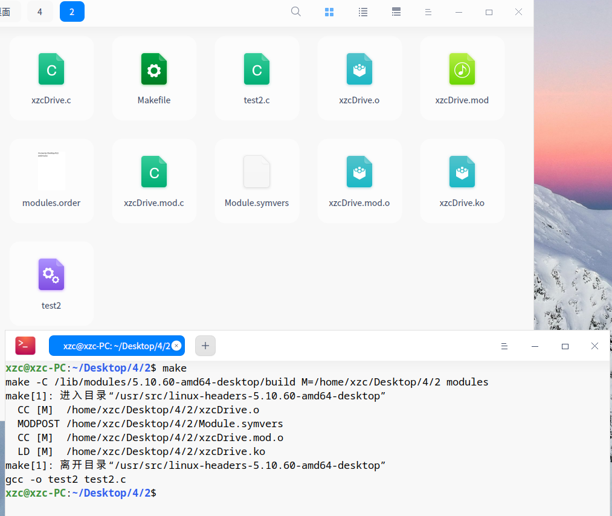

`sudo insmod xzcDrive.ko`

`lsmod | grep xzc`

`dmesg | tail -1`

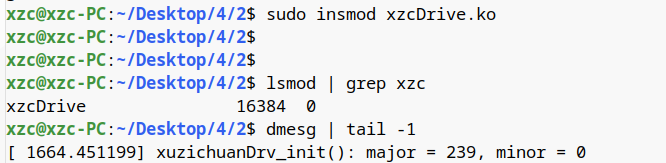

`sudo mknod /dev/xzcDrive c 239 0`

`sudo ./test2`


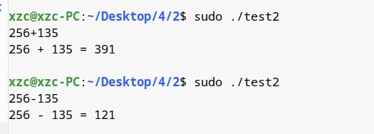

`sudo rm -rf /dev/xzcDrive`
`sudo rmmod xzcDrive`
`dmesg | tail -7`

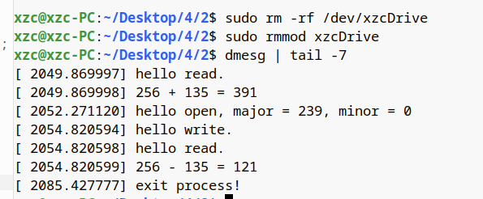

`make clean`

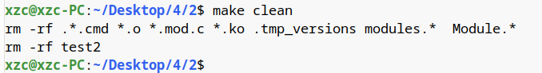

# 3 编写Linux驱动程序并编程应用程序测试。功能：有序读写内核缓冲区，返回实际读写字节数

## Makefile

```MAKEFILE
CONFIG_MODULE_SIG=n
obj-m:=xzcDrive2.o
CURRENT_PATH:=$(shell pwd)
VERSION_NUM :=$(shell uname -r)
LINUX_PATH  :=/usr/src/linux-headers-$(VERSION_NUM)

all :   
	make -C $(LINUX_PATH) M=$(CURRENT_PATH) modules   
clean :   
	make -C $(LINUX_PATH) M=$(CURRENT_PATH) clean

```

## xzcDrive2.cpp

```CPP
#include <linux/init.h>
#include <linux/module.h>
#include <linux/kernel.h>
#include <linux/slab.h>
#include <linux/fs.h> 
#include <linux/errno.h>
#include <linux/types.h> 
#include <linux/proc_fs.h>
#include <linux/fcntl.h> 
#include <linux/uaccess.h> 

MODULE_LICENSE("HUSTCSE");
MODULE_AUTHOR("XZC");
MODULE_DESCRIPTION("My Linux Driver");

static int __init xzcDrive2_init(void);
static void __exit xzcDrive2_exit(void);
static ssize_t xzcDrive2_read(struct file *fp, char __user *buf,
                         size_t length, loff_t *pos);
static ssize_t xzcDrive2_write(struct file *fp, const char __user *buf,
                           size_t length, loff_t *pos);
loff_t xzcDrive2_llseek(struct file *filp, loff_t offset, int whence);

//驱动可用函数
struct file_operations xzcDrive2_fops = {
    //读数据
    read: xzcDrive2_read,
    //写数据      
    write: xzcDrive2_write,
    //文件指针移动    
    llseek: xzcDrive2_llseek   
};
//设备号
const int xzcDrive2_major = 222;    
const char *xzcDrive2_name = "xzcDrive2";
//驱动程序缓冲区最大值
const loff_t xzcDrive2_max_size = 64;
//驱动程序缓冲区  
char *xzcDrive2_buf;
//当前缓冲区数据大小   
loff_t xzcDrive2_size = 0;     

static int __init xzcDrive2_init(void) {
    int ret;
    //注册设备
    ret = register_chrdev(xzcDrive2_major, xzcDrive2_name, &xzcDrive2_fops);
    if(ret < 0) {
        printk(KERN_EMERG"ERROR!\n");
        return ret;
    }
    xzcDrive2_buf = kmalloc(xzcDrive2_max_size, GFP_KERNEL);
    if(!xzcDrive2_buf) {
        ret = -ENOMEM;
        return ret;
    }
    memset(xzcDrive2_buf, 0, xzcDrive2_max_size);
    printk("xzcDrive2: Installing xzcDrive2\n");
    return 0;
}

//删除驱动程序
static void __exit xzcDrive2_exit(void) {
    unregister_chrdev(xzcDrive2_major, xzcDrive2_name);
    if(xzcDrive2_buf) kfree(xzcDrive2_buf);
    printk("xzcDrive2: Removing xzcDrive2\n");
}

//读取字符
static ssize_t xzcDrive2_read(struct file *fp, char __user *buf,
                         size_t length, loff_t *pos) {
    
    int left = xzcDrive2_size - *pos;
    if(left == 0) return 0;
    else if(length > left) length = left;

    if(copy_to_user(buf, xzcDrive2_buf+(*pos), length))
        return -EFAULT;
    printk("xzcDrive2: Read %ldB, left %ldB\n", length, left-length);
    
    *pos += length;
    
    return length;
}

// 写入字符
static ssize_t xzcDrive2_write(struct file *fp, const char __user *buf,
                           size_t length, loff_t *pos) {

    int left = xzcDrive2_max_size - *pos;
    if(left == 0) return 0;
    else if(length > left) length = left;
    
    if(copy_from_user(xzcDrive2_buf+(*pos), buf, length))
        return -EFAULT;
    printk("xzcDrive2: Write %ldB, left %ldB\n", length, left-length);
    
    *pos += length;
    
    if(*pos > xzcDrive2_size) xzcDrive2_size = *pos;
    
    return length;
}

//文件指针移动
loff_t xzcDrive2_llseek(struct file *fp, loff_t offset, int whence) {
    //新文件指针位置
    loff_t newpos = 0;
    //判断起点
    switch (whence) {
        //文件头
    case SEEK_SET:  
        newpos = offset;
        break;
        //文件指针当前位置
    case SEEK_CUR:  
        newpos = fp->f_pos + offset;
        break;
        //文件尾
    case SEEK_END:  
        newpos = xzcDrive2_size + offset;
        break;
    default:
        return -EINVAL;
    }
    if(newpos < 0 || newpos >= xzcDrive2_size) return -EINVAL;
    //重置文件指针位置并返回
    fp->f_pos = newpos;
    printk("xzcDrive2: fpPosition is %lld\n", newpos);
    return newpos;
}

//注册函数
module_init(xzcDrive2_init);
module_exit(xzcDrive2_exit);
```

## test.c

```C
#include <stdio.h>
#include <string.h>
#include <sys/types.h>
#include <sys/stat.h>
#include <unistd.h>
#include <fcntl.h>

char src[256];
char dest[256];
int pc = 0;

int main() {
    int length, count;
    int position;
    int fp = open("/dev/xzcDrive2", O_RDWR);
    if(fp < 0) {
        printf("Open drive2 fail\n");
        return 0;
    }
    printf("Please write string:\n");
    while(scanf("%s", src) != EOF) {
        length = strlen(src);
        count = write(fp, src, length);
        printf("Write to drive2 %dB\n", count);
    }
    
    printf("position: %ld\n", lseek(fp, 0, SEEK_SET));
    printf("Please input the bytes of reading :\n");
    while(scanf("%d", &length) != EOF) {
        count = read(fp, dest, length);
        dest[count] = 0;
        printf("Read from drive2 %dB: %s\n", count, dest);
    }
    close(fp);
    return 0;
}
```

## 执行命令

分别用如下的命令编译安装模块，类似于任务二。

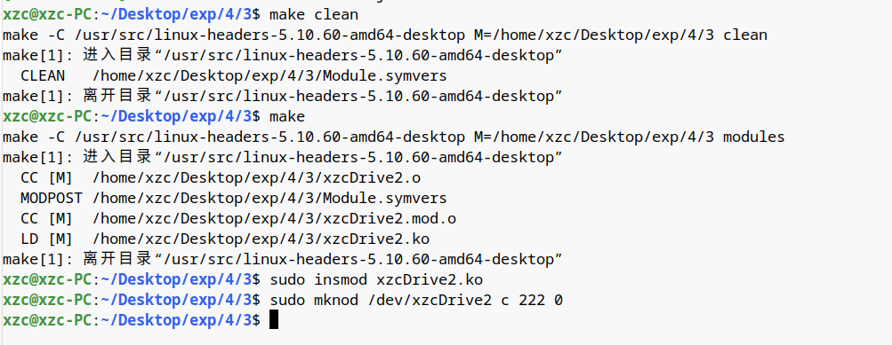

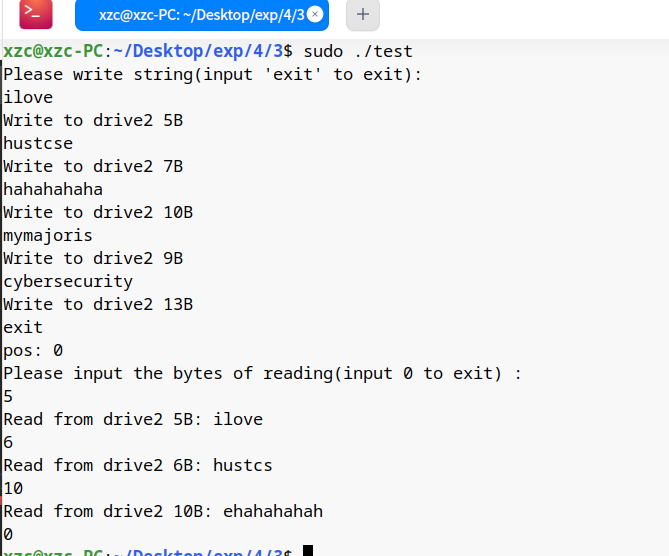

用`dmesg`查看信息

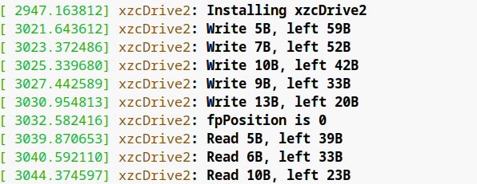
