# Task1

## 测试运行

- 直接在该文件夹下执行`make`指令即可完成编译和装盘；
- 在虚拟机中该文件夹下执行`bochs -f bochsrc`指令打开虚拟机测试运行；
- 输入`c`进入A盘，然后输入`B:`进入B盘，输入`task1.com`运行
- 就可以看到运行结果，HUST和IS19交替显示

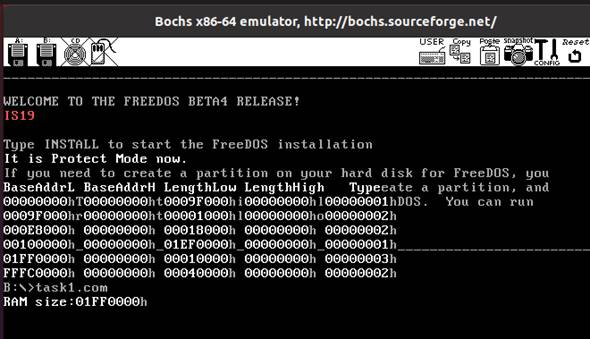

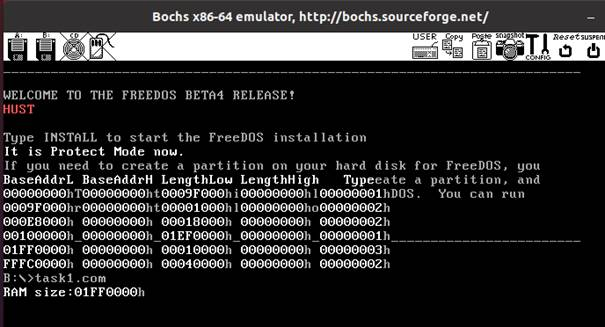

# Task2

## task2.c
- 文件名是task2.c
- 定义了设备号是：234
- 定义了设备名是：task2
- 定义了缓冲区大小：64  

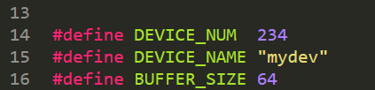

## Makefile

注意与task2.c对应

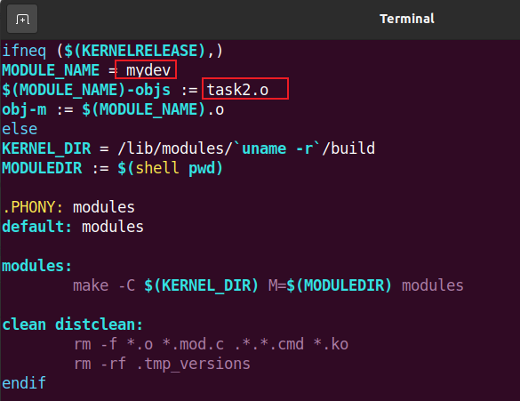

## 测试运行

### 编译安装模块

编译

`sudo make`

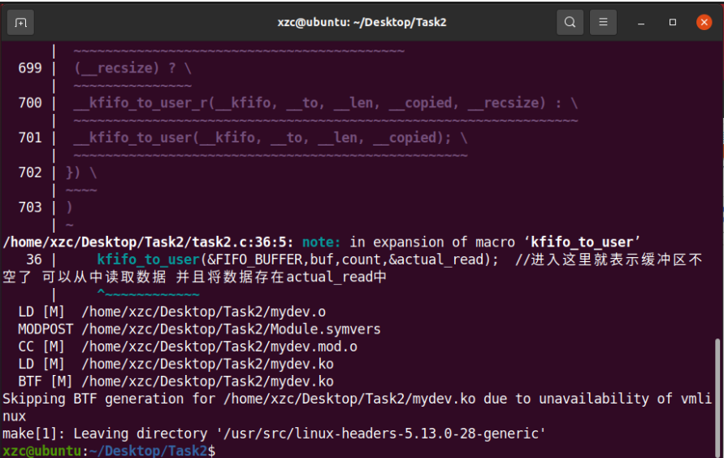

加载驱动 

`sudo insmod mydev.ko  `

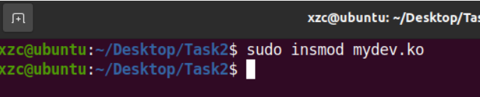

查看是否加载
`cat /proc/devices `

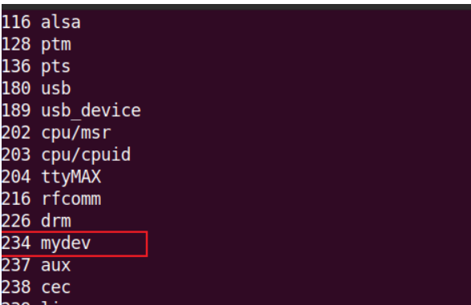

创建节点
`cd /dev`
`sudo mknod mydev c 234 0  `

查看是否创建成功
`ls -a | grep mydev  `

### 编译运行测试程序  

如果换环境了记得重新编译一遍  

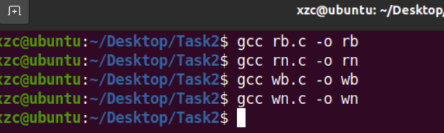

### 阻塞状态测试

> 缓冲区大小64， 我们有80个字符

直接运行rb ，阻塞式读，发现阻塞，因为此时缓冲区没东西  

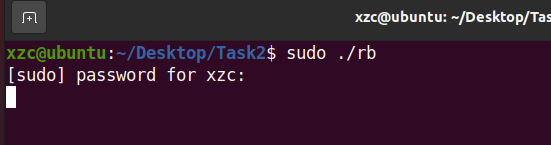

然后运行wb ，阻塞式写，可以发现两边同时结束，并且都是80个字符

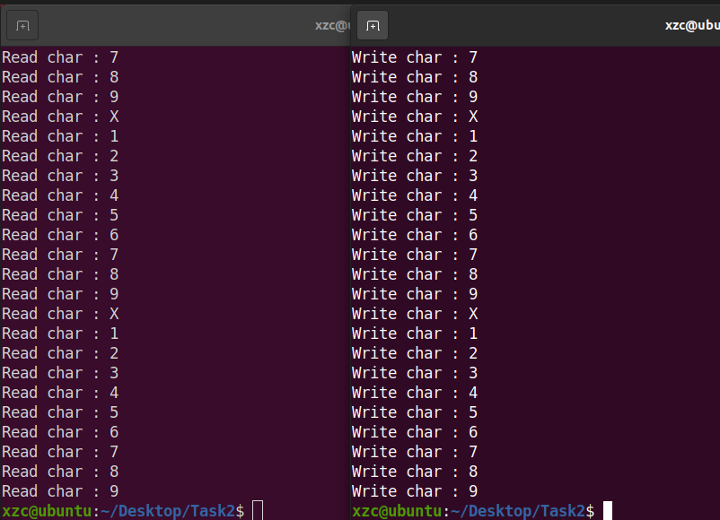

如果我们先运行wb，阻塞式写，会发现在写第64个字符写完后阻塞

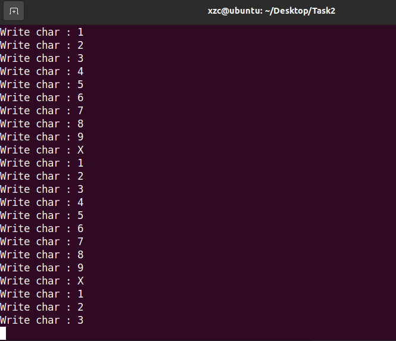

如果我们运行rb，阻塞式读，发现两个一块结束，且都是80个字符

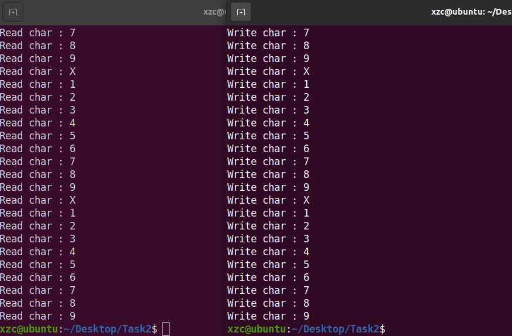

达到预期结果

### 非阻塞状态测试

无论是读还是写，互不影响，如果写超了就舍弃。可以看到先运行wn，非阻塞式写，写完64个，后面都写不进去了。再运行rn，直接读64个字符，后续读不到了。

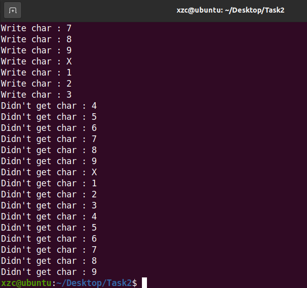

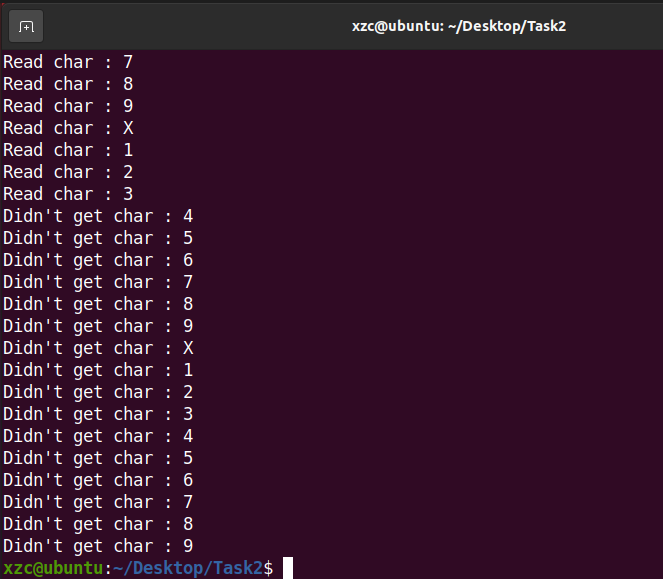

达到预期结果。
