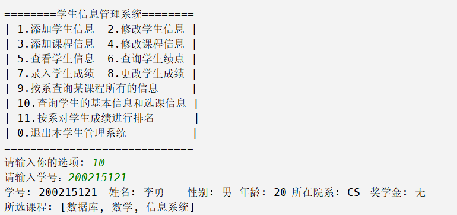
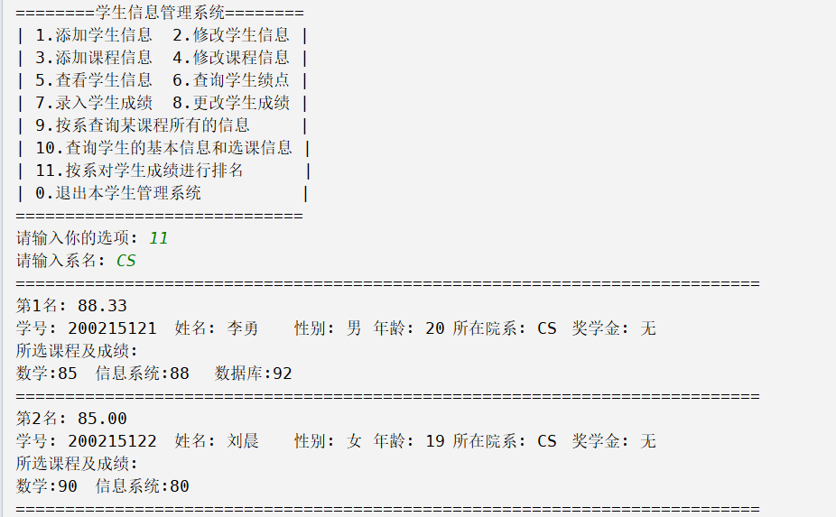

# DataBaseLab
学生信息管理系统

实验环境：

- JAVA: JDK 1.8及以上

- IDE: IntelliJ IDEA 2021.3.2
- MySQL: Ver 8.0.23 for Win64 on x86_64
- 框架: MyBatis

# db.properties文件（重要）
在src/main/resources文件夹下添加一个db.properties输入你的数据库的url和用户名以及密码
```properties
driver=com.mysql.cj.jdbc.Driver
url=
username=
password=
```
# 演示



