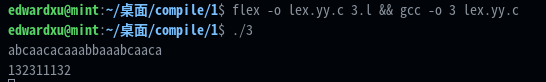
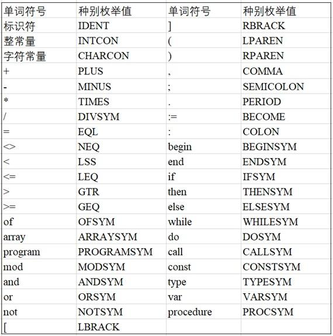
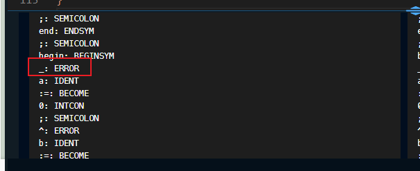
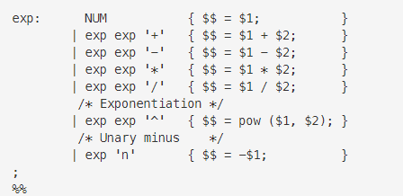
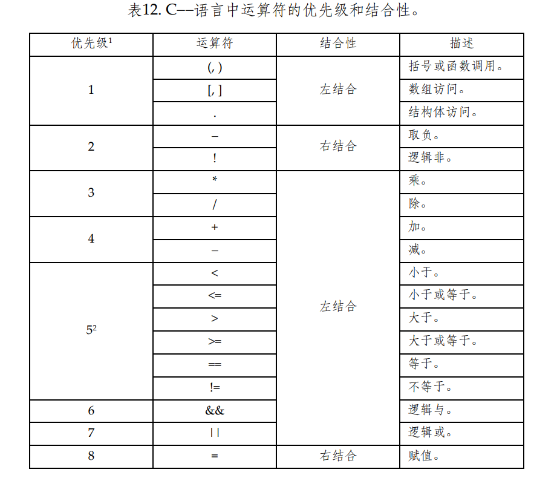

# Flex&Bison入门


## **第1关 [Flex首次尝试](https://www.educoder.net/tasks/okcfst8uazbl)**

```lex
        int num_lines=0,num_chars=0;
%%
\n ++num_lines;
.  ++num_chars;
%%
int main()
{
    yylex();
    printf("Lines=%d,Chars=%d\n",num_lines,num_chars);
}

```

## **第2关 [简单Pascal-like toy语言识别补全](https://www.educoder.net/tasks/tb69ixypmvjq)**

```lex
%{
  #include <math.h>
%}
DIGIT [0-9]
ID [a-z][a-z0-9]*
%%
{DIGIT}+                {printf( "An integer: %s (%d)\n", yytext,atoi( yytext ) );}
{DIGIT}+"."{DIGIT}*     {printf( "A float: %s (%g)\n", yytext,atof( yytext ) );}
if|then|begin|end|procedure|function {printf( "A keyword: %s\n", yytext );}
{ID} printf( "An identifier: %s\n", yytext );
"+"|"-"|"*"|"/"         printf( "An operator: %s\n", yytext );
"{"[^}\n]*"}" 	
[ \t\n]+ 		
.       printf( "Unrecognized character: %s\n", yytext );
%%
int main( argc, argv )
int argc;
char **argv;
{
++argv, --argc; /* skip over program name */
if ( argc > 0 )
        yyin = fopen( argv[0], "r" );
else
        yyin = stdin;
        yylex();
}       
```

## **第3关 [Flex规则匹配顺序](https://www.educoder.net/tasks/n6mktgir5w2u)**



```
 132311132
```

## **第4关 [Flex词法规则补全（PL语言）](https://www.educoder.net/tasks/5zc2x6qoprbg)**





样例出现了表格中没有出现的字符 再自己定义一个`ERROR` 来包含这些字符。


```lex
/* PL词法分析器 */
/* 功能：能够识别出PL支持的所有单词符号并给出种别值 */
/* 说明：在下面的begin和end之间添加代码，已经实现了标识符和整常量的识别，你需要完成剩下的部分，加油吧！ */
/* 提示：因为是顺序匹配，即从上至下依次匹配规则，所以需要合理安排顺序～ */
%{
#include <stdio.h>
%} /*** begin ****/

OFSYM			of
ARRAYSYM		array
MODSYM			mod
ANDSYM			and
ORSYM			or
NOTSYM			not
PROGRAMSYM		program
BEGINSYM		begin
ENDSYM			end
IFSYM			if
THENSYM			then
ELSESYM			else
WHILESYM		while
DOSYM			do
CALLSYM			call
CONSTSYM		const
TYPESYM			type
VARSYM			var
PROCSYM			procedure
ERROR			[~!@#$%^&_]?|\\
INTCON			[\-]?[1-9][0-9]*|0
IDENT			[A-Za-z][A-Za-z0-9]*
CHARCON			['][^']*[']
PLUS			\+
MINUS			\-
TIMES			\*
DIVSYM			\/
BECOME			:=
EQL				\=
NEQ				<>
LEQ				<=
LSS				\<
GEQ				>=
GTR				\>
LBRACK			\[
RBRACK			\]
LPAREN			\(
RPAREN			\)
COMMA			\,
SEMICOLON		\;
PERIOD			\.
COLON			\:

%%  

{OFSYM}				{printf("%s: OFSYM\n", yytext);}
{ARRAYSYM}			{printf("%s: ARRAYSYM\n", yytext);}
{PROGRAMSYM}		{printf("%s: PROGRAMSYM\n", yytext);}
{MODSYM}			{printf("%s: MODSYM\n", yytext);}
{ANDSYM}			{printf("%s: ANDSYM\n", yytext);}
{ORSYM}				{printf("%s: ORSYM\n", yytext);}
{NOTSYM}			{printf("%s: NOTSYM\n", yytext);}
{BEGINSYM}			{printf("%s: BEGINSYM\n", yytext);}
{ENDSYM}			{printf("%s: ENDSYM\n", yytext);}
{IFSYM}				{printf("%s: IFSYM\n", yytext);}
{THENSYM}			{printf("%s: THENSYM\n", yytext);}
{ELSESYM}			{printf("%s: ELSESYM\n", yytext);}
{WHILESYM}			{printf("%s: WHILESYM\n", yytext);}
{DOSYM}				{printf("%s: DOSYM\n", yytext);}
{CALLSYM}			{printf("%s: CALLSYM\n", yytext);}
{CONSTSYM}			{printf("%s: CONSTSYM\n", yytext);}
{TYPESYM}			{printf("%s: TYPESYM\n", yytext);}
{VARSYM}			{printf("%s: VARSYM\n", yytext);}
{PROCSYM}			{printf("%s: PROCSYM\n", yytext);}
{INTCON}			{printf("%s: INTCON\n", yytext);}
{IDENT}				{printf("%s: IDENT\n", yytext);}
{CHARCON}			{printf("%s: CHARCON\n", yytext);}
{PLUS}				{printf("%s: PLUS\n", yytext);}
{MINUS}				{printf("%s: MINUS\n", yytext);}
{TIMES}				{printf("%s: TIMES\n", yytext);}
{DIVSYM}			{printf("%s: DIVSYM\n", yytext);}
{BECOME}			{printf("%s: BECOME\n", yytext);}
{EQL}				{printf("%s: EQL\n", yytext);}
{NEQ}				{printf("%s: NEQ\n", yytext);}
{LEQ}				{printf("%s: LEQ\n", yytext);}
{LSS}				{printf("%s: LSS\n", yytext);}
{GEQ}				{printf("%s: GEQ\n", yytext);}
{GTR}				{printf("%s: GTR\n", yytext);}
{LBRACK}			{printf("%s: LBRACK\n", yytext);}
{RBRACK}			{printf("%s: RBRACK\n", yytext);}
{LPAREN}			{printf("%s: LPAREN\n", yytext);}
{RPAREN}			{printf("%s: RPAREN\n", yytext);}
{COMMA}				{printf("%s: COMMA\n", yytext);}
{SEMICOLON}			{printf("%s: SEMICOLON\n", yytext);}
{PERIOD}			{printf("%s: PERIOD\n", yytext);}
{COLON}				{printf("%s: COLON\n", yytext);}
{ERROR}				{printf("%s: ERROR\n", yytext);}
 


\n				{}
.				{}
%% /*** end ***/
int yywrap() { return 1; }
int main(int argc, char **argv)
{
	if (argc > 1) {
		if (!(yyin = fopen(argv[1], "r"))) {
			perror(argv[1]);
			return 1;
		}
	}
	while (yylex());
	return 0;
}

```

## **第5关 [Bison入门（逆波兰式计算）](https://www.educoder.net/tasks/tx8w5u2pqlhs)**

本关任务是**利用YACC/Bison构建一个逆波兰符号计算器**。

```bison
 %{
  #include <ctype.h>
  #include <stdio.h>
  #include <math.h>
  int yylex (void);
  void yyerror (char const *);
%}

%define api.value.type {double}
%token NUM

%% 
/* Grammar rules and actions follow.  */
input:
  %empty
| input line
;


line:
  '\n'
| exp '\n'      { printf ("%.10g\n", $1); }
;

exp:
  NUM           { $$ = $1;           }
 /* begin */
             | exp exp '+'   { $$ = $1 + $2;      } 
             | exp exp '-'   { $$ = $1 - $2;      } 
             | exp exp '*'   { $$ = $1 * $2;      } 
             | exp exp '/'   { $$ = $1 / $2;      } 
              /* Exponentiation */ 
             | exp exp '^'   { $$ = pow ($1, $2); } 
              /* Unary minus    */ 
             | exp 'n'       { $$ = -$1;          } 
 /* end */
;

%%

/* The lexical analyzer returns a double floating point
   number on the stack and the token NUM, or the numeric code
   of the character read if not a number.  It skips all blanks
   and tabs, and returns 0 for end-of-input.  */

int yylex (void)
{
  int c;
  /* Skip white space.  */
  while ((c = getchar ()) == ' ' || c == '\t')
    continue;

  /* Process numbers.  */
  if (c == '.' || isdigit (c))
    {
      ungetc (c, stdin);
      scanf ("%lf", &yylval);
      return NUM;
    }

  /* Return end-of-input.  */
  if (c == EOF)
    return 0;
  if (c == '!')
  	return 0;
  /* Return a single char.  */
  return c;
}

int main (int argc, char** argv)
{
   yyparse();
   return 0;
}


/* Called by yyparse on error.  */
void yyerror (char const *s)
{
  fprintf (stderr, "%s\n", s);
}

```

只需编写该部分：



## **第6关 [bison入门（中缀式计算）](https://www.educoder.net/tasks/tejxvr2lish7)**

继续使用`Bison`，完成中缀式计算器的语法规则设计

```lex
%{
#include <stdio.h>
#include <stdlib.h>
#include <ctype.h>
int yylex(void);
void yyerror(char const *);
%}
%define api.value.type {double}
/* Tokens */
%token NUM
%token EOL
%token ADD SUB MUL DIV
 /* begin */
 /* end */
%% 
  /* Grammar rules and actions follow.  */
 /* begin */
calclist:
    %empty
    |calclist exp EOL {printf("=%.10g\n",$2);}
exp: factor        { $$ = $1; }
  | exp ADD factor { $$ = $1 + $3; }
  | exp SUB factor { $$ = $1 - $3; }
  ;

factor: term        { $$ = $1; }
  | factor MUL term { $$ = $1 * $3; }
  | factor DIV term { $$ = $1 / $3; }
  ;

term:NUM
  ;
 /* end */
%%
/* The lexical analyzer returns a double floating point
   number on the stack and the token NUM, or the numeric code
   of the character read if not a number.  It skips all blanks
   and tabs, and returns 0 for end-of-input.  */
/* begin */
int yylex(void)
{
    int c;
    while((c=getchar())==' '||c=='\t')
    continue;
    if(c=='.'||isdigit(c))
    {
    ungetc(c,stdin);
    if(scanf("%lf",&yylval)!=1)
        abort();
    return NUM;
    }
    switch(c){
    case EOF: return YYEOF;
    case '\n':return EOL;
    case '+': return ADD;
    case '-': return SUB;
    case '*': return MUL;
    case '/': return DIV;
    default:
        return c;
    }
}
/* end */
int main (int argc, char** argv)
{
   yyparse();
   return 0;
}
/* Called by yyparse on error.  */
void yyerror (char const *s)
{
  fprintf (stderr, "%s\n", s);
} 
```

## **第7关 [Flex+Bison联合使用](https://www.educoder.net/tasks/qpvzcrg4ktla)**

用Flex+Bison，联合完成中缀式计算。注意数据类型的处理，阅读Bison文献中关于复杂返回值的处理方法（结构、联合）。

```
%{
/*
Filename:lab107.y
Author:
Date:
Makefile:
______________
scanner:lab107.l lab107.y
	bison -v -d lab107.y
	flex lab107.l
	gcc -o scanner 406.tab.c lex.yy.c -lm -lfl
.PHONY:clean
clean:
	rm scanner lab107.tab.c lex.yy.c lab107.tab.h
_______________
Description:

*/
// Notice: '-' using as -5+2=-3 ;or 5-2, need something special. By LM. 2021 using 
// with %precedence NEG used as the highest token, higher than '^', then we can get -2^2=4; without %prec NEG in the rule, SUB is lower than ^, then -2^2=-4
#include <stdio.h>
#include <math.h>
extern int yylineno;
int yylex();
void yyerror(const char *s);
%}

%define api.value.type {double}
%token NUM
%token EOL
%token ADD 
%token SUB 
%token MUL 
%token DIV
%token EXPO
%token LP
%token RP

%%
calclist:
	%empty
	|calclist exp EOL {printf("=%.10g\n",$2);}
	
exp:term	{$$=$1;}
   	|exp ADD exp {$$=$1+$3;}
	|exp SUB exp {$$=$1-$3;}
	|exp MUL exp {$$=$1*$3;}
	|exp DIV exp {$$=$1/$3;}
	|error {}
	;

term:NUM	{$$=$1;}
	|exp EXPO exp {$$=pow($1,$3);}
	|SUB NUM {$$=-$2;}
	|LP exp RP {$$=$2;}
	;
%%

int main(int args,char **argv){
	yyparse();
	return 0;
}
void yyerror(char const *s){
	fprintf(stderr,"MyError:%s yylineno:%d\n",s,yylineno);	
}
```

# MiniC词法(Flex)

## **第1关 [Flex minic词法分析（一）](https://www.educoder.net/tasks/lx4g3p9qru2a)**

面向样例编程

```C
%{
#include "string.h"
#include "def.h"

extern int yycolumn;

#define YYSTYPE yylval
extern "C"
{	
	int yywrap(void);
	int yylex(void);
}

void flexout(std::string name,std::string value){
  std::cout<<name<<"\t:"<<value<<std::endl;
}
//flex为bison提供行号信息
%}
%option yylineno 

%%

"int"        {flexout("TYPE","int");}
"float"      {flexout("TYPE","float");}
"char"      {flexout("TYPE","char");}
"("      {flexout("LP","(");}
")"      {flexout("RP",")");}
"{"      {flexout("LC","{");}
"}"      {flexout("RC","}");}
[A-Za-z][A-Za-z0-9]*      {flexout("ID",yytext);}
"="      {flexout("ASSIGNOP","=");}
[\-]?[1-9][0-9]*|0    {flexout("INT",yytext);}
";"      {flexout("SEMI",";");}
"+"      {flexout("PLUS","+");}
[\~\!\@\#\$\%\^\&\_\\] {printf("Error type A at Line %d: Mysterious characters '%s'\n", yycolumn, yytext);}

[\n]		{yycolumn++;}
[ \r\t]		{/*printf("过滤空格等字符\n");*/}

%%

int yywrap()
{
    return 1;
}

```

## **第2关 [Flex minic词法分析（二）](https://www.educoder.net/tasks/8r2bcp5gy9h6)**

```C
%{
#include "string.h"
#include "def.h"

extern int yycolumn;

#define YYSTYPE yylval
extern "C"
{	
	int yywrap(void);
	int yylex(void);
}

void flexout(std::string name,std::string value){
  std::cout<<name<<"\t:"<<value<<std::endl;
}
//flex为bison提供行号信息
%}
%option yylineno 

int num_lines=0

%%

"int"        {flexout("TYPE","int");}
"float"      {flexout("TYPE","float");}
"char"      {flexout("TYPE","char");}
"if"        {flexout("IF","if");}
"else"        {flexout("ELSE","else");}
"struct"        {flexout("STRUCT","struct");}
"("      {flexout("LP","(");}
")"      {flexout("RP",")");}
"{"      {flexout("LC","{");}
"["      {flexout("LB","[");}
"}"      {flexout("RC","}");}
"]"      {flexout("RB","]");}    
"=="     {flexout("RELOP","==");}
[A-Za-z][A-Za-z0-9]*      {flexout("ID",yytext);}
"="      {flexout("ASSIGNOP","=");}
[0][0-9]*[8-9][0-9]*    {printf("Error type A at Line %d: Illegal octal number '%s'\n", yycolumn, yytext);}
[0][x][A-F1-9]*[G-Z][A-F1-9]* {printf("Error type A at Line %d: Illegal hexadecimal number '%s'\n", yycolumn, yytext);}
[0][0-7]*    {flexout("INT",yytext);}
[0][x][A-F1-9][A-F0-9]* {flexout("INT",yytext);}
[1-9][0-9]*   {flexout("INT",yytext);}
";"      {flexout("SEMI",";");}
"."       {flexout("DOT",".");}
"+"      {flexout("PLUS","+");}
","      {flexout("COMMA",",");}
[\n]		{yycolumn++;}
[ \r\t]		{/*printf("过滤空格等字符\n");*/}
[1-9][0-9]*[.][0-9][0-9]*[e][\-][1-9] {flexout("FLOAT",yytext);}
[1-9][0-9]*[.][0-9][0-9]* {flexout("FLOAT",yytext);}
[\~\!\@\#\$\%\^\&\_\\] {printf("Error type A at Line %d: Mysterious characters '%s'\n", yycolumn, yytext);}
%%

int yywrap()
{
    return 1;
}

```


## **第3关 [Flex minic词法分析（三）](https://www.educoder.net/tasks/cgi7orknxzls)**

```C
%{
#include "string.h"
#include "def.h"

extern int yycolumn;

#define YYSTYPE yylval
extern "C"
{	
	int yywrap(void);
	int yylex(void);
}

void flexout(std::string name,std::string value){
  std::cout<<name<<"\t:"<<value<<std::endl;
}
//flex为bison提供行号信息
%}
%option yylineno 

int num_lines=0

%%

"int"        {flexout("TYPE","int");}
"float"      {flexout("TYPE","float");}
"char"      {flexout("TYPE","char");}
"if"        {flexout("IF","if");}
"else"        {flexout("ELSE","else");}
"struct"        {flexout("STRUCT","struct");}
"return"     {flexout("RETURN","return");}
"("      {flexout("LP","(");}
")"      {flexout("RP",")");}
"{"      {flexout("LC","{");}
"["      {flexout("LB","[");}
"}"      {flexout("RC","}");}
"]"      {flexout("RB","]");}    
"=="     {flexout("RELOP","==");}
"++"     {flexout("PLUSPLUS","++");}
"--"     {flexout("MINUSMINUS","--");}
"+="     {flexout("PLUSASS","+=");}
"-="     {flexout("MINUSASS","-=");}
[A-Za-z][A-Za-z0-9]*      {flexout("ID",yytext);}
"="      {flexout("ASSIGNOP","=");}
[0][0-9]*[8-9][0-9]*    {printf("Error type A at Line %d: Illegal octal number '%s'\n", yycolumn, yytext);}
[0][x][A-F1-9]*[G-Z][A-F1-9]* {printf("Error type A at Line %d: Illegal hexadecimal number '%s'\n", yycolumn, yytext);}
[0][0-7]*    {flexout("INT",yytext);}
[0][x][A-F1-9][A-F0-9]* {flexout("INT",yytext);}
[1-9][0-9]*   {flexout("INT",yytext);}
";"      {flexout("SEMI",";");}
"."       {flexout("DOT",".");}
"+"      {flexout("PLUS","+");}
","      {flexout("COMMA",",");}
[\n]		{yycolumn++;}
[ \r\t]		{/*printf("过滤空格等字符\n");*/}
[1-9][0-9]*[.][0-9][0-9]*[e][\-][1-9] {flexout("FLOAT",yytext);}
[1-9][0-9]*[.][0-9][0-9]* {flexout("FLOAT",yytext);}
[\~\!\@\#\$\%\^\&\_\\] {printf("Error type A at Line %d: Mysterious characters '%s'\n", yycolumn, yytext);}
%%

int yywrap()
{
    return 1;
}

```

 

# **MiniC语法分析及语法树生成**

## **第1关 [Bison工作原理及移进规约冲突解决](https://www.educoder.net/tasks/pe6ci479xkfu)**

```C
%union
{
	int ival;
	char *sval;
} //**begin***//
%token <ival>NUM
%nterm <ival>exp
%left '-'
%left '+'
%%
exp:
	exp '+' exp
	|exp '-' exp
	|NUM
	;

%% //**end**//
```

## **第2关 [Bison 语法规则构造（一）语法规则构造](https://www.educoder.net/tasks/ebofkyhws74j)**

对着Appendix_A.pdf抄即可

```C
%locations
//bison的.y文件中，加入％locations，这样bison加入－d编译后的.h符号表文件中会多出一个YYLTYPE结构体定义和一个该结构体类型的全局变量yylloc，这样，flex的.l文件include该.h文件后，该结构体类型就可以被flex知道，且flex可以向yylloc里面填入信息。

%{
#include <stdio.h>
#include <math.h>
#include <string.h>
#include "def.h"

#include <bits/stdc++.h>
extern int yylineno;
extern char *yytext;
extern FILE *yyin;
char myerror[255];
// extern NProgram *p;
extern int allerror;
void myyyerror();

extern "C"{
void yyerror(const char* fmt, ...);
extern int yylex(void);
}
%}

%union {
    int *p;
    std::string *text;
	int    type_int;
	float  type_float;
	int    type_char;
	char   type_id[32];
}
//union的默认结构体类型为YYSTYPE，相当于自己把YYSTYPE重新定义为union类型。所以相应的词法分析中yylval也变为union类型。
//这个union类型-d选项编译时会放在头文件中
//% type  用于定义非终结符的语义值类型
%type  <p> program ExtDefList ExtDef Specifier ExtDecList DecList VarDec FunDec CompSt DefList VarList ParamDec Dec Def StmtList Exp Stmt Args OptTag  Tag StructSpecifier
//% token 用于定义终结符的语义值类型
%token <type_int> INT                   //指定INT的语义值是type_int，由词法分析得到的数值
%token <type_id> ID RELOP TYPE STRUCT   //指定ID,RELOP 的语义值是type_id，由词法分析得到的标识符字符串mmecpy得到的
%token <type_float> FLOAT               //指定ID的语义值是type_float，由词法分析得到的float
%token <type_char> CHAR
%token LP RP LC RC LB RB SEMI COMMA     //用bison对该文件编译时，带参数-d，生成的exp.tab.h中给这些单词进行编码，可在lex.l中包含parser.tab.h使用这些单词种类码
%token DOT PLUS MINUS STAR DIV MOD ASSIGNOP AND OR NOT IF BREAK ELSE WHILE RETURN PLUSASS MINUSASS STARASS DIVASS PLUSPLUS MINUSMINUS
//由低到高的定义优先级


%%
/*High-level Definitions*/ /*Begin*/
program: ExtDefList {std::cout<<"Program"<<std::endl;} /*显示规则对应非终结符*/
        
ExtDefList: ExtDef ExtDefList {std::cout<<"ExtDefList"<<std::endl;}
        | {std::cout<<"ExtDefList"<<std::endl;}
        
ExtDef: Specifier ExtDecList SEMI {std::cout<<"ExtDef"<<std::endl;}
        | Specifier SEMI {std::cout<<"ExtDef"<<std::endl;}
        | Specifier FunDec CompSt {std::cout<<"ExtDef"<<std::endl;}
        
ExtDecList: VarDec {std::cout<<"ExtDecList"<<std::endl;}
        | VarDec COMMA ExtDecList {std::cout<<"ExtDecList"<<std::endl;}
        
/*Specifiers*/       
Specifier: TYPE {std::cout<<"Specifier"<<std::endl;}
            |StructSpecifier {std::cout<<"Specifier"<<std::endl;}
StructSpecifier: STRUCT OptTag LC DefList RC {std::cout<<"StructSpecifier"<<std::endl;}
            |STRUCT Tag {std::cout<<"StructSpecifier"<<std::endl;}
OptTag: ID {std::cout<<"OptTag"<<std::endl;}
            | {std::cout<<"OptTag"<<std::endl;}
            
Tag: ID {std::cout<<"Tag"<<std::endl;}
/*Declarators*/
VarDec: ID {std::cout<<"VarDec"<<std::endl;}
            |VarDec LB INT RB {std::cout<<"VarDec"<<std::endl;}
FunDec: ID LP VarList RP {std::cout<<"FunDec"<<std::endl;}
            |ID LP RP {std::cout<<"FunDec"<<std::endl;}
VarList: ParamDec COMMA VarList {std::cout<<"VarList"<<std::endl;}
            |ParamDec {std::cout<<"VarList"<<std::endl;}
ParamDec: Specifier VarDec {std::cout<<"ParamDec"<<std::endl;}
/*Statements*/
CompSt: LC DefList StmtList RC {std::cout<<"CompSt"<<std::endl;}
StmtList: Stmt StmtList {std::cout<<"StmtList"<<std::endl;}
            | {std::cout<<"StmtList"<<std::endl;}
Stmt: Exp SEMI {std::cout<<"Stmt"<<std::endl;}
            |CompSt {std::cout<<"Stmt"<<std::endl;}
            |RETURN Exp SEMI {std::cout<<"Stmt"<<std::endl;}
            |IF LP Exp RP Stmt {std::cout<<"Stmt"<<std::endl;}
            |IF LP Exp RP Stmt ELSE Stmt {std::cout<<"Stmt"<<std::endl;}
            |WHILE LP Exp RP Stmt {std::cout<<"Stmt"<<std::endl;}
/*Local Definitions*/
DefList: Def DefList {std::cout<<"DefList"<<std::endl;}
            | {std::cout<<"DefList"<<std::endl;}
Def: Specifier DecList SEMI {std::cout<<"Def"<<std::endl;}
DecList: Dec {std::cout<<"DecList"<<std::endl;}
            |Dec COMMA DecList {std::cout<<"DecList"<<std::endl;}
Dec: VarDec {std::cout<<"Dec"<<std::endl;}
            |VarDec ASSIGNOP Exp {std::cout<<"Dec"<<std::endl;}

/*Expressions*/
Exp: Exp ASSIGNOP Exp {std::cout<<"Exp"<<std::endl;}
            |Exp AND Exp {std::cout<<"Exp"<<std::endl;}
            |Exp OR Exp {std::cout<<"Exp"<<std::endl;}
            |Exp RELOP Exp {std::cout<<"Exp"<<std::endl;}
            |Exp PLUS Exp {std::cout<<"Exp"<<std::endl;}
            |Exp MINUS Exp {std::cout<<"Exp"<<std::endl;}
            |Exp STAR Exp {std::cout<<"Exp"<<std::endl;}
            |Exp DIV Exp {std::cout<<"Exp"<<std::endl;}
            |LP Exp RP {std::cout<<"Exp"<<std::endl;}
            |MINUS Exp {std::cout<<"Exp"<<std::endl;}
            |NOT Exp {std::cout<<"Exp"<<std::endl;}
            |ID LP Args RP {std::cout<<"Exp"<<std::endl;}
            |ID LP RP {std::cout<<"Exp"<<std::endl;}
            |Exp LB Exp RB {std::cout<<"Exp"<<std::endl;}
            |Exp DOT ID {std::cout<<"Exp"<<std::endl;}
            |ID {std::cout<<"ID"<<std::endl;}
            |INT {std::cout<<"INT"<<std::endl;}
            |FLOAT {std::cout<<"FLOAT"<<std::endl;}
Args: Exp COMMA Args {std::cout<<"Args"<<std::endl;}
            |Exp {std::cout<<"Args"<<std::endl;}
        ;
        

%%
/*End*/
#include<stdarg.h>
void yyerror(const char* fmt, ...)
{
    va_list ap;//取参数对应的函数
    va_start(ap, fmt);
    fprintf(stderr, "Grammar Error at Line %d Column %d: ", yylloc.first_line,yylloc.first_column);
    vfprintf(stderr, fmt, ap);
    fprintf(stderr,"%s",myerror);
    fprintf(stderr,"%s", ".\n");
    memset(myerror,0,sizeof(myerror));
}	
void myyyerror()
{
    fprintf(stderr, "Grammar Error at Line %d Column %d: ", yylloc.first_line,yylloc.first_column);
    fprintf(stderr,"%s",myerror);
    fprintf(stderr, "%s",".\n");
    memset(myerror,0,sizeof(myerror));
}
```

**别忘记 token.l 将模运算一行删掉**

## 第3关 **[Bison 语法规则构造（二）冲突状态解决](https://www.educoder.net/tasks/sc5klymph4og)**

主要是先由低到高定义优先级



在第二关代码基础上添加如下片段即可

```
//由低到高的定义优先级
%right ASSIGNOP
%left OR
%left AND
%left RELOP
%left PLUS
%left STAR DIV
%right MINUS NOT
%left LP RP LB RB DOT 

%nonassoc LOWER_THEN_ELSE //无结合性
%nonassoc ELSE
```

全部代码 只与第二关代码差在上述代码

```
%locations
//bison的.y文件中，加入％locations，这样bison加入－d编译后的.h符号表文件中会多出一个YYLTYPE结构体定义和一个该结构体类型的全局变量yylloc，这样，flex的.l文件include该.h文件后，该结构体类型就可以被flex知道，且flex可以向yylloc里面填入信息。

%{
#include <stdio.h>
#include <math.h>
#include <string.h>
#include "def.h"

#include <bits/stdc++.h>
extern int yylineno;
extern char *yytext;
extern FILE *yyin;
char myerror[255];
// extern NProgram *p;
extern int allerror;
void myyyerror();

extern "C"{
void yyerror(const char* fmt, ...);
extern int yylex(void);
}
%}

%union {
    int *p;
    std::string *text;
	int    type_int;
	float  type_float;
	int    type_char;
	char   type_id[32];
}
//union的默认结构体类型为YYSTYPE，相当于自己把YYSTYPE重新定义为union类型。所以相应的词法分析中yylval也变为union类型。
//这个union类型-d选项编译时会放在头文件中
//% type  用于定义非终结符的语义值类型
%type  <p> program ExtDefList ExtDef Specifier ExtDecList DecList VarDec FunDec CompSt DefList VarList ParamDec Dec Def StmtList Exp Stmt Args OptTag  Tag StructSpecifier
//% token 用于定义终结符的语义值类型
%token <type_int> INT                   //指定INT的语义值是type_int，由词法分析得到的数值
%token <type_id> ID RELOP TYPE STRUCT   //指定ID,RELOP 的语义值是type_id，由词法分析得到的标识符字符串mmecpy得到的
%token <type_float> FLOAT               //指定ID的语义值是type_float，由词法分析得到的float
%token <type_char> CHAR
%token LP RP LC RC LB RB SEMI COMMA     //用bison对该文件编译时，带参数-d，生成的exp.tab.h中给这些单词进行编码，可在lex.l中包含parser.tab.h使用这些单词种类码
%token DOT PLUS MINUS STAR DIV MOD ASSIGNOP AND OR NOT IF BREAK ELSE WHILE RETURN PLUSASS MINUSASS STARASS DIVASS PLUSPLUS MINUSMINUS
//由低到高的定义优先级
%right ASSIGNOP
%left OR
%left AND
%left RELOP
%left PLUS
%left STAR DIV
%right MINUS NOT
%left LP RP LB RB DOT 

%nonassoc LOWER_THEN_ELSE //无结合性
%nonassoc ELSE

%%
/*High-level Definitions*/ /*Begin*/
program: ExtDefList {std::cout<<"Program"<<std::endl;} /*显示规则对应非终结符*/
        
ExtDefList: ExtDef ExtDefList {std::cout<<"ExtDefList"<<std::endl;}
        | {std::cout<<"ExtDefList"<<std::endl;}
        
ExtDef: Specifier ExtDecList SEMI {std::cout<<"ExtDef"<<std::endl;}
        | Specifier SEMI {std::cout<<"ExtDef"<<std::endl;}
        | Specifier FunDec CompSt {std::cout<<"ExtDef"<<std::endl;}
        
ExtDecList: VarDec {std::cout<<"ExtDecList"<<std::endl;}
        | VarDec COMMA ExtDecList {std::cout<<"ExtDecList"<<std::endl;}
        
/*Specifiers*/       
Specifier: TYPE {std::cout<<"Specifier"<<std::endl;}
            |StructSpecifier {std::cout<<"Specifier"<<std::endl;}
StructSpecifier: STRUCT OptTag LC DefList RC {std::cout<<"StructSpecifier"<<std::endl;}
            |STRUCT Tag {std::cout<<"StructSpecifier"<<std::endl;}
OptTag: ID {std::cout<<"OptTag"<<std::endl;}
            | {std::cout<<"OptTag"<<std::endl;}
            
Tag: ID {std::cout<<"Tag"<<std::endl;}
/*Declarators*/
VarDec: ID {std::cout<<"VarDec"<<std::endl;}
            |VarDec LB INT RB {std::cout<<"VarDec"<<std::endl;}
FunDec: ID LP VarList RP {std::cout<<"FunDec"<<std::endl;}
            |ID LP RP {std::cout<<"FunDec"<<std::endl;}
VarList: ParamDec COMMA VarList {std::cout<<"VarList"<<std::endl;}
            |ParamDec {std::cout<<"VarList"<<std::endl;}
ParamDec: Specifier VarDec {std::cout<<"ParamDec"<<std::endl;}
/*Statements*/
CompSt: LC DefList StmtList RC {std::cout<<"CompSt"<<std::endl;}
StmtList: Stmt StmtList {std::cout<<"StmtList"<<std::endl;}
            | {std::cout<<"StmtList"<<std::endl;}
Stmt: Exp SEMI {std::cout<<"Stmt"<<std::endl;}
            |CompSt {std::cout<<"Stmt"<<std::endl;}
            |RETURN Exp SEMI {std::cout<<"Stmt"<<std::endl;}
            |IF LP Exp RP Stmt {std::cout<<"Stmt"<<std::endl;}
            |IF LP Exp RP Stmt ELSE Stmt {std::cout<<"Stmt"<<std::endl;}
            |WHILE LP Exp RP Stmt {std::cout<<"Stmt"<<std::endl;}
/*Local Definitions*/
DefList: Def DefList {std::cout<<"DefList"<<std::endl;}
            | {std::cout<<"DefList"<<std::endl;}
Def: Specifier DecList SEMI {std::cout<<"Def"<<std::endl;}
DecList: Dec {std::cout<<"DecList"<<std::endl;}
            |Dec COMMA DecList {std::cout<<"DecList"<<std::endl;}
Dec: VarDec {std::cout<<"Dec"<<std::endl;}
            |VarDec ASSIGNOP Exp {std::cout<<"Dec"<<std::endl;}

/*Expressions*/
Exp: Exp ASSIGNOP Exp {std::cout<<"Exp"<<std::endl;}
            |Exp AND Exp {std::cout<<"Exp"<<std::endl;}
            |Exp OR Exp {std::cout<<"Exp"<<std::endl;}
            |Exp RELOP Exp {std::cout<<"Exp"<<std::endl;}
            |Exp PLUS Exp {std::cout<<"Exp"<<std::endl;}
            |Exp MINUS Exp {std::cout<<"Exp"<<std::endl;}
            |Exp STAR Exp {std::cout<<"Exp"<<std::endl;}
            |Exp DIV Exp {std::cout<<"Exp"<<std::endl;}
            |LP Exp RP {std::cout<<"Exp"<<std::endl;}
            |MINUS Exp {std::cout<<"Exp"<<std::endl;}
            |NOT Exp {std::cout<<"Exp"<<std::endl;}
            |ID LP Args RP {std::cout<<"Exp"<<std::endl;}
            |ID LP RP {std::cout<<"Exp"<<std::endl;}
            |Exp LB Exp RB {std::cout<<"Exp"<<std::endl;}
            |Exp DOT ID {std::cout<<"Exp"<<std::endl;}
            |ID {std::cout<<"ID"<<std::endl;}
            |INT {std::cout<<"INT"<<std::endl;}
            |FLOAT {std::cout<<"FLOAT"<<std::endl;}
Args: Exp COMMA Args {std::cout<<"Args"<<std::endl;}
            |Exp {std::cout<<"Args"<<std::endl;}
        ;
        

%%
/*End*/
#include<stdarg.h>
void yyerror(const char* fmt, ...)
{
    va_list ap;//取参数对应的函数
    va_start(ap, fmt);
    fprintf(stderr, "Grammar Error at Line %d Column %d: ", yylloc.first_line,yylloc.first_column);
    vfprintf(stderr, fmt, ap);
    fprintf(stderr,"%s",myerror);
    fprintf(stderr,"%s", ".\n");
    memset(myerror,0,sizeof(myerror));
}	
void myyyerror()
{
    fprintf(stderr, "Grammar Error at Line %d Column %d: ", yylloc.first_line,yylloc.first_column);
    fprintf(stderr,"%s",myerror);
    fprintf(stderr, "%s",".\n");
    memset(myerror,0,sizeof(myerror));
}
```

## 第4关Bison 输出语法树（一）

**更改parser.y**

```C
%locations
//bison的.y文件中，加入％locations，这样bison加入－d编译后的.h符号表文件中会多出一个YYLTYPE结构体定义和一个该结构体类型的全局变量yylloc，这样，flex的.l文件include该.h文件后，该结构体类型就可以被flex知道，且flex可以向yylloc里面填入信息。

%{
#include <stdio.h>
#include <math.h>
#include <string.h>
#include "def.h"

#include <bits/stdc++.h>
extern int yylineno;
extern char *yytext;
extern FILE *yyin;
char myerror[255];
extern NProgram *p;
extern int allerror;
void myyyerror();

extern "C"{
void yyerror(const char* fmt, ...);
extern int yylex(void);
}
%}

%union {
		NExtDefFunDec  *nExtDefFunDec;
        NExtDefList *nExtDefList;
        NExtDef *nExtDef;
        NSpecifier *nSpecifier;
        NExtDecList *nExtDecList;
        NDecList *nDecList;
        NVarDec *nVarDec;
        NFunDec *nFunDec;
        NCompSt *nCompSt;
        NVarList *nVarList;
        NParamDec *nParamDec;
        NDefList *nDefList;
        NDec *nDec;
        NDef *nDef;
        NStmtList *nStmtList;
        NStmt *nStmt;
        NExpression *nExpression;
        NArgs *nArgs;
        NIdentifier *nIdentifier;
        NStructSpecifier *nStructSpecifier;

        std::string *text;
		int		type_int;
        int		line;
		float	type_float;
		int		type_char;
		char	type_id[32];
}
//union的默认结构体类型为YYSTYPE，相当于自己把YYSTYPE重新定义为union类型。所以相应的yylval也变为union类型。
//这个union类型-d选项编译时会放在头文件中
//  %type 定义非终结符的语义值类型
%type  <nExtDefFunDec> program
%type  <nExtDefList> ExtDefList
%type  <nExtDef> ExtDef
%type  <nSpecifier> Specifier
%type  <nExtDecList> ExtDecList
%type  <nDecList> DecList
%type  <nVarDec> VarDec
%type  <nFunDec> FunDec
%type  <nCompSt> CompSt

%type  <nDefList> DefList
%type  <nVarList> VarList
%type  <nParamDec> ParamDec
%type  <nDec> Dec
%type  <nDef> Def
%type  <nStmtList> StmtList

%type  <nExpression> Exp
%type  <nStmt> Stmt
%type  <nArgs> Args
%type  <nIdentifier> OptTag  Tag
%type  <nStructSpecifier> StructSpecifier
//% token 定义终结符的语义值类型
%token <type_int> INT                   //指定INT的语义值是type_int，有词法分析得到的数值
%token <type_id> ID RELOP TYPE    //指定ID,RELOP 的语义值是type_id，有词法分析得到的标识符字符串mmecpy得到的
%token <type_float> FLOAT               //指定ID的语义值是type_float，有词法分析得到的float
%token <type_char> CHAR
%token <line> STRUCT LP RP LC RC LB RB SEMI COMMA     //用bison对该文件编译时，带参数-d，生成的exp.tab.h中给这些单词进行编码，可在lex.l中包含parser.tab.h使用这些单词种类码
%token <line> DOT PLUS MINUS STAR DIV MOD ASSIGNOP AND OR NOT IF BREAK ELSE WHILE RETURN PLUSASS MINUSASS STARASS DIVASS MODASS PLUSPLUS MINUSMINUS
//由低到高的定义优先级

%left COMMA
%left ASSIGNOP PLUSASS MINUSASS STARASS DIVASS MODASS
//先不支持？三目运算
%left OR
%left AND
%left RELOP//比较运算内部暂不定义优先级
%left PLUS MINUS
%left STAR DIV MOD
%right UMINUS NOT UPLUSPLUS UMINUSMINUS
%left PLUSPLUS MINUSMINUS 
%right DOT
%left LB

%nonassoc LOWER_THEN_ELSE //无结合性
%nonassoc ELSE

%%
/*High-level Definitions*/
program: ExtDefList {p=new NProgram($1);if($1) p->line=$1->line;} /*显示语法树*/
        ;
ExtDefList: {  $$=nullptr;}
        | ExtDef ExtDefList {$$=new NExtDefList(*$1,$2); $$->line=$1->line;}
        ;
ExtDef: Specifier ExtDecList SEMI {$$=new NExtDef(*$1,$2);$$->line=$1->line;}
        | Specifier SEMI {$$=new NExtDef(*$1);$$->line=$1->line;} 
        | Specifier FunDec CompSt {$$=new NExtDef(*$1,$2,$3);$$->line=$1->line;}
        ;
ExtDecList: VarDec {$$=new NExtDecList(*$1,nullptr);$$->line=$1->line;}
        | VarDec COMMA ExtDecList {$$=new NExtDecList(*$1,$3);$$->line=$1->line;}
        ;

/*Specifiers*/
Specifier: TYPE {$$=new NSpecifier(*(new std::string($1)));$$->line=yylineno;}   
        | StructSpecifier {$$=new NSpecifier(*$1);$$->line=$1->line;}   
        ;

StructSpecifier: STRUCT OptTag LC DefList RC {$$=new NStructSpecifier($2,$4);$$->line=$2->line;}   
        | STRUCT Tag {$$=new NStructSpecifier($2);$$->line=$2->line;}   
        ;

OptTag: ID {$$=new NIdentifier(*(new std::string($1)));$$->line=yylineno;}   
        | {$$=nullptr;}   
        ;

Tag: ID {$$=new NIdentifier(*(new std::string($1)));$$->line=yylineno;}   
        ;

/*Declarators*/
VarDec:  ID {$$=new NVarDec(*(new NIdentifier(*(new std::string($1)))));$$->line=yylineno;}   //ID结点，标识符符号串存放结点的type_id
        | VarDec LB INT RB {$$=$1;$$->line=$1->line;}
        ;
FunDec: ID LP VarList RP {$$=new NFunDec(*(new NIdentifier(*(new std::string($1)))),$3);$$->line=$3->line;}
        | ID LP RP {$$=new NFunDec(*(new NIdentifier(*(new std::string($1)))),nullptr);$$->line=yylineno;}
        ;
VarList: ParamDec {$$=new NVarList(*$1,nullptr);$$->line=$1->line;}
        | ParamDec COMMA VarList {$$=new NVarList(*$1,$3);$$->line=$1->line;}
        ;
ParamDec: Specifier VarDec {$$=new NParamDec(*$1,*$2);$$->line=$1->line;}
        ;

/*Statements*/
CompSt:   LC DefList StmtList RC {$$=new NCompSt($2,$3);$$->line=$1;}
        ;
StmtList: {$$=nullptr;}  
        | Stmt StmtList  {$$=new NStmtList(*$1,$2);$$->line=$1->line;}
        ;
Stmt:     Exp SEMI {$$=new NExpStmt(*$1);$$->line=$1->line;}
        | CompSt {$$=new NCompStStmt(*$1);$$->line=$1->line;}      //复合语句结点直接最为语句结点，不再生成新的结点
        | RETURN Exp SEMI {$$=new NRetutnStmt(*$2);$$->line=$2->line;}
        | IF LP Exp RP Stmt %prec LOWER_THEN_ELSE   {$$=new NIfStmt(*$3,*$5);$$->line=yylineno;}
        | IF LP Exp RP Stmt ELSE Stmt {$$=new NWhileStmt(*$3,*$5);$$->line=yylineno;}
        | WHILE LP Exp RP Stmt {$$=new NWhileStmt(*$3,*$5);$$->line=yylineno;}
        | BREAK SEMI {$$=new NBreakStmt();$$->line=$1;}
        ;

/*Local Definitions*/
DefList: {$$=nullptr;}
        | Def DefList {$$=new NDefList(*$1,$2);$$->line=$1->line;}
        ;
Def: Specifier DecList SEMI {$$=new NDef(*$1,$2);$$->line=$1->line;}
        ;

DecList:  Dec  {$$=new NDecList(*$1,nullptr);$$->line=$1->line;}
        | Dec COMMA DecList  {$$=new NDecList(*$1,$3);$$->line=$1->line;}
        ;
Dec:      VarDec  {$$=new NDec(*$1);$$->line=$1->line;}
        | VarDec ASSIGNOP Exp  {$$=new NDec(*$1,$3);$$->line=$1->line;}
        ;

/*Expressions*/
Exp:      Exp ASSIGNOP Exp {$$=new NAssignment(*(new std::string("ASSIGNOP")),*$1,ASSIGNOP,*$3);$$->line=yylineno;}//$$结点type_id空置未用，正好存放运算符
        
        | Exp PLUSASS Exp   {$$=new NAssignment(*(new std::string("PLUSASS")),*$1,PLUSASS,*$3);$$->line=yylineno;}//复合赋值运算
        | Exp MINUSASS Exp   {$$=new NAssignment(*(new std::string("MINUSASS")),*$1,MINUSASS,*$3);$$->line=yylineno;}
        | Exp STARASS Exp   {$$=new NAssignment(*(new std::string("STARASS")),*$1,STARASS,*$3);$$->line=yylineno;}
        | Exp DIVASS Exp   {$$=new NAssignment(*(new std::string("DIVASS")),*$1,DIVASS,*$3);$$->line=yylineno;}

        | PLUSPLUS Exp %prec UPLUSPLUS   {}//这里利用BISON %prec表示和UMINUS同优先级
        | MINUSMINUS Exp %prec UMINUSMINUS   {}//这里利用BISON %prec表示和UMINUS同优先级
        | Exp PLUSPLUS   {}//这里利用BISON %prec表示和UMINUS同优先级
        | Exp MINUSMINUS  {}//这里利用BISON %prec表示和UMINUS同优先级

        | Exp AND Exp   {$$=new NBinaryOperator(*(new std::string("AND")),*$1,AND,*$3);$$->line=$1->line;}
        | Exp OR Exp    {$$=new NBinaryOperator(*(new std::string("OR")),*$1,OR,*$3);$$->line=$1->line;}
        | Exp RELOP Exp {$$=new NBinaryOperator(*(new std::string("RELOP")),*$1,RELOP,*$3);$$->line=$1->line;}  //词法分析关系运算符号自身值保存在$2中
        | Exp PLUS Exp  {$$=new NBinaryOperator(*(new std::string("PLUS")),*$1,PLUS,*$3);$$->line=$1->line;}
        | Exp MINUS Exp {$$=new NBinaryOperator(*(new std::string("MINUS")),*$1,MINUS,*$3);$$->line=$1->line;}
        | Exp STAR Exp  {$$=new NBinaryOperator(*(new std::string("STAR")),*$1,STAR,*$3);$$->line=$1->line;}
        | Exp DIV Exp   {$$=new NBinaryOperator(*(new std::string("DIV")),*$1,DIV,*$3);$$->line=$1->line;}
           
        | Exp MOD Exp   {$$=new NBinaryOperator(*(new std::string("MOD")),*$1,DIV,*$3);$$->line=$1->line;}
        
        | LP Exp RP     {$$=new NParenOperator(*$2);$$->line=$2->line;}
        | MINUS Exp %prec UMINUS   {$$=new NSingleOperator(*(new std::string("MINUS")),MINUS,*$2);$$->line=$2->line;}
        | NOT Exp       {$$=new NSingleOperator(*(new std::string("NOT")),NOT,*$2);$$->line=$2->line;}
        | ID LP Args RP {$$=new NMethodCall(*(new NIdentifier(*(new std::string($1)))),$3);$$->line=$2;}
        | ID LP RP      {$$=new NMethodCall(*(new NIdentifier(*(new std::string($1)))),nullptr);$$->line=$2;}
        | Exp LB Exp RB {$$=new NListOperator(*$1,*$3);$$->line=$1->line;}
        | Exp DOT ID    {$$=new NDotOperator(*$1,*(new NIdentifier(*(new std::string($3)))));$$->line=$1->line;}
        | ID            {$$=new NIdentifier(*(new std::string($1)));$$->line=yylineno;}
        | INT           {$$=new NInteger($1);$$->line=yylineno;}
        | FLOAT         {$$=new NFloat($1);$$->line=yylineno;}
        | CHAR          {$$=new NChar($1);$$->line=yylineno;}
        ;
Args:   Exp COMMA Args {$$=new NArgs(*$1,$3);$$->line=$1->line;}
        | Exp {$$=new NArgs(*$1,nullptr);$$->line=$1->line;}
        ;

%%
#include<stdarg.h>
void yyerror(const char* fmt, ...)
{
    va_list ap;//取参数对应的函数
    va_start(ap, fmt);
    fprintf(stderr, "Grammar Error at Line %d Column %d: ", yylloc.first_line,yylloc.first_column);
    vfprintf(stderr, fmt, ap);
    fprintf(stderr,"%s",myerror);
    fprintf(stderr,"%s", ".\n");
    memset(myerror,0,sizeof(myerror));
}	
void myyyerror()
{
    fprintf(stderr, "Grammar Error at Line %d Column %d: ", yylloc.first_line,yylloc.first_column);
    fprintf(stderr,"%s",myerror);
    fprintf(stderr, "%s",".\n");
    memset(myerror,0,sizeof(myerror));
}
```


## 第5关Bison 输出语法树（二）


详情见3-5文件夹

# MiniC语义分析及中间代码生成

## 第1关 LLVM IR初识

task1

```C
 ; ModuleID = 'task1.c'
source_filename = "task1.c"
target datalayout = "e-m:e-p270:32:32-p271:32:32-p272:64:64-i64:64-f80:128-n8:16:32:64-S128"
target triple = "x86_64-pc-linux-gnu"

; Function Attrs: noinline nounwind optnone uwtable
define dso_local i32 @main() #0 {
  %1 = alloca i32, align 4
  %2 = alloca i32, align 4
  %3 = alloca i32, align 4
  %4 = alloca i32, align 4
  %5 = alloca i32, align 4
  %6 = alloca i32, align 4
  %7 = alloca i32, align 4
  store i32 72, i32* %1, align 4
  store i32 85, i32* %2, align 4
  store i32 83, i32* %3, align 4
  store i32 84, i32* %4, align 4
  store i32 67, i32* %5, align 4
  store i32 83, i32* %6, align 4
  store i32 69, i32* %7, align 4        
  %8 = load i32, i32* %1, align 4
  %9 = call i32 @putchar(i32 %8)
  %10 = load i32, i32* %2, align 4
  %11 = call i32 @putchar(i32 %10)
  %12 = load i32, i32* %3, align 4
  %13 = call i32 @putchar(i32 %12)
  %14 = load i32, i32* %4, align 4
  %15 = call i32 @putchar(i32 %14)
  %16 = load i32, i32* %5, align 4
  %17 = call i32 @putchar(i32 %16)
  %18 = load i32, i32* %6, align 4
  %19 = call i32 @putchar(i32 %18)
  %20 = load i32, i32* %7, align 4
  %21 = call i32 @putchar(i32 %20)
  ;begin

  ;end
  ret i32 0
}

declare dso_local i32 @putchar(i32) #1

attributes #0 = { noinline nounwind optnone uwtable "correctly-rounded-divide-sqrt-fp-math"="false" "disable-tail-calls"="false" "frame-pointer"="all" "less-precise-fpmad"="false" "min-legal-vector-width"="0" "no-infs-fp-math"="false" "no-jump-tables"="false" "no-nans-fp-math"="false" "no-signed-zeros-fp-math"="false" "no-trapping-math"="false" "stack-protector-buffer-size"="8" "target-cpu"="x86-64" "target-features"="+cx8,+fxsr,+mmx,+sse,+sse2,+x87" "unsafe-fp-math"="false" "use-soft-float"="false" }
attributes #1 = { "correctly-rounded-divide-sqrt-fp-math"="false" "disable-tail-calls"="false" "frame-pointer"="all" "less-precise-fpmad"="false" "no-infs-fp-math"="false" "no-nans-fp-math"="false" "no-signed-zeros-fp-math"="false" "no-trapping-math"="false" "stack-protector-buffer-size"="8" "target-cpu"="x86-64" "target-features"="+cx8,+fxsr,+mmx,+sse,+sse2,+x87" "unsafe-fp-math"="false" "use-soft-float"="false" }

!llvm.module.flags = !{!0}
!llvm.ident = !{!1}

!0 = !{i32 1, !"wchar_size", i32 4}
!1 = !{!"clang version 10.0.0-4ubuntu1 "}

```

task2

```C
; ModuleID = 'task2.c'
source_filename = "task2.c"
target datalayout = "e-m:e-p270:32:32-p271:32:32-p272:64:64-i64:64-f80:128-n8:16:32:64-S128"
target triple = "x86_64-pc-linux-gnu"

; Function Attrs: noinline nounwind optnone uwtable
define dso_local i32 @main() #0 {
  %1 = alloca i32, align 4
  %2 = alloca i32, align 4
  %3 = alloca i32, align 4
  store i32 89, i32* %1, align 4
  store i32 78, i32* %2, align 4
  %4 = load i32, i32* %1, align 4
  %5 = load i32, i32* %2, align 4
  %6 = call i32 @getchar()
  store i32 %6, i32* %3, align 4
  ;begin
  
  ;end
  %7 = icmp eq i32 %6, 97
  br i1 %7, label %IfEqual, label %IfUnequal
IfEqual:
  %8 = call i32 @putchar(i32 %4)
  ret i32 %8
IfUnequal:
  %9 = call i32 @putchar(i32 %5)
  ret i32 %9


  ret i32 0
}

declare dso_local i32 @getchar() #1

declare dso_local i32 @putchar(i32) #1

attributes #0 = { noinline nounwind optnone uwtable "correctly-rounded-divide-sqrt-fp-math"="false" "disable-tail-calls"="false" "frame-pointer"="all" "less-precise-fpmad"="false" "min-legal-vector-width"="0" "no-infs-fp-math"="false" "no-jump-tables"="false" "no-nans-fp-math"="false" "no-signed-zeros-fp-math"="false" "no-trapping-math"="false" "stack-protector-buffer-size"="8" "target-cpu"="x86-64" "target-features"="+cx8,+fxsr,+mmx,+sse,+sse2,+x87" "unsafe-fp-math"="false" "use-soft-float"="false" }
attributes #1 = { "correctly-rounded-divide-sqrt-fp-math"="false" "disable-tail-calls"="false" "frame-pointer"="all" "less-precise-fpmad"="false" "no-infs-fp-math"="false" "no-nans-fp-math"="false" "no-signed-zeros-fp-math"="false" "no-trapping-math"="false" "stack-protector-buffer-size"="8" "target-cpu"="x86-64" "target-features"="+cx8,+fxsr,+mmx,+sse,+sse2,+x87" "unsafe-fp-math"="false" "use-soft-float"="false" }

!llvm.module.flags = !{!0}
!llvm.ident = !{!1}

!0 = !{i32 1, !"wchar_size", i32 4}
!1 = !{!"clang version 10.0.0-4ubuntu1 "}
```

## 第2关 LLVM IR API

task1

```CPP
 #include <iostream>

#include <string>
#include <vector>

#include <algorithm>
#include <assert.h>
#include <cctype>
#include <cstdint>
#include <cstdio>
#include <cstdlib>
#include <map>
#include <memory>

#include "llvm/ADT/APFloat.h"
#include "llvm/ADT/STLExtras.h"
#include "llvm/IR/BasicBlock.h"
#include "llvm/IR/Constants.h"
#include "llvm/IR/DataLayout.h"
#include "llvm/IR/DerivedTypes.h"
#include "llvm/IR/Function.h"
#include "llvm/IR/IRBuilder.h"
#include "llvm/IR/Instructions.h"
#include "llvm/IR/LLVMContext.h"
#include "llvm/IR/LegacyPassManager.h"
#include "llvm/IR/Module.h"
#include "llvm/IR/Type.h"
#include "llvm/IR/Verifier.h"
#include "llvm/Support/TargetSelect.h"
#include "llvm/Target/TargetMachine.h"
#include "llvm/Transforms/InstCombine/InstCombine.h"
#include "llvm/Transforms/Scalar.h"
#include "llvm/Transforms/Scalar/GVN.h"
#include "llvm/Transforms/Utils.h"

#include <fstream>

using namespace llvm;

std::unique_ptr<LLVMContext> theContext;
std::unique_ptr<Module> theModule;
std::unique_ptr<IRBuilder<>> builder;
std::map<std::string, AllocaInst *> namedValues;
std::unique_ptr<legacy::FunctionPassManager> theFPM;

std::map<std::string, AllocaInst *> curNamedValues;

BasicBlock *continueBasicBlock = nullptr;

void InitializeModuleAndPassManager() {
  // Open a new module.
  theContext = std::make_unique<LLVMContext>();
  theModule = std::make_unique<Module>("test", *theContext);

  // theModule->setDataLayout(dL);

  // Create a new builder for the module.
  builder = std::make_unique<IRBuilder<>>(*theContext);

  // Create a new pass manager attached to it.
  theFPM = std::make_unique<legacy::FunctionPassManager>(theModule.get());

  // Promote allocas to registers.
  //theFPM->add(createPromoteMemoryToRegisterPass());
  // Do simple "peephole" optimizations and bit-twiddling optzns.
  //theFPM->add(createInstructionCombiningPass());
  // Reassociate expressions.
  //theFPM->add(createReassociatePass());
  // Eliminate Common SubExpressions.
  //theFPM->add(createGVNPass());
  // Simplify the control flow graph (deleting unreachable blocks, etc).
  //theFPM->add(createCFGSimplificationPass());

  theFPM->doInitialization();
}

int main(int argc, char *argv[]) {
  // Init
  InitializeModuleAndPassManager();

  //默认输出函数putchar
  std::vector<Type *> putArgs;
  putArgs.push_back(Type::getInt32Ty(*theContext));

  FunctionType *putType =
      FunctionType::get(builder->getInt32Ty(), putArgs, false);
  Function *putFunc = Function::Create(putType, Function::ExternalLinkage,
                                       "putchar", theModule.get());

  //设置返回类型
  Type *retType = Type::getInt32Ty(*theContext);
  std::vector<Type *> argsTypes;     //参数类型
  std::vector<std::string> argNames; //参数名
  //无参，所以不push内容
  //得到函数类型
  FunctionType *ft = FunctionType::get(retType, argsTypes, false);
  //创建函数
  Function *f =
      Function::Create(ft, Function::ExternalLinkage, "main", theModule.get());
  //为函数的参数设置名字
  unsigned idx = 0;
  for (auto &arg : f->args()) {
    arg.setName(argNames[idx++]);
  }
  //创建第一个基本块 函数入口
  BasicBlock *bb = BasicBlock::Create(*theContext, "entry", f);
  builder->SetInsertPoint(bb);
  // 为参数变量申请空间
  // 无参
  // 创建第一个变量 a
  AllocaInst *alloca_a =
      builder->CreateAlloca(Type::getInt32Ty(*theContext), nullptr, "a");
  //得到常量1
  Value *const_1 = ConstantInt::get(*theContext, APInt(32, 'H', true));
  //初始化
  builder->CreateStore(const_1, alloca_a);
  Function *calleeF = theModule->getFunction("putchar");
  //处理参数
  std::vector<Value *> argsV;
  //加载a
  Value *load_a4 =
      builder->CreateLoad(alloca_a->getAllocatedType(), alloca_a, "a");
  argsV.push_back(load_a4);
  //判断参数是否符合 自行处理
  Value *callputchar = builder->CreateCall(calleeF, argsV, "callputchar");
  // begin

  std::vector<Value *> argsV2;
  Value *const_2 = ConstantInt::get(*theContext, APInt(32, 'U', true));
  argsV2.push_back(const_2);
  //判断参数是否符合 自行处理
  Value *callputchar2 = builder->CreateCall(calleeF, argsV2, "callputchar");
  
  std::vector<Value *> argsV3;
  Value *const_3 = ConstantInt::get(*theContext, APInt(32, 'S', true));
  argsV3.push_back(const_3);
  //判断参数是否符合 自行处理
  Value *callputchar3 = builder->CreateCall(calleeF, argsV3, "callputchar");

  std::vector<Value *> argsV4;
  Value *const_4 = ConstantInt::get(*theContext, APInt(32, 'T', true));
  argsV4.push_back(const_4);
  //判断参数是否符合 自行处理
  Value *callputchar4 = builder->CreateCall(calleeF, argsV4, "callputchar");

  std::vector<Value *> argsV5;
  Value *const_5 = ConstantInt::get(*theContext, APInt(32, 'C', true));
  argsV5.push_back(const_5);
  //判断参数是否符合 自行处理
  Value *callputchar5 = builder->CreateCall(calleeF, argsV5, "callputchar");

  std::vector<Value *> argsV6;
  Value *const_6 = ConstantInt::get(*theContext, APInt(32, 'S', true));
  argsV6.push_back(const_6);
  //判断参数是否符合 自行处理
  Value *callputchar6 = builder->CreateCall(calleeF, argsV6, "callputchar");

  std::vector<Value *> argsV7;
  Value *const_7 = ConstantInt::get(*theContext, APInt(32, 'E', true));
  argsV7.push_back(const_7);
  //判断参数是否符合 自行处理
  Value *callputchar7 = builder->CreateCall(calleeF, argsV7, "callputchar");

  // end
  //设置返回值
  builder->CreateRet(const_1);
  verifyFunction(*f);
  // Run the optimizer on the function.
  // theFPM->run(*f);
  //输出
  theModule->print(outs(), nullptr);

  return 0;
}
```

task2

```CPP
#include <iostream>
#include <string>
#include <vector>

#include <algorithm>
#include <assert.h>
#include <cctype>
#include <cstdint>
#include <cstdio>
#include <cstdlib>
#include <map>
#include <memory>

#include "llvm/ADT/APFloat.h"
#include "llvm/ADT/STLExtras.h"
#include "llvm/IR/BasicBlock.h"
#include "llvm/IR/Constants.h"
#include "llvm/IR/DataLayout.h"
#include "llvm/IR/DerivedTypes.h"
#include "llvm/IR/Function.h"
#include "llvm/IR/IRBuilder.h"
#include "llvm/IR/Instructions.h"
#include "llvm/IR/LLVMContext.h"
#include "llvm/IR/LegacyPassManager.h"
#include "llvm/IR/Module.h"
#include "llvm/IR/Type.h"
#include "llvm/IR/Verifier.h"
#include "llvm/Support/TargetSelect.h"
#include "llvm/Target/TargetMachine.h"
#include "llvm/Transforms/InstCombine/InstCombine.h"
#include "llvm/Transforms/Scalar.h"
#include "llvm/Transforms/Scalar/GVN.h"
#include "llvm/Transforms/Utils.h"

#include <fstream>

using namespace llvm;

std::unique_ptr<LLVMContext> theContext;
std::unique_ptr<Module> theModule;
std::unique_ptr<IRBuilder<>> builder;
std::map<std::string, AllocaInst *> namedValues;
std::unique_ptr<legacy::FunctionPassManager> theFPM;

std::map<std::string, AllocaInst *> curNamedValues;

BasicBlock *continueBasicBlock = nullptr;

void InitializeModuleAndPassManager() {
  // Open a new module.
  theContext = std::make_unique<LLVMContext>();
  theModule = std::make_unique<Module>("test", *theContext);

  // theModule->setDataLayout(dL);

  // Create a new builder for the module.
  builder = std::make_unique<IRBuilder<>>(*theContext);

  // Create a new pass manager attached to it.
  theFPM = std::make_unique<legacy::FunctionPassManager>(theModule.get());

  // Promote allocas to registers.
  //theFPM->add(createPromoteMemoryToRegisterPass());
  // Do simple "peephole" optimizations and bit-twiddling optzns.
  //theFPM->add(createInstructionCombiningPass());
  // Reassociate expressions.
  //theFPM->add(createReassociatePass());
  // Eliminate Common SubExpressions.
  //theFPM->add(createGVNPass());
  // Simplify the control flow graph (deleting unreachable blocks, etc).
  //theFPM->add(createCFGSimplificationPass());

  theFPM->doInitialization();
}

int main(int argc, char *argv[]) {
  // Init
  InitializeModuleAndPassManager();

  //默认输出函数putchar
  std::vector<Type *> putArgs;
  putArgs.push_back(Type::getInt32Ty(*theContext));

  FunctionType *putType =
      FunctionType::get(builder->getInt32Ty(), putArgs, false);
  Function *putFunc = Function::Create(putType, Function::ExternalLinkage,
                                       "putchar", theModule.get());
  //默认输入函数getchar
  std::vector<Type *> getArgs;
  FunctionType *getType =
      FunctionType::get(builder->getInt32Ty(), getArgs, false);
  Function *getFunc = Function::Create(getType, Function::ExternalLinkage,
                                       "getchar", theModule.get());

  //设置返回类型
  Type *retType = Type::getInt32Ty(*theContext);
  std::vector<Type *> argsTypes;     //参数类型
  std::vector<std::string> argNames; //参数名
  //无参，所以不push内容
  //得到函数类型
  FunctionType *ft = FunctionType::get(retType, argsTypes, false);
  //创建函数
  Function *f =
      Function::Create(ft, Function::ExternalLinkage, "main", theModule.get());
  //为函数的参数设置名字
  unsigned idx = 0;
  for (auto &arg : f->args()) {
    arg.setName(argNames[idx++]);
  }
  //创建第一个基本块 函数入口
  BasicBlock *bb = BasicBlock::Create(*theContext, "entry", f);
  builder->SetInsertPoint(bb);
  // 为参数变量申请空间
  // 无参
  // 创建第一个变量 a
  AllocaInst *alloca_a =
      builder->CreateAlloca(Type::getInt32Ty(*theContext), nullptr, "a");

  //得到常量1
  Value *const_1 = ConstantInt::get(*theContext, APInt(32, 'a', true));


  //初始化
  
  Function *calleeFp = theModule->getFunction("putchar");
  Function *calleeFg = theModule->getFunction("getchar");
  //处理参数
  //加载a
  //判断参数是否符合 自行处理
  
  // begin
  
  Value *load_a1=builder->CreateCall(calleeFg);

  Value *compare_a_97 = builder->CreateICmpEQ(load_a1, const_1, "comp");
  // //判断结果真假
   Value *condVal = builder->CreateICmpNE(
       compare_a_97, Constant::getNullValue(compare_a_97->getType()), "cond");


  //创建条件为真和假应跳转的两个基本块
  BasicBlock *thenb = BasicBlock::Create(*theContext, "then", f);
  BasicBlock *ifcontb = BasicBlock::Create(*theContext, "ifcont");
  BasicBlock *outif = BasicBlock::Create(*theContext, "outif");

  //根据condVal值跳转 真为thenb 否则为ifcontb
  builder->CreateCondBr(condVal, thenb, ifcontb);
  //进入thenb基本块
  builder->SetInsertPoint(thenb);
  Value *const_2 = ConstantInt::get(*theContext, APInt(32, 'Y', true));
  builder->CreateCall(calleeFp,const_2,"callputchar");
  builder->CreateBr(outif);


  //将创建的ifcontb 基本块 插入
  f->getBasicBlockList().push_back(ifcontb);
  //进入 infcontb
  builder->SetInsertPoint(ifcontb);
  Value *const_3 = ConstantInt::get(*theContext, APInt(32, 'N', true));
  builder->CreateCall(calleeFp,const_3,"callputchar");
  builder->CreateBr(outif);

  //将创建的outif 基本块 插入
  f->getBasicBlockList().push_back(outif);
  builder->SetInsertPoint(outif);


  // end
  //设置返回值
  builder->CreateRet(const_1);
  verifyFunction(*f);
  // Run the optimizer on the function.
  // theFPM->run(*f);
  //输出
  theModule->print(outs(), nullptr);

  return 0;
}
```

## 第3-5关 语义分析与中间代码生成

```CPP
#include "astnode.h"
#include<map>
#include<string>
#include<list>

extern int spaces;
extern std::unique_ptr<LLVMContext> theContext;
extern std::unique_ptr<Module> theModule;
extern std::unique_ptr<IRBuilder<>> builder;
extern std::map<std::string, AllocaInst *> namedValues;
extern std::unique_ptr<legacy::FunctionPassManager> theFPM;
extern int grammererror;
extern std::map<std::string, AllocaInst *> curNamedValues;

extern BasicBlock *continueBasicBlock;

// #define debug


struct Var {
  std::string vName;
  AllocaInst *alloc;
};
std::list<Var*>vars;

Var* search(std::string varName) {
    std::list<Var*>::iterator it = vars.begin();
    for(;it != vars.end();it++) {
      if((*it)->vName == varName) {
        return *it;
      }
    }
    return NULL;
}

Var* searchInComp(std::string varName) {
    std::list<Var*>::iterator it = vars.begin();
    for(;it != vars.end();it++) {
      if((*it)->vName == varName) {
        return *it;
      }
      if((*it)->vName == "") {
        return NULL;
      }
    }
    return NULL;
}

void printspaces() {
  for (int i = 0; i < spaces; ++i)
    std::cout << " ";
}
void printGrammerInfo(std::string nodeName, int line) {
  printspaces();
  std::cout << nodeName << " (" << line << ")" << std::endl;
}

void printSemanticError(int type, int line, std::string info = "") {
  grammererror = 1;
  std::cout << "Error type " << type << " at Line " << line << "."
            << std::endl;
}

int parseNIdentifier(NIdentifier &nIdentifier) {
  printspaces();
  std::cout << "ID: " << nIdentifier.name << std::endl;
  return 0;
}

Value *LogErrorV(const char *Str) {
  // std::cout << Str << std::endl;
  return nullptr;
}

void InitializeModuleAndPassManager() {
  // Open a new module.
  theContext = std::make_unique<LLVMContext>();
  theModule = std::make_unique<Module>("test", *theContext);

  // theModule->setDataLayout(dL);

  // Create a new builder for the module.
  builder = std::make_unique<IRBuilder<>>(*theContext);

  // Create a new pass manager attached to it.
  theFPM = std::make_unique<legacy::FunctionPassManager>(theModule.get());

  // Promote allocas to registers.
  //theFPM->add(createPromoteMemoryToRegisterPass());
  // Do simple "peephole" optimizations and bit-twiddling optzns.
  //theFPM->add(createInstructionCombiningPass());
  // Reassociate expressions.
  //theFPM->add(createReassociatePass());
  // Eliminate Common SubExpressions.
  //theFPM->add(createGVNPass());
  // Simplify the control flow graph (deleting unreachable blocks, etc).
  //theFPM->add(createCFGSimplificationPass());

  theFPM->doInitialization();
}

Function *getFunction(std::string Name) {
  // First, see if the function has already been added to the current module.
  if (auto *F = theModule->getFunction(Name))
    return F;
}

/// CreateEntryBlockAlloca - Create an alloca instruction in the entry block
/// of the function.  This is used for mutable variables etc.
static AllocaInst *CreateEntryBlockAlloca(Function *TheFunction,
                                          StringRef VarName, Type *varType) {
  IRBuilder<> TmpB(&TheFunction->getEntryBlock(),
                   TheFunction->getEntryBlock().begin());
  return TmpB.CreateAlloca(varType, nullptr, VarName);
}

int NInteger::parse() {
  printGrammerInfo(getNodeName(), line);
  spaces += 2;
  printspaces();
  std::cout << "INT"
            << ": " << value << std::endl;
  spaces -= 2;
  return 0;
}
int NFloat::parse() {
  printGrammerInfo(getNodeName(), line);
  spaces += 2;
  printspaces();
  std::cout << "FLOAT"
            << ": " << value << std::endl;
  spaces -= 2;
  return 0;
}
int NChar::parse() {
  printGrammerInfo(getNodeName(), line);
  spaces += 2;
  printspaces();
  std::cout << "CHAR"
            << ": " << value << std::endl;
  spaces -= 2;
  return 0;
}
int NIdentifier::parse() {
  printGrammerInfo(getNodeName(), line);

  spaces += 2;
  printspaces();
  std::cout << "ID"
            << ": " << name << std::endl;
  spaces -= 2;
  return 0;
}

//(a+1).Id
int NDotOperator::parse() {
  printGrammerInfo(getNodeName(), line);
  spaces += 2;
  exp.parse();
  printspaces();
  std::cout << "DOT" << std::endl;
  parseNIdentifier(id);
  // id.parse();
  spaces -= 2;
  return 0;
}


int NListOperator::parse() {
  printGrammerInfo(getNodeName(), line);
  spaces += 2;
  lhs.parse();
  printspaces();
  std::cout << "LB" << std::endl;
  rhs.parse();
  printspaces();
  std::cout << "RB" << std::endl;
  spaces -= 2;
  return 0;
}
// Id[2+1]
// a +  3  exp
  

int NArgs::parse() {
  printGrammerInfo(getNodeName(), line);

  spaces += 2;
  exp.parse(); 
  if (nArgs) {
    printspaces();
    std::cout << "COMMA" << std::endl;
    nArgs->parse();
  }
  spaces -= 2;
  return 0;
}
//exp
//  

int NMethodCall::parse() {
  printGrammerInfo(getNodeName(), line);

  spaces += 2;
  parseNIdentifier(id);
  // id.parse();
  printspaces();
  std::cout << "LP" << std::endl;
  if (nargs) {
    nargs->parse();
  }  
  printspaces();
  std::cout << "RP" << std::endl;
  spaces -= 2;   
  // get(nargs)
  
  return 0;
}


int NParenOperator::parse() {
  printGrammerInfo(getNodeName(), line);

  spaces += 2;
  printspaces();
  std::cout << "LP" << std::endl;
  printspaces();
  exp.parse();
  printspaces();
  std::cout << "RP" << std::endl;
  spaces -= 2;

  //( exp )
  return 0;
}


int NSingleOperator::parse() {
  printGrammerInfo(getNodeName(), line);

  spaces += 2;
  printspaces();
  std::cout << name << std::endl;
  hs.parse();

  // - exp 
  spaces -= 2;
  return 0;
}


int NBinaryOperator::parse() {
  printGrammerInfo(getNodeName(), line);

  spaces += 2;
  lhs.parse();
  printspaces();
  if (name.substr(0, 5) == "RELOP")
    std::cout << "RELOP" << std::endl;
  else
    std::cout << name << std::endl;
  rhs.parse();
  spaces -= 2;
  

  return 0;
}


int NAssignment::parse() {
  printGrammerInfo(getNodeName(), line);

  spaces += 2;
  lhs.parse();
  printspaces();
  std::cout << name << std::endl;
  rhs.parse();
  spaces -= 2;
  return 0;
}


int NSpecifier::parse() {
  printGrammerInfo(getNodeName(), line);

  spaces += 2;
  printspaces();
  std::cout << "TYPE: " << type << std::endl;
  spaces -= 2;
  return 0;
}


int NVarDec::parse() {
  printGrammerInfo(getNodeName(), line);

  if (v.size()) {
    spaces += 2;
    for (int i = 0; i < v.size(); ++i) {
      printGrammerInfo(getNodeName(), line);

      spaces += 2;
    }
    parseNIdentifier(Id);
    // Id.parse();
    spaces -= 2;
    for (int i = 0; i < v.size(); ++i) {
      printspaces();
      std::cout << "LB" << std::endl;
      printspaces();
      std::cout << "INT: " << v[i] << std::endl;
      printspaces();
      std::cout << "RB" << std::endl;
      spaces -= 2;
    }
  } else {
    spaces += 2;
    parseNIdentifier(Id);
    // Id.parse();
    spaces -= 2;
  }
  return 0;
}


int NParamDec::parse() {
  printGrammerInfo(getNodeName(), line);

  spaces += 2;
  nSpecifier.parse();
  varDec.parse();
  spaces -= 2;
  return 0;
}


int NVarList::parse() {
  printGrammerInfo(getNodeName(), line);

  spaces += 2;
  nParamDec.parse();
  if (nVarList) {
    printspaces();
    std::cout << "COMMA" << std::endl;
    nVarList->parse();
  }
  spaces -= 2;
  return 0;
}


int NFunDec::parse() {
  printGrammerInfo(getNodeName(), line);

  spaces += 2;
  parseNIdentifier(Id);
  // Id.parse();
  printspaces();
  std::cout << "LP" << std::endl;
  if (arguments)
    arguments->parse();
  printspaces();
  std::cout << "RP" << std::endl;
  spaces -= 2;
  return 0;
}
int NDec::parse() {
  printGrammerInfo(getNodeName(), line);

  spaces += 2;
  vardec.parse();
  if (exp) {
    printspaces();
    std::cout << "ASSIGNOP" << std::endl;
    exp->parse();
  }
  spaces -= 2;
  return 0;
}
int NDecList::parse() {
  printGrammerInfo(getNodeName(), line);

  spaces += 2;
  dec.parse();
  if (nDecList) {
    printspaces();
    std::cout << "COMMA" << std::endl;
    nDecList->parse();
  }
  spaces -= 2;
  return 0;
}
int NDef::parse() {
  printGrammerInfo(getNodeName(), line);

  spaces += 2;
  nSpecifier.parse();
  if (nDecList)
    nDecList->parse();
  printspaces();
  std::cout << "SEMI" << std::endl;
  spaces -= 2;
  return 0;
}
int NDefList::parse() {
  printGrammerInfo(getNodeName(), line);

  spaces += 2;
  nDef.parse();
  if (nDefList) {
    nDefList->parse();
  }
  spaces -= 2;
  return 0;
}
int NStructSpecifier::parse() {
  printGrammerInfo(getNodeName(), line);

  spaces += 2;
  printGrammerInfo("StructSpecifier", line);

  spaces += 2;
  printspaces();
  std::cout << "STRUCT" << std::endl;
  if (deflist) {
    if (tag) {
      printGrammerInfo("OptTag", line);
      spaces += 2;
      parseNIdentifier(*tag);
      spaces -= 2;
      printspaces();
      std::cout << "LC" << std::endl;
      deflist->parse();
      printspaces();
      std::cout << "RC" << std::endl;
    } else {
      deflist->parse();
    }
  } else if (tag) {
    printGrammerInfo("Tag", line);

    spaces += 2;
    parseNIdentifier(*tag);
    spaces -= 2;
  }
  spaces -= 2;
  spaces -= 2;
  return 0;
}
int NStmtList::parse() {
  printGrammerInfo(getNodeName(), line);

  spaces += 2;
  nStmt.parse();
  if (nStmtList)
    nStmtList->parse();
  spaces -= 2;
  return 0;
}

int NCompSt::parse() {
  printGrammerInfo(getNodeName(), line);

  spaces += 2;
  printspaces();
  std::cout << "LC" << std::endl;
  if (ndeflist)
    ndeflist->parse();
  if (nstmtlist)
    nstmtlist->parse();
  printspaces();
  std::cout << "RC" << std::endl;
  spaces -= 2;
  return 0;
}
int NExpStmt::parse() {
  printGrammerInfo(getNodeName(), line);

  spaces += 2;
  this->exp.parse();
  printspaces();
  std::cout << "SEMI" << std::endl;
  spaces -= 2;
  return 0;
}
int NCompStStmt::parse() {
  printGrammerInfo(getNodeName(), line);

  spaces += 2;
  compst.parse();
  spaces -= 2;
  return 0;
}
int NRetutnStmt::parse() {
  printGrammerInfo(getNodeName(), line);

  spaces += 2;
  printspaces();
  std::cout << "RETURN" << std::endl;
  this->exp.parse();
  printspaces();
  std::cout << "SEMI" << std::endl;
  spaces -= 2;
  return 0;
}
int NIfStmt::parse() {
  printGrammerInfo(getNodeName(), line);

  spaces += 2;
  printspaces();
  std::cout << "IF" << std::endl;
  printspaces();
  std::cout << "LP" << std::endl;
  this->exp.parse();
  printspaces();
  std::cout << "RP" << std::endl;
  this->stmt.parse();
  spaces -= 2;
  return 0;
}
int NIfElseStmt::parse() {
  printGrammerInfo(getNodeName(), line);

  spaces += 2;
  printspaces();
  std::cout << "IF" << std::endl;
  printspaces();
  std::cout << "LP" << std::endl;
  this->exp.parse();
  printspaces();
  std::cout << "RP" << std::endl;
  this->stmt.parse();
  printspaces();
  std::cout << "ELSE" << std::endl;
  this->stmt_else.parse();
  spaces -= 2;
  return 0;
}
int NWhileStmt::parse() {
  printGrammerInfo(getNodeName(), line);

  spaces += 2;
  printspaces();
  std::cout << "WHILE" << std::endl;
  printspaces();
  std::cout << "LP" << std::endl;
  this->exp.parse();
  printspaces();
  std::cout << "RP" << std::endl;
  this->stmt.parse();
  spaces -= 2;
  return 0;
}
int NBreakStmt::parse() {
  printGrammerInfo(getNodeName(), line);

  spaces += 2;
  printspaces();
  std::cout << "BREAK" << std::endl;
  printspaces();
  std::cout << "SEMI" << std::endl;
  spaces -= 2;
  return 0;
}
int NExtDecList::parse() {
  printGrammerInfo(getNodeName(), line);

  spaces += 2;
  nVarDec.parse();
  if (nExtDecList) {
    printspaces();
    std::cout << "COMMA" << std::endl;
    nExtDecList->parse();
  }
  spaces -= 2;
  return 0;
}
int NExtDef::parse() {
  printGrammerInfo(getNodeName(), line);

  spaces += 2;
  specifier.parse();
  if (fundec) {
    fundec->parse();
    if (compst) {
      compst->parse();
    }
  } else {
    if (nextdeclist) {
      nextdeclist->parse();
    }
    printspaces();
    std::cout << "SEMI" << std::endl;
  }

  spaces -= 2;
  return 0;
}
int NExtDefList::parse() {
  printGrammerInfo(getNodeName(), line);

  spaces += 2;
  nExtDef.parse();
  if (nExtDefList)
    nExtDefList->parse();
  spaces -= 2;
  return 0;
}
int NProgram::parse() {
  printGrammerInfo("Program", line);
  spaces += 2;
  if (nextdeflist)
    nextdeflist->parse();
  spaces -= 2;
  return 0;
}


// codegen()
Value *Node::codegen() {
  assert(false); // Never use this function.
  // This is a list.
  return ConstantInt::get(*theContext, APInt(32, 0, true));
}


Value *NExpression::codegen() {
  return ConstantInt::get(*theContext, APInt(32, 0, true));
}

Value *NInteger::codegen() {
  return ConstantInt::get(*theContext, APInt(32, value, true));
}    

Value *NFloat::codegen() {
  // begin
  return ConstantFP::get(*theContext,APFloat(value));
  // end
}
Value *NChar::codegen() {
  // begin
  return ConstantInt::get(*theContext,APInt(8,value,false));
  // end
}


Value *NIdentifier::codegen() {
  // begin
  Var *var = search(name);
  if(var != nullptr) {
     return builder->CreateLoad(var->alloc->getAllocatedType(),var->alloc); 
  } else {
    printSemanticError(1,line);
    exit(0);
  }
}


//func (exp,exp,exp)
Value *NArgs::codegen() { return exp.codegen(); }


Value *NMethodCall::codegen() {
  // begin
  Function *calleeF = theModule->getFunction(id.name);
  if(calleeF == nullptr) {
      printSemanticError(2,line);
      exit(0);
  }

  std::vector<Value *> argsV;
  
  NArgs *arg = nargs;
    
    for(auto &Farg : calleeF->args()) {
      if(arg == nullptr) {
        printSemanticError(8,line);
        exit(0);
      }
      Type *t = Farg.getType();
      Value *v = arg->codegen();
      if (t != v->getType()) {
        printSemanticError(8,line);
        exit(0);
      }
      argsV.push_back(v);
      arg = arg->nArgs;      
   }

   if(arg != nullptr) {
        printSemanticError(8,line);
        exit(0);
   } 

  Value *retval = builder->CreateCall(calleeF,argsV);
  return retval;
  // end
}


Value *NParenOperator::codegen() { return exp.codegen(); }


Value *NSingleOperator::codegen() {
  // begin
  Value * vv = hs.codegen();


  switch (op)
  {
  case 282:
    return builder->CreateNot(vv);
  case 275:
    return builder->CreateNeg(vv);
  default:
    break;
  }
  return nullptr;
  // end
}


Value *NBinaryOperator::codegen() {

  Value *l,*r;
  l = lhs.codegen();
  r = rhs.codegen();

  std::string relop;
  if(op == 260)
    relop = name.substr(5,2);
  switch (op)
  {
  case 260:     
    if(relop == "<=") {
        return builder->CreateICmpULE(l,r);
    } else if(relop == "==") {
        return builder->CreateICmpEQ(l,r);
    } else if(relop == "!=") {
        return builder->CreateICmpNE(l,r);
    } else if(relop == ">") { 
        return builder->CreateICmpSGT(l,r);
    } else if(relop == "<") {
        return builder->CreateICmpSLT(l,r);
    } else if(relop == ">=") {
        return builder->CreateICmpSGE(l,r);
    }
  case 280:  
      return builder->CreateAnd(l,r);
  case 281:  
      return builder->CreateOr(l,r);
  case 274:
      return builder->CreateAdd(l,r);
  case 275:
      return builder->CreateSub(l,r);
  case 276:
      return builder->CreateMul(l,r);
  case 277:
      return builder->CreateSDiv(l,r);
  default:
    break;
  }
  return nullptr;
  // end
}


Value *NAssignment::codegen() {
  // Assignment requires the LHS to be an identifier.
  // begin
  Var *var;
  Value *lv,*rv;
  rv = rhs.codegen(); 
  
  if (lhs.name == "") {
    printSemanticError(6,line); 
    exit(0);
  } else {
    var = search(lhs.name);
    if(var == nullptr) {
      printSemanticError(1,line);  
      exit(0);
    }
    if(var->alloc->getAllocatedType() != rv->getType()) {
      printSemanticError(5,line);
      exit(0);
    }
  }

  return builder->CreateStore(rv,var->alloc);
}


Value *NSpecifier::codegen() {
  // begin
  // end
}

Type *NSpecifier::getType() {
  if (type == "int")
    return Type::getInt32Ty(*theContext);
  if (type == "float")
    return Type::getFloatTy(*theContext);
  if (type == "char")
    return Type::getInt8Ty(*theContext);
  assert(false);
  return Type::getInt32Ty(*theContext);
}


Value *NVarDec::codegen() {
  // begin

  // end
}

Value *NParamDec::codegen() {
  // begin
  return nullptr;
  // end
}

std::pair<std::string, Type *> NParamDec::getType() {
  assert(varDec.v.size() == 0);
  std::pair<std::string, Type *> tmp(varDec.Id.name, nSpecifier.getType());
  return tmp;
}


Value *NVarList::codegen() {
  assert(false); // Never use this function.
  // This is a list.
  return ConstantInt::get(*theContext, APInt(32, 0, true));
}


Function *NFunDec::funcodegen(Type *retType) {
  // check if it exists the same name of fun
  
  #ifdef debug
  std::cout<<"line: "<<__LINE__<<" file: "<<__FUNCTION__<<std::endl;
  #endif


  if (theModule->getFunction(Id.name)) {
    printSemanticError(4, line, "Redefined " + Id.name);
    return nullptr;
  }

  std::vector<Type *> argsTypes;
  std::vector<std::string> argNames;
  
  for (NVarList *item = arguments; item; item = item->nVarList) {
    
    auto tmp = item->nParamDec.getType();
    
    argNames.push_back(tmp.first);
    
    argsTypes.push_back(tmp.second);
  }


  FunctionType *ft = FunctionType::get(retType, argsTypes, false);
  
  Function *f =
      Function::Create(ft, Function::ExternalLinkage, Id.name, theModule.get());
  unsigned idx = 0;
  
  for (auto &arg : f->args()) {
    arg.setName(argNames[idx++]);
  }
  #ifdef debug
  std::cout<<"line: "<<__LINE__<<" file: "<<__FUNCTION__<<std::endl;
  #endif

  return f; 
}


Value *NDef::codegen() {
  // begin
  Type *s = nSpecifier.getType();
  #ifdef debug
    std::cout<<"line: "<<__LINE__<<" file: "<<__FUNCTION__<<std::endl;
  #endif
  
  if(nDecList != nullptr) {
      NDecList *d = nDecList;
      for(;d != nullptr;d = d->nDecList) {
          
          if(searchInComp(d->dec.vardec.Id.name) != nullptr) {
              printSemanticError(3,line);
              exit(0);
          }
          AllocaInst *alloca_tmp = builder->CreateAlloca(s,nullptr,d->dec.vardec.Id.name );

          if(d->dec.exp != nullptr) {
              Value *v = d->dec.exp->codegen();
              builder->CreateStore(v,alloca_tmp);
          } 
          // Var *var = (Var*)malloc(sizeof(Var));
          Var *var = new Var;
          var->vName = d->dec.vardec.Id.name;
          var->alloc = alloca_tmp;
          vars.push_front(var);
          #ifdef debug
          std::cout<<"line: "<<__LINE__<<" file: "<<__FUNCTION__<<std::endl;
          #endif
      } 
      
  } 

  return nullptr;  
}


Value *NDefList::codegen() {
  // begin
  #ifdef debug
  std::cout<<"line: "<<__LINE__<<" file: "<<__FUNCTION__<<std::endl;
    #endif
    
  nDef.codegen();
  
  #ifdef debug
  std::cout<<"line: "<<__LINE__<<" file: "<<__FUNCTION__<<std::endl;
    #endif
    
  if(nDefList != nullptr) 
     nDefList->codegen();
  return nullptr;
  // end
}


Value *NStmtList::codegen() {
  auto *retVal = nStmt.codegen();
  if (nStmtList)
    retVal = nStmtList->codegen();
  return retVal;
}


Value *NCompSt::codegen() {
  // Var *var = (Var *)malloc(sizeof(Var));
  Var *var = new Var;
  if(var == nullptr) {
      printf("malloc error\n");
      exit(0);
  }
  var->alloc = nullptr;
  vars.push_front(var);

  #ifdef debug
  std::cout<<"line: "<<__LINE__<<" file: "<<__FUNCTION__<<std::endl;
  #endif
  
  Value *retVal = nullptr;
  if (ndeflist)
    retVal = ndeflist->codegen();
  
  #ifdef debug
  std::cout<<"line: "<<__LINE__<<" file: "<<__FUNCTION__<<std::endl;
  #endif
  
  if (nstmtlist)
    retVal = nstmtlist->codegen();
  
  for(std::list<Var*>::iterator it = vars.begin();it != vars.end();) {
    Var *var_tmp = *it;
    std::string tname = var_tmp->vName;
    it++;
    vars.pop_front();
    if(tname == "") {
      break;
    }
    // free(var_tmp);
    delete var_tmp;
  }
  return retVal;
}


Value *NExpStmt::codegen() 
{ 
  exp.codegen(); 
  return nullptr;  
}

Value *NCompStStmt::codegen() {
  // begin
 return compst.codegen();
  // end
}


Value *NRetutnStmt::codegen() {

  Function *theFun = builder->GetInsertBlock()->getParent();
  
  BasicBlock *bb = BasicBlock::Create(*theContext, "ret", theFun);

  builder->CreateBr(bb);
  
  builder->SetInsertPoint(bb);
  
  Value *retVal = exp.codegen();

  // Value *v = builder->CreateLoad(mp[retVal]->getAllocatedType(),mp[retVal]);
  
  // check the return type and fundec type
  // begin
  Type *t = theFun->getReturnType();
  
  if(t != retVal->getType()) {
    printSemanticError(7,line);
    exit(0);
  }
  // end
  builder->CreateRet(retVal);
  return retVal;
}

Value *NIfStmt::codegen() {
  Function *theFun = builder->GetInsertBlock()->getParent();
  // begin


  BasicBlock *thenb = BasicBlock::Create(*theContext,"ifthen",theFun); 
  BasicBlock *ifnotb = BasicBlock::Create(*theContext,"ifnot"); 
  builder->CreateCondBr(exp.codegen(),thenb,ifnotb);

  builder->SetInsertPoint(thenb);
  if(stmt.codegen() == nullptr) {
    builder->CreateBr(ifnotb);
  } else {
     
     #ifdef debug
     std::cout<<"don't create br\n"; 
     #endif
  }

  theFun->getBasicBlockList().push_back(ifnotb);
  builder->SetInsertPoint(ifnotb);
  
  return nullptr;
  // end
}


Value *NIfElseStmt::codegen() {
  Function *theFun = builder->GetInsertBlock()->getParent();
  // begin
  BasicBlock *thenb = BasicBlock::Create(*theContext, "ifthen", theFun); 
  BasicBlock *ifnotb = BasicBlock::Create(*theContext,"ifnot"); 
  BasicBlock *after = BasicBlock::Create(*theContext,"ifafter"); 
  builder->CreateCondBr(exp.codegen(),thenb,ifnotb);

  builder->SetInsertPoint(thenb);
  if(stmt.codegen() == nullptr) {
    builder->CreateBr(after);
  }


  theFun->getBasicBlockList().push_back(ifnotb);
  builder->SetInsertPoint(ifnotb);
  if(stmt_else.codegen() == nullptr) {
    builder->CreateBr(after);
  }

  //after
  theFun->getBasicBlockList().push_back(after);
  builder->SetInsertPoint(after);
  return nullptr;
  // end
}


Value *NWhileStmt::codegen() {
  Function *theFun = builder->GetInsertBlock()->getParent();
  
  BasicBlock *condb = BasicBlock::Create(*theContext, "xzc1", theFun);
  builder->CreateBr(condb);

  BasicBlock *rundb = BasicBlock::Create(*theContext, "xzc2");
  BasicBlock *after = BasicBlock::Create(*theContext, "xzc3");
  
  builder->SetInsertPoint(condb);
  builder->CreateCondBr(exp.codegen(),rundb,after);


  theFun->getBasicBlockList().push_back(rundb);
  builder->SetInsertPoint(rundb);  
  if(stmt.codegen() == nullptr) {
     builder->CreateBr(condb);
  }

  theFun->getBasicBlockList().push_back(after);
  builder->SetInsertPoint(after);  

  // begin
  return nullptr;
  // end
}


Value *NBreakStmt::codegen() {
  // begin

  return nullptr;
  // end
}


Value *NExtDefVarDec::codegen() {

  return nullptr;

}


Value *NExtDefFunDec::codegen() {
  Type *retType = specifier.getType();
  #ifdef debug
  std::cout<<"line: "<<__LINE__<<" file: "<<__FUNCTION__<<std::endl;
  #endif
  
  Function *f = fundec->funcodegen(retType);
  
  if (!f) {
    return nullptr;
  }
  
  assert(compst != nullptr); 
  
  BasicBlock *bb = BasicBlock::Create(*theContext, "entry", f);
  
  builder->SetInsertPoint(bb);
  
  namedValues.clear();  
  curNamedValues.clear();
  for(std::list<Var*>::iterator it = vars.begin();it != vars.end();) {
    Var *var_tmp = *it;
    std::string tname = var_tmp->vName;
    it++;
    vars.pop_front();

    delete var_tmp;
    if(tname == "") {
      break;
    }
  }

  for (auto &arg : f->args()) {

    AllocaInst *alloca =
        CreateEntryBlockAlloca(f, arg.getName(), arg.getType());

    if (curNamedValues[std::string(arg.getName())]) {
      printSemanticError(3, line, "Redefined " + arg.getName().str());
      return LogErrorV("Unknown function referenced");
    }


    builder->CreateStore(&arg, alloca);
    

    namedValues[std::string(arg.getName())] = alloca;
    curNamedValues[std::string(arg.getName())] = alloca;
    

    Var *var = new Var;
    var->vName = std::string(arg.getName());
    var->alloc = alloca;
    vars.push_front(var);
  }

  if (Value *retVal = compst->codegen()) {

    verifyFunction(*f);

    return f;
  }

  f->eraseFromParent();
  #ifdef debug
  std::cout<<"line: "<<__LINE__<<" file: "<<__FUNCTION__<<std::endl;
  #endif
  
  return nullptr;
}


Value *NExtDefList::codegen() {
  
  #ifdef debug
  std::cout<<"line: "<<__LINE__<<" file: "<<__FUNCTION__<<std::endl;
  #endif
  
  auto *lastCode = nExtDef.codegen();

  
  #ifdef debug
  std::cout<<"line: "<<__LINE__<<" file: "<<__FUNCTION__<<std::endl;
  #endif

  if (nExtDefList)
    lastCode = nExtDefList->codegen();
  return lastCode;
}


Value *NProgram::codegen() {
  #ifdef debug
  std::cout<<"line: "<<__LINE__<<" file: "<<__FUNCTION__<<std::endl;
  #endif

  std::vector<Type *> putArgs;
  putArgs.push_back(Type::getInt32Ty(*theContext));

  FunctionType *putType =
      FunctionType::get(builder->getInt32Ty(), putArgs, false);
  Function *putFunc = Function::Create(putType, Function::ExternalLinkage,
                                       "putchar", theModule.get());

  std::vector<Type *> getArgs;


  FunctionType *getType =
      FunctionType::get(builder->getInt32Ty(), getArgs, false);
  Function *getFunc = Function::Create(getType, Function::ExternalLinkage,
                                       "getchar", theModule.get());

  Value *lastCode = nextdeflist->codegen();
 
  #ifdef debug
  std::cout<<"line: "<<__LINE__<<" file: "<<__FUNCTION__<<std::endl; 
    #endif
    
  if (grammererror)
    return nullptr;
  return lastCode;
}
```

# MiniC代码优化及目标代码生成

## 第1关 LLVM PASS

task1.txt

```C
; ModuleID = 'test'
source_filename = "test"
declare i32 @putchar(i32)
declare i32 @getchar()
define i32 @calc(i32 %k, i32 %t) {
entry:
  br label %ret

ret:                                              ; preds = %entry
  %0 = mul i32 %k, %t
  ret i32 %0
}
define i32 @main() {
entry:
  %0 = call i32 @getchar()
  %1 = sub i32 %0, 48
  %2 = call i32 @getchar()
  %3 = sub i32 %2, 48
  br label %xzc1

xzc1:                                           ; preds = %xzc2, %entry
  %target.0 = phi i32 [ 1, %entry ], [ %6, %xzc2 ]
  %i.0 = phi i32 [ 0, %entry ], [ %5, %xzc2 ]
  %4 = icmp slt i32 %i.0, %3
  br i1 %4, label %xzc2, label %xzc3

xzc2:                                            ; preds = %xzc1
  %5 = add i32 %i.0, 1
  %6 = mul i32 %target.0, %1
  br label %xzc1

xzc3:                                          ; preds = %xzc1
  %7 = add i32 %target.0, 48
  %8 = call i32 @putchar(i32 %7)
  br label %ret

ret:                                              ; preds = %xzc3
  ret i32 0
} 

```

Ctask2.sh

```BASH
 opt -mem2reg test.txt -S>u.txt
 llc test.txt -o test.s
 clang test.s -o test
```

countPass.cpp

```CPP
#include "llvm/IR/Function.h"
#include "llvm/Pass.h"
#include "llvm/Support/raw_ostream.h"

using namespace llvm;

namespace {
struct CountPass : public FunctionPass {
  static char ID;
  CountPass() : FunctionPass(ID) {}

  bool runOnFunction(Function &F) override {

    outs().write_escaped(F.getName()) << ':'<< F.getBasicBlockList().size()<<'\n';
    return false;
  }
};
} // namespace

char CountPass::ID = 0;
static RegisterPass<CountPass> X("CountPass", "Count Pass", false, false);
```

