# P1 攻击主机信息

- ip: 192.168.2.183
- MAC:  PcsCompu_e6:16:43(08:00:27:e6:16:43)
- 域名: kali.lan

从第72个数据包开始，可以看到`192.168.2.183`一直向`192.168.2.222`发送大量TCP的SYN报文，并且端口号一直不一样，比较反常，如下图

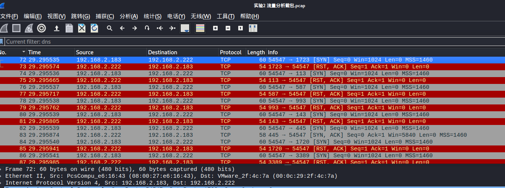

 `192.168.2.183` 在尝试寻找 `192.168.2.222` 开放的端口

打开一个 SYN 报文,  可以确定其MAC地址,  为 `PcsCompu_e6:16:43(08:00:27:e6:16:43)`.

ip是`192.168.2.183`

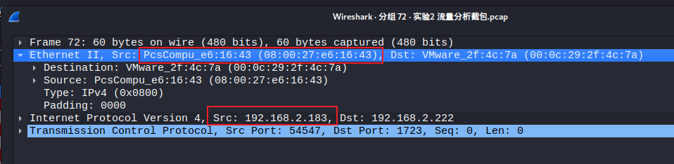

通过过滤DNS，得到主机域名是`kali.lan`

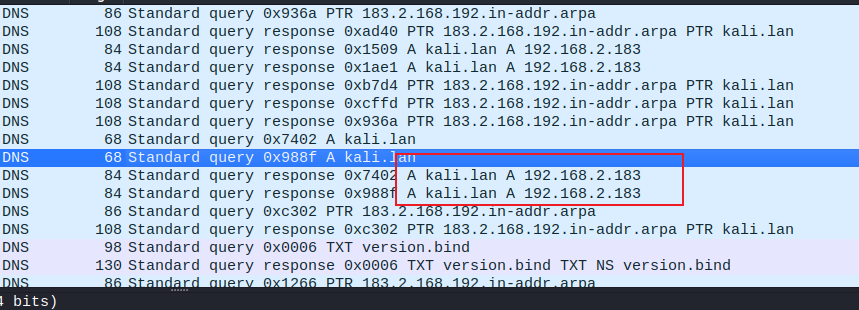

# P2 还原的攻击步骤

通过上述分析, 确定了攻击机 IP 为 `192.168.2.183`, 目标机 IP 为 `192.168.2.222`, 接下来使用 Wireshark 的包过滤功能, 仅查看这两个 IP 之间的报文, 过滤条件为:

`(ip.src==192.168.2.183 and ip.dst==192.168.2.222) or (ip.src==192.168.2.222 and ip.dst==192.168.2.183)`

通过使用如下过滤条件查找源 IP 为攻击机且 TCP 的 RST 置1, ACK 置0的截包, 可以得到攻击机扫描到目标机开放了 `445`, `139`, `111`, `5900`, `80`, 等等端口.

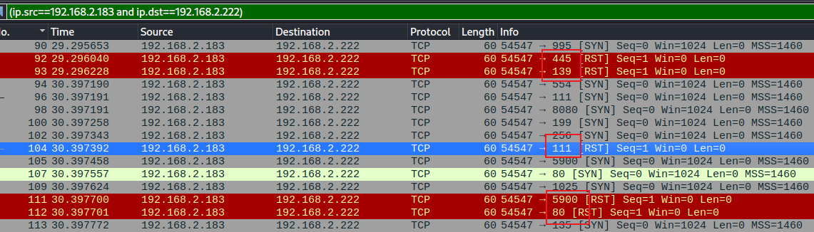

在端口扫描之后, 可以看到第2268个包攻击机又向目标机的 21 号端口建立了 TCP连接.

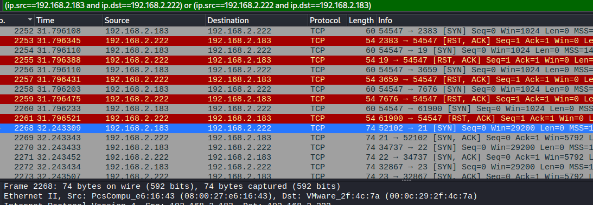

通过追踪该 TCP 流可以看到, 这里实际上是与目标机建立了 FTP 连接, 并获知了目标机 vsFTPd 的版本为 2.3.4.

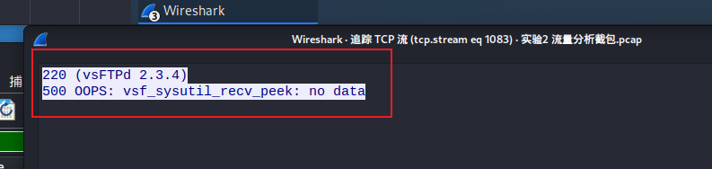

接下来, 类似的, 攻击机通过目标机的 22、23、25、80 等多个端口建立了相应的SSH、TELNET、SMTP、DNS、HTTP等连接， 并紧接着就四次挥手释放了TCP连接，分析该步骤主要是根据扫描到的目标机开放端口获取这些端口在目标机上对应程序的相关信息.
接下来, 在 No.2440 到 No.3212 附近数据包, 可以看到攻击机尝试与目标机建立远程登录Rlogin连接, 并试图发送数据. 但根据大部分情况下目标机未向攻击机进行回复, 或者回复"rlogind: Permission denied"或"\001", 猜测攻击机并没有成功进行远程访问.

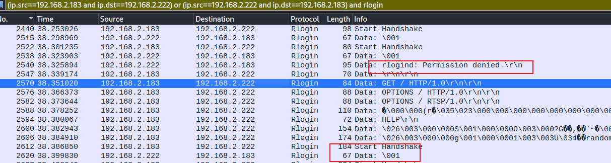

在 No.3210 到 No.3335 附近数据包, 可以看到攻击机访问了目标机Web服务器的根路径几次, 并尝试了 HTTP1.0, HTTP1.1 两个版本.

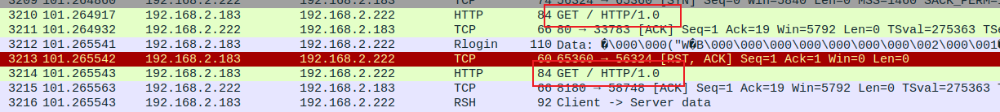

在 No.4172 到 No.4177 附近数据包, 可以看到攻击机尝试与目标机建立 FTP 连接. **而这里有很值得注意的地方, 通过由于 vsFTPd 的版本是 2.3.4, 且此处登录的用户名结尾为 `:)`, 因此此处攻击机很可能使用了 vsFTPd2.3.4 的笑脸漏洞**.

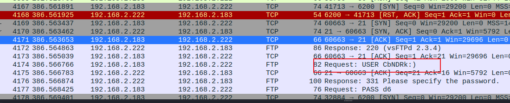

注意到在 FTP 连接之后, 即 No.4178 到 No.6678 附近, 有一大部分 TCP 报文, 对4718的 TCP 数据包进行追踪流, 可以看到, 这里应该是攻击机攻击成功并得到了一个目标机的 shell. 在该 shell 中, 攻击机做了如下操作:

- 使用了 id 查看了当前 shell 的权限为 root 权限
- 使用 nohup 将标准输出和错误输出都重定向到了 /dev/null 文件中, 相当于将输出信息进行丢弃, 猜测是防止目标机用户发现.
- 使用 uname -a 命令查看了目标机的主机信息
- 使用 whoami 得到了当前用户为 root 用户
- 使用 adduser 添加了个新用户 newuser
- 使用 tar 打包了 /etc/passwd 和 /etc/shadow 两个系统文件到 user.tgz 中, 并将其权限设置为 644, 即所有人是可写的.
- 使用 vi 在 /home/newuser/ 目录下创建了新文件 hello.sh. 根据内容猜测, 该文件没有保存, 也就是说并没有实际创建.
- 使用 `exit` 退出了该 shell 

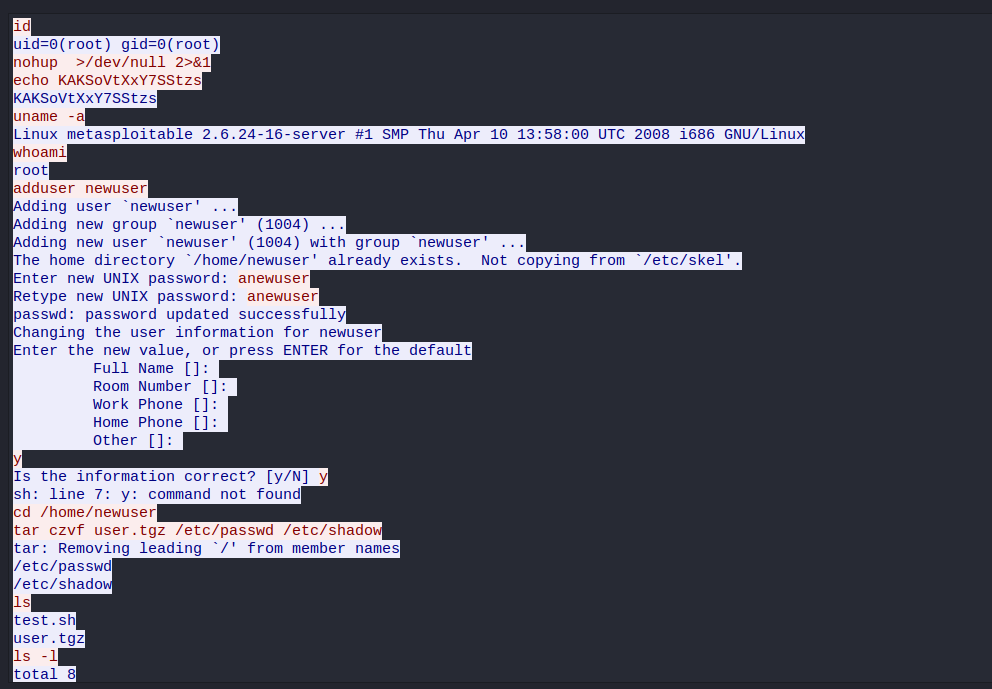

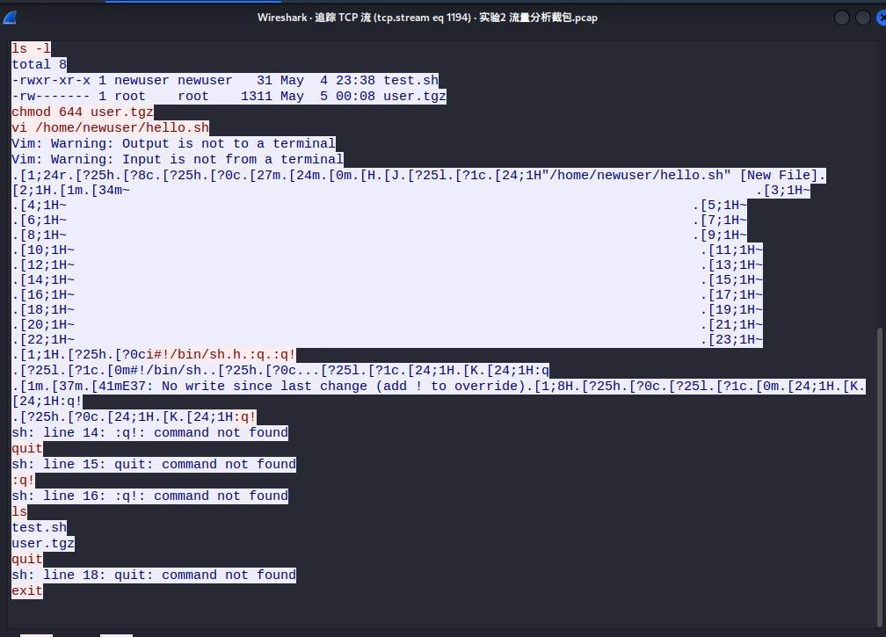

另一方面, 从 No.4451 到 No.4617 部分数据包可以看到, 攻击机又与目标机建立了 FTP 连接, 而且通过上述分析可以知道, 此时攻击机已经在目标机上创建了新用户 newuser 以及打包了文件 user.tgz(根据报文序号猜测这里攻击者又打开了一个新的控制台).
通过追踪流可以看到, 此处攻击机正是使用了新建的用户 newuser 与目标机成功建立了 FTP 连接, 并使用 FTP 的 RETR 命令将打包的文件 user.tgz 下载了下来. (此处使用了两次下载, 第一次失败, 根据上述 shell 中的分析, 猜测是刚打包的 user.tgz 文件的权限不够, 修改权限后才成功下载)

追踪4451

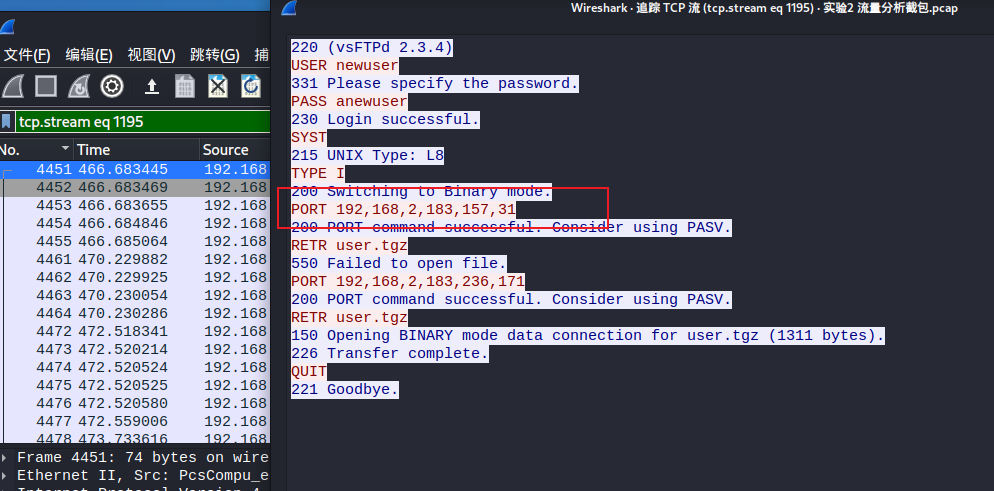

下面开始还原

基本信息: 攻击机IP: `192.168.2.183`, 目标机IP: `192.168.2.222`

攻击机进行端口扫描. 推测使用的是 nmap 等工具进行的 TCP SYN 扫描, 扫描的端口下至 `21` 上至 `61900`, 且不连续, 推测是扫描的一些常用端口或是随机进行端口扫描.

```bash
$ sudo msfconsole
msf5 > nmap -sS 192.168.2.0/24
```

攻击机进行 vsFTPd 笑脸攻击. 推测是直接使用的 `msfconsole` 提供的漏洞利用.

```bash
msf5> use exploit/unix/ftp/vsftpd_234_backdoor
msf5> set rhost 192.168.2.222
```

攻击机攻击成功后建立了一个与目标机的shell, 在该 shell 中, 攻击机先进行了查询权限, 创建新用户, 和打包密码文件的操作.

```bash
$ id
$ uname -a
$ whoami
$ adduser newuser    # password: anewuser
$ cd /home/newuser
$ tar czvf user.tgz /etc/passwd /etc/shadow
```

攻击机紧接着又打开一个新的控制台, 使用 `newuser` 与目标机建立 FTP 连接, 并下载打包的 `user.tgz` 文件.

```bash
$ ftp 192.168.2.222
Name: newuser
Password: anewuser
ftp> system    # 对应 SYST, 查看系统信息
ftp> binary    # 对应 TYPE I, 将文件传送类型设置为二进制
ftp> get user.tgz    # 下载文件
```

攻击机此处下载会失败, 然后攻击机又在 shell 窗口中修改了 `user.tgz` 的权限

```bash
chmod 644 user.tgz
```

攻击机重新尝试下载 `user.tgz` 文件, 本次下载成功, 并关闭了 FTP 连接

```bash
ftp> get user.tgz
ftp> bye    # 对应 QUIT, 退出 FTP
```

# P3 破解root口令

先说答案

`adminmsf`

下面说过程

使用 ftp-data 进行包过滤, 就可以找到唯一的 FTP 传输文件的报文, 选中后追踪 TCP 流, 得到该连接的信息. 然后, 对该数据包以"原始数据"进行保存, 即可得到下载的压缩文件 user.tgz, 将其解压即可在 shadow 文件中找到加密的 root 口令信息.

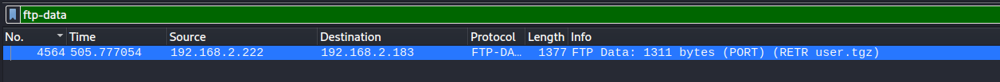

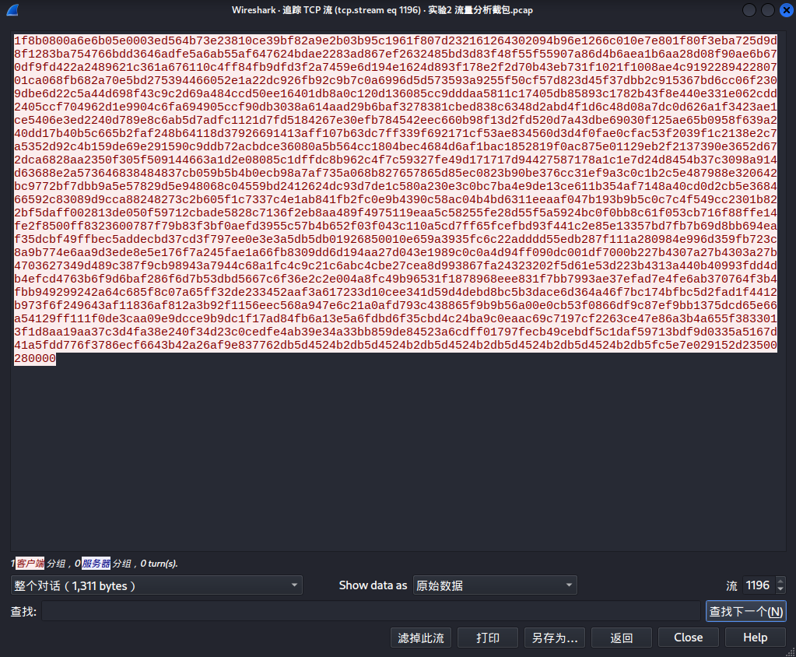

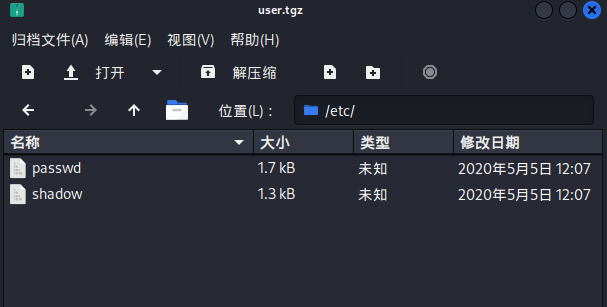

解压后得到

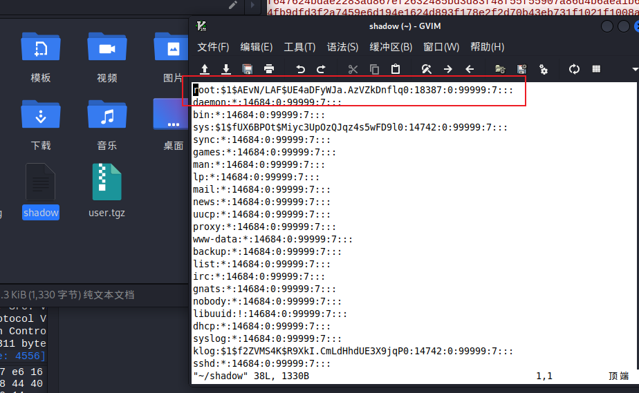

将`$1$AEvN/LAF$UE4aDFyWJa.AzVZkDnflq0`放入一个1.txt开始破解

使用 hashcat 对口令进行暴力破解 (已知 root 密码: 8位小写字母, 里面有 msf)
`hashcat -m 500 -a 3 ./1.txt ?l?l?l?l?lmsf --force`

得到结果：

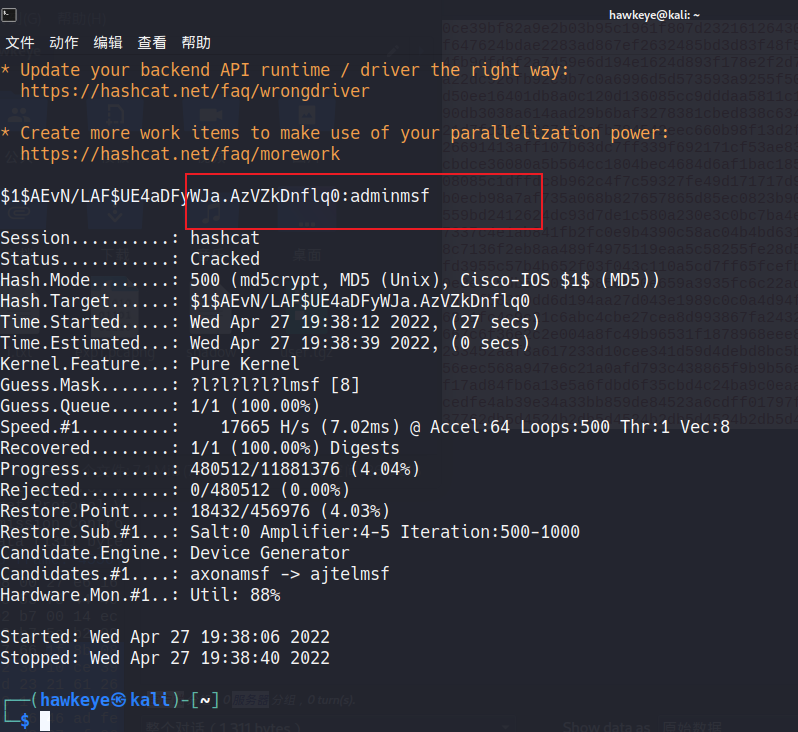