# 修改逻辑缺陷

## 修改前运行截图

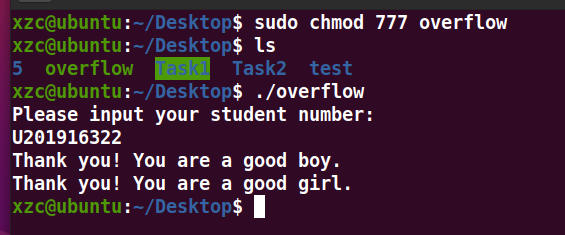

## 修改过程

修改前汇编程序代码

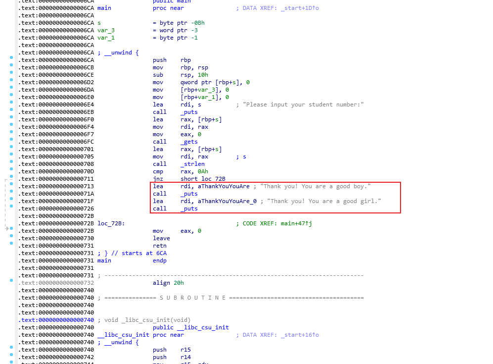

将其中一个 `call _puts` 指令替换为空指令. 修改后程序汇编代码

右键点击图中黄色区域 选择 Keypatch->Patcher 然后Assembly改为nop

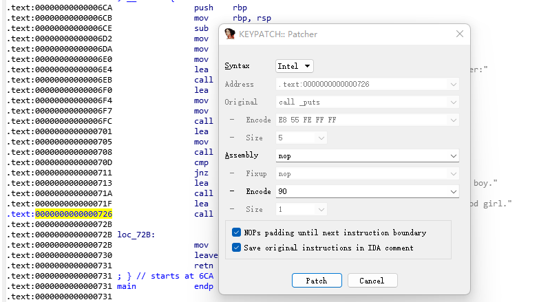

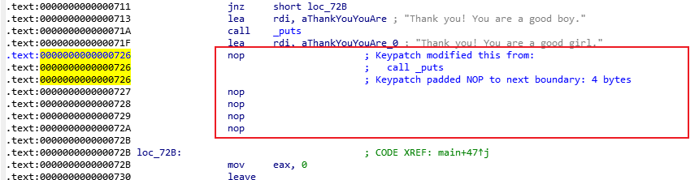

## 修改结果

最后使用 Edit->Patch program->Apply patches to input file… 将修改保存到原二进制文件中. 运行结果如图, 仅显示其中一条语句:

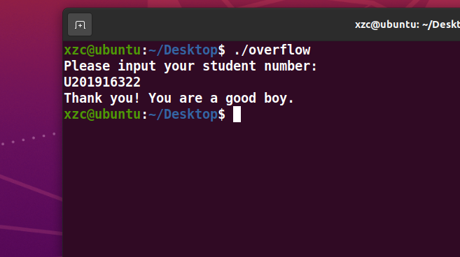

# 修改栈溢出函数

## 修改前运行截图

程序崩溃退出

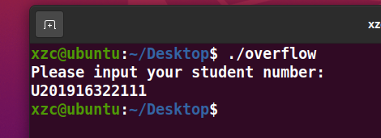

## 修改过程

修改前的汇编代码

在 `.eh_frame` 段添加调用 `read()` 的代码.  Edit->Patch Program->Change byte… 修改 `.eh_frame` 中的机器码

在880处改

`BA 0A 00 00 00 48 8D 75 F5 48 C7 C7 00 00 00 00 `

在890处前面一部分改

`0F 05 E9 6A FE FF FF`

然后按C可以看到如下图

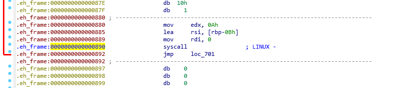

在 `main()` 函数中将 `gets()` 函数替换为调用 `read()` 函数的代码. 方法与上述相同, 修改 `main` 中的 `call _gets` 指令为 `jmp 0x880`

修改前的图

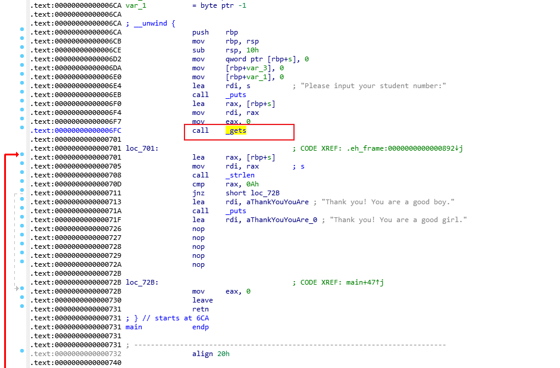

选中 右键Keypatch 如下

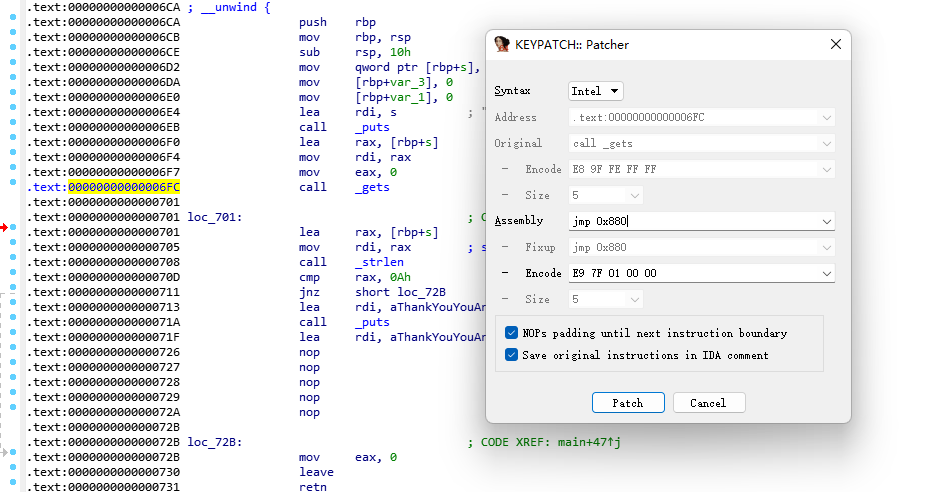

修改后如下

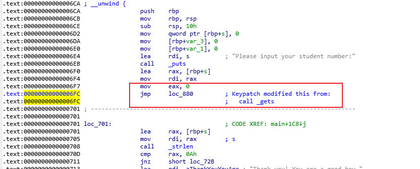

## 修改结果

最后使用 Edit->Patch program->Apply patches to input file… 将修改保存到原文件中. 最后运行程序, 如图, 同样输入超过 10 个字符, 但程序并不会崩溃, 不会引发栈溢出漏洞，如下图

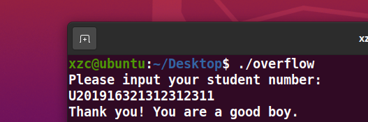