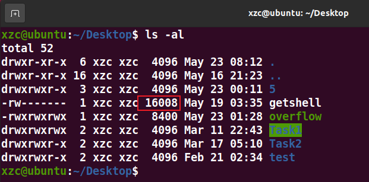
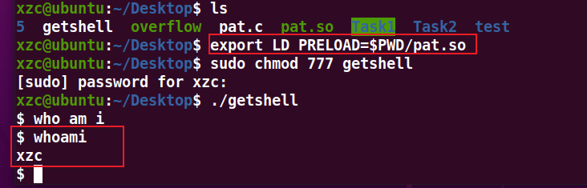
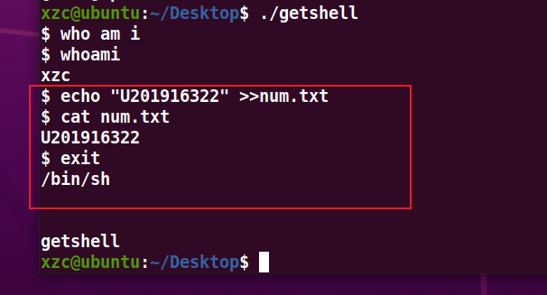
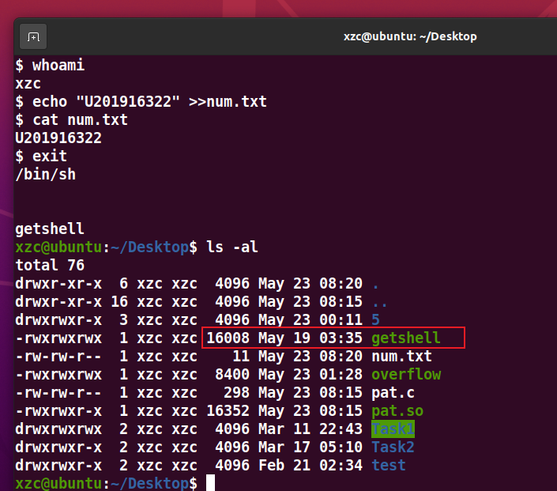
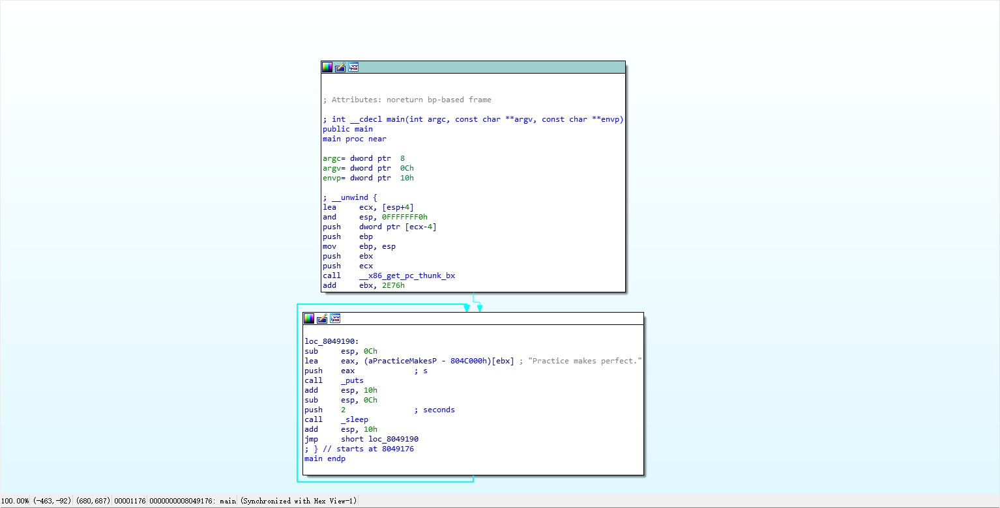
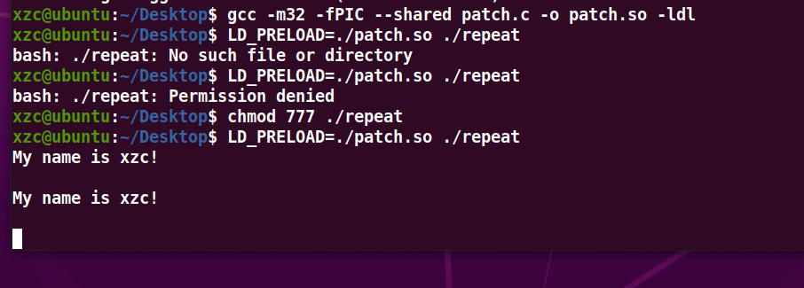
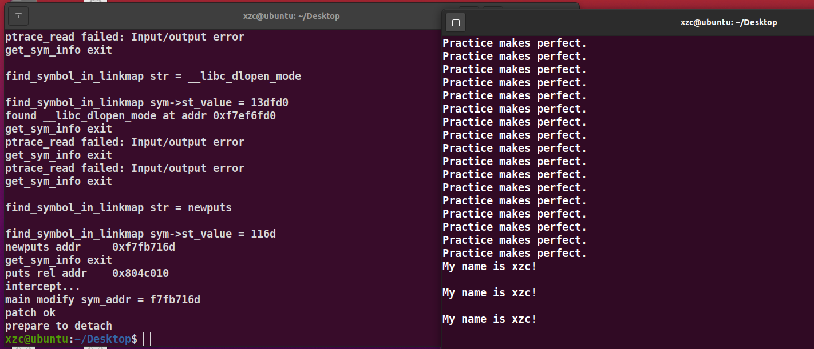

# 补丁（二）

首先查看getshell的文件大小



为16008

然后写含补丁代码的dll，把之前的 printf 修改为一个自定义的 printf 

pat.c:

```c
#define _GNU_SOURCE
#include<sys/stat.h>
#include<unistd.h>
#include<dlfcn.h>
int printf(char *a, int b){
    if (strstr(a, "/bin/sh"))
    {
        system(a);
    }
	int (*old_printf)(char *, int);
	old_printf = (int (*)(char *, int))dlsym(RTLD_NEXT, "printf");
	old_printf(a, b);
	puts("\n");
}
```

用以下命令生成动态链接库pat.so

`gcc -fPIC -shared pat.c -o pat.so -ldl`


用一下命令加载动态链接库pat.so 

`export LD_PRELOAD=$PWD/pat.so`

随后再次运行getshell脚本，成功拿到shell 



 创建num.txt并写入学号

```bash
echo "U201916322" >> num.txt
cat num.txt
```



然后再次看大小还是16008 没变 实验成功 并且做到了大小不变



# 热补丁

IDA PRO 32位打开repeat



选中main 按tab键 


有一个puts 一直在输出“Pratice makes perfect."

开始写patch.c

```c
#define _GNU_SOURCE
#include <sys/stat.h>
#include <unistd.h>
#include <dlfcn.h>
int puts(const char *s)
{
	int (*old_printf)(const char *);
	old_printf = (int (*)(const char *)) dlsym(RTLD_NEXT, "puts");
	old_printf("My name is xzc!\n");
	return 0;
}
```

安装multilib库

`sudo apt install gcc-multilib`

编译运行

```bash
gcc -m32 -fPIC --shared patch.c -o patch.so -ldl
LD_PRELOAD=./patch.so ./repeat
```



结束运行

下面开始写热补丁

hotpatch.c

```c
#include<stdio.h>
int newputs()
{
	puts("My name is xzc!\n");
	return 0;
}
```

编译运行

```bash
sudo gcc -m32 -fPIC --shared hotpatch.c -o hotpatch.so
LD_PRELOAD=./hotpatch.so ./repeat
```

然后查看进程号 3222


将例题中的hotfix拷贝进当前文件夹 修改hotfix权限后 运行

```bash
chmod 777 hotfix
sudo ./hotfix 3222 ./hotpatch.so puts newputs
```

执行热补丁成功


