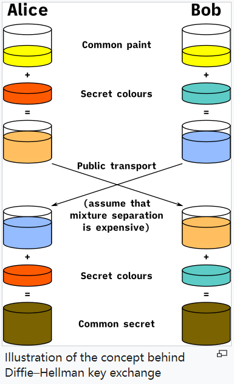

### 基于UDP的DH算法传输描述文本
在UDP的data段，前10位比特表示传输类型，而后面的所有比特表示传输值。
`send_p_g`: 表示"发送p和g"，后接`p`值和`q`值，俩值用逗号分隔。
`send_Ya`: 表示"发送Ya"，后接`Ya`值。
`send_Yb`: 表示"发送Yb"，后接`Yb`值。
客户端首先发送`p`和`q`，服务端在收到`p`和`q`之后发送`Yb`，然后客户端在收到`Yb`之后发送`Ya`， 最终客户端和服务端都得到了相同的密钥`key`。
下面是一个示意图（颜色表示传输值）。

