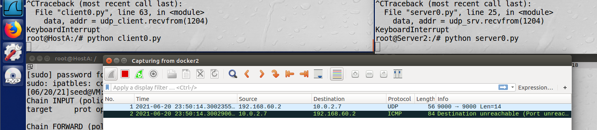
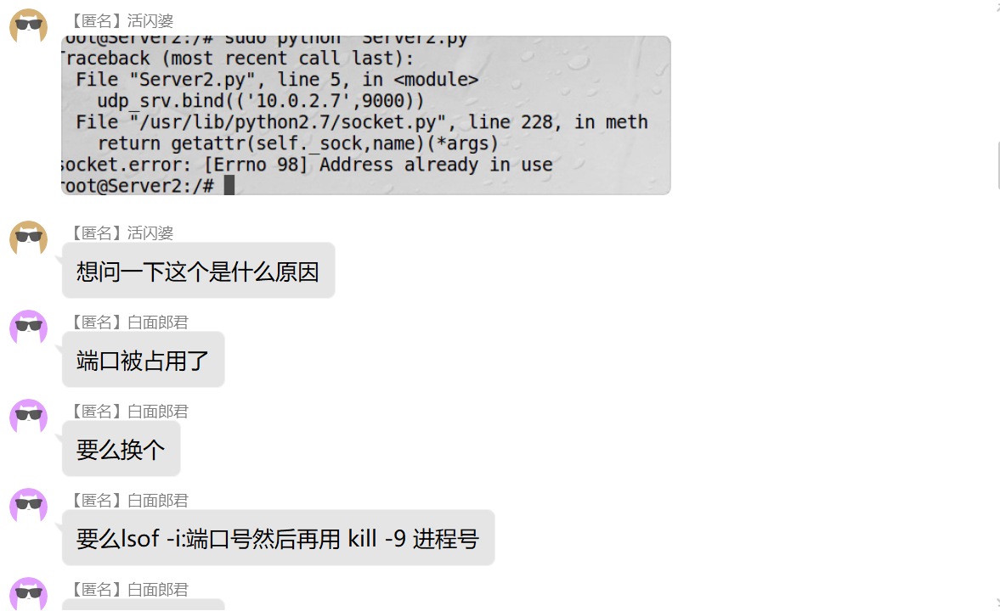

### README

References: 
1. https://blog.csdn.net/weixin_41678001/article/details/82830732
2. https://docs.python.org/3.9/library/socket.html#socket.socket.recvfrom
3. Xiao Ling's PowerPoint

Thanks for zbs's help and groupmates' help. It helps me a lot!!!
Tips: 
If you meet this:

Please check out whether your port is used just by this command:
`lsof -i:9000`
to end the use of the 9000th port.

Then I debug it successfully. 
Thanks for reading.

