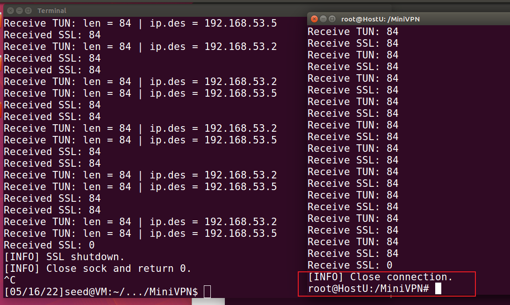

# 环境配置

```bash
在 VM 上创建 docker 网络 extranet
root@VM:/$ sudo docker network create --subnet=10.0.2.0/24 --gateway=10.0.2.8 --opt "com.docker.network.bridge.name"="docker1" extranet
在 VM 上创建 docker 网络 intranet
root@VM:/$ sudo docker network create --subnet=192.168.60.0/24 --gateway=192.168.60.1 --opt "com.docker.network.bridge.name"="docker2" intranet
在 VM 上新开一个终端，创建并运行容器 HostU
root@VM:/$ sudo docker run -it --name=HostU --hostname=HostU --net=extranet --ip=10.0.2.7 --privileged "seedubuntu" /bin/bash
在 VM 上新开一个终端，创建并运行容器 HostV
root@VM:/$ sudo docker run -it --name=HostV --hostname=HostV --net=intranet --ip=192.168.60.101 --privileged "seedubuntu" /bin/bash
在容器 HostU 和 HostV 内分别删除掉默认路由
root@HostU:/# route del default
root@HostV:/# route del default

```


# 使用 TUN/TAP 创建一个主机到主机的隧道

编译

运行vpnserver


```bash
在 VM 上的另一个终端配置 tun0 虚拟 IP 地址并激活接口
root@VM:/$ sudo ifconfig tun0 192.168.53.1/24 up
在 VM 上启用 IP 转发
root@VM:/$ sudo sysctl net.ipv4.ip_forward=1
在 VM 上清除 iptables 规则
root@VM:/$ sudo iptables -F
```


```bash
在VM 上拷贝 VPN 客户端
root@VM:/$ sudo docker cp vpnclient HostU:/vpnclient
在容器 HostU 中启动 VPN 客户端
root@HostU:/# ./vpnclient 10.0.2.8
在容器 HostU 中配置 tun0 虚拟 IP 地址并激活接口
root@HostU:/# ifconfig tun0 192.168.53.5/24 up
```


```bash
在 HostU 上创建隧道路由
root@HostU:/# route add -net 192.168.60.0/24 tun0
hostV上执行
route add -net 192.168.53.0/24 gw 192.168.60.1
```


收到回复 

user中的客户端响应


HostV输入`service openbsd-inetd start`开启telnet

telnet链接成功


# 加密隧道


后续把图里workspace文件夹改名为了MiniVPN

```BASH
HostU
sudo echo "10.0.2.8 xzc.com" >> /etc/hosts
VM
sudo ./svpnserver 然后输入123456
HostU
sudo ./svpnclient xzc.com 4433 seed dees 2

```

成功


# 认证VPN服务器

首先生成证书

把虚拟机的/usr/lib/ssl/openssl.cnf复制到cert_server目录


建文件夹demoCA

进入demoCA

```bash
mkdir certs crl newcerts
touch index.txt serial
echo 1000 > serial
```


接着回到上一级目录使用命令

`openssl req -new -x509 -keyout ca-xzc-key.pem -out ca-xzc-crt.pem -config openssl.cnf`

PEM pass phrase 是123456


然后使用命令

`openssl genrsa -des3 -out server-xzc-key.pem 1024`

`openssl req -new -key server-xzc-key.pem -out server-xzc-csr.pem -config openssl.cnf`


然后使用命令

`openssl ca -in server-xzc-csr.pem -out server-xzc-crt.pem -cert ca-xzc-crt.pem -keyfile ca-xzc-key.pem -config openssl.cnf`


创建一个ca_client目录


在VM运行server 在HostU运行client

成功


# 认证VPN客户端

在上一个任务中已经做出来了


# 支持多个客户端

再创建一个HostU2

```bash
sudo docker run -it --name=HostU2 --hostname=HostU2 --net=extranet --ip=10.0.2.6 --privileged "seedubuntu" /bin/bash

route del default
```


然后把MiniVPN复制到HostU2里

因为没修改hosts 用命令

`./svpnclient 10.0.2.8 4433 seed dees 5`

启动客户端


然后两个HOST都再开一个终端开始ping 192.168.60.101

可以看到成功了


此时HostU和HostU2情况如下图


wireshark抓包可以看到两个ip在和192.168.60.101通信


此时如果我们断开HostU2客户端的连接

可以看到服务端输出的信息


查看pipe文件夹 也是2和5 对应两个客户端


当服务器退出 也可以看到客户端显示下线 然后终止



# 测试准备

配置好环境

VM，HostU和HostU2

然后进入myVPN目录 用以下命令编译

```bash
sudo make
```

这样编译好的文件会同时在VM，HostU和HostU2中

VM中 输入

```bash
sudo ./myser
```

运行服务器

HostU中输入

```bash
./mycli ZichuanXU 4433 seed dees 2
```

运行客户端

注意HostU 要修改Hosts把ZichuanXU和IP 10.0.2.8对应

# 认证VPN服务器

## 证书主题包含个人信息


## VPN客户端提示证书过期

Ctrl+C 关闭客户端和服务器

```bash
date -s 2033/6/1
```

设置客户端时间


提示过期


# 认证VPN客户端

## 提示错误无法登录

我们如果用

用户名:seed

密码:dees1

登录 会发现提示错误无法登录


## 能正确登录

同`认证VPN服务器-证书主题包含个人信息`

## 加密隧道通信

修改wireshark配置 首选项 协议 HTTP 这里添加4433


一个HostU终端用于认证 开启另一个终端ping内网主机

wireshark监听docker1端口

## 能通信

可以ping通


## 经隧道封装

侦听docker1如下


## 隧道为TLS


# 支持多客户端

HOSTU和HOSTU2同时登录


## 各自正常登录通信

同时登录


HOSTU和HOSTU2 一起telnet 192.168.60.101

成功


## 隧道保持，通信不受影响

断开HOSTU2的telnet 然后断开HOSTU2的客户端连接


HOSTU的通信依然不受影响

## 易用性和稳定性

### VPN客户端虚拟IP获取

手动分配 获取分配的2和5 则ip是192.168.53.2和192.168.53.5


### VPN客户端虚拟IP配置

自动添加 自动配置的192.168.53.2和192.168.53.5


### VPN客户端内网路由配置

自动添加


## 正常使用时的稳定性

稳定