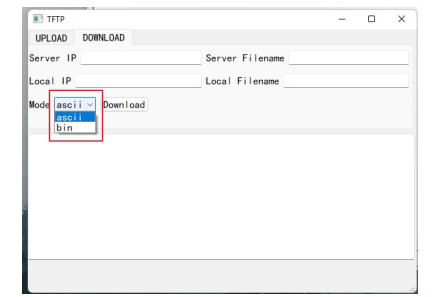
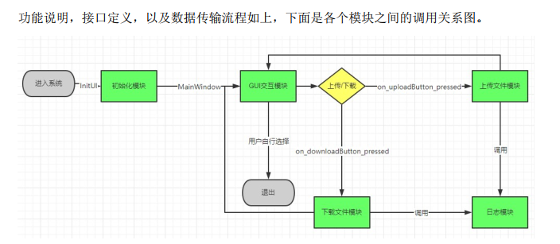

# TFTP
## 实验名称
Socket 编程实验
## 实验目的
通过 socket 程序的编写、调试，了解计算机网络可靠传输协议，熟悉基于 UDP 协议的socket 编程方法，掌握如何开发基于 TCP/UDP 的网络应用。
## 实验环境
操作系统：Windows

编程语言：C，C++

IDE：Visual Studio 2019，Qt 5.14.1，Qt Creator 4.11.1

## 实验内容
完成一个 TFTP 协议客户端程序，实现一下要求：
（1） 严格按照 TFTP 协议与标准 TFTP 服务器通信；
（2） 能够实现两种不同的传输模式 netascii 和 octet；
（3） 能够将文件上传到 TFTP 服务器；
（4） 能够从 TFTP 服务器下载指定文件；
（5） 能够向用户展现文件操作的结果：文件传输成功/传输失败；
（6） 针对传输失败的文件，能够提示失败的具体原因；
（7） 能够显示文件上传与下载的吞吐量；
（8） 能够记录日志，对于用户操作、传输成功，传输失败，超时重传等行为记录日志；
（9） 人机交互友好（图形界面/命令行界面均可）；
（10） 额外功能的实现，将视具体情况予以一定加分

## 实验要求
（1） 必须基于 Socket 编程，不能直接借用任何现成的组件、封装的库等；
（2） 提交实验设计报告和源代码；实验设计报告必须包括程序流程图，源代码必须加详细注释。
（3） 实验设计报告需提交纸质档和电子档，源代码、编译说明需提交电子档。
（4） 基于自己的实验设计报告，通过实验课的上机试验，将源代码编译成功，运行演示给实验指导教师检查。

## 使用方法

用Qt Creator打开src目录下的TFTP_GUI.pro即可，核心代码都在mainwindow.cpp中。

## 简单介绍

