# 实验步骤

双击打开`Experiment-1.exe`：

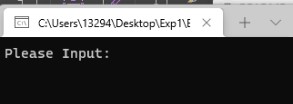

可以看到一个提示字符串：

> Please Input:

使用 IDA_Pro_7.0（**注意这里是使用IDA而不是IDA64**） 打开`Experient-1.exe`文件， 接下来就是对线索字符串的寻找。 使用快捷键 Shift+F12 快速打开 Strings window。 并在其中寻找“Please Input： ”结果如下图所示：  

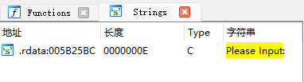

定位该字符串后，从其交叉引用中定位到目标函数`sub_4A19B0`

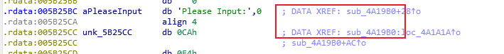

在这里双击进入该函数，然后按F5执行反汇编，发现报错，是栈平衡问题，意思是在函数结束时， 栈指针 sp 应该为 0， 但是此时出现的数值为“positive” ， 即一个正数， 说明在 push 后缺少了 pop。 接下来开始排查。  

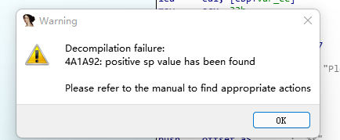

为了更加便捷的排查栈的信息， 可以直接使用 IDAPRO 自带的栈功能， 点击 Options->General->Stack pointer。  

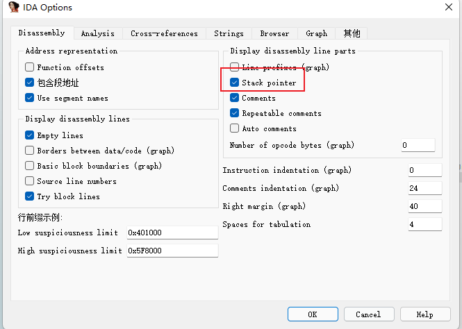

观察报错处的堆栈信息如下， 可以看到堆栈长度并未归 0。 有 8 个长度。 结果如下：  

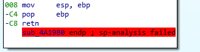

注意到在函数内会执行 push 和 pop 的操作， 其中 push是让esp+4， pop是让esp-4。 栈的长度主要由这两个指令发生变化。  顺着代码我们发现两处`push 0`，却没有对应的pop，正好可以让esp+8，所以修改这两处即可。

第一处：

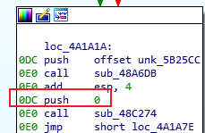

第二处：

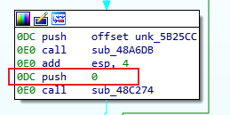

点击 Options->General->Number of opcode bytes(graph)修改为 16 即可。  

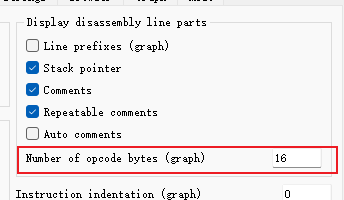

然后选择对应的地址， 点击： Edit->Patch Program->Change byte,修改为 90 90 即可。 修改完后的指令如下：  

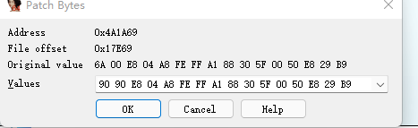

修改后如下：

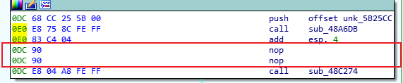

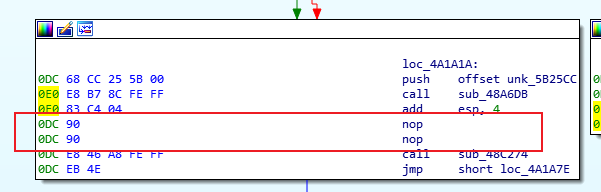

修改完之后再按F5，可以发现反汇编成功，生成代码如下：

`sub_48C0EE`中自带的参数`%s` ， 十分类似与 C 语言的 `scanf` 函数， `sub_48CD46 `又类似`printf`输出信息， 因为程序的最开始我们看到的就是 Please Input： 的字符串。  

观察变量 `v1` 的行为， 是接受字符串后对字符串进行操作并将返回值赋予给 `v1`， 观察 `v1 `的声明， 为 signed int，  可以猜测函数 `sub_48A9A6` 可能为`strlen`函数。

在 `v1` 满足长度判断的分支内对`dword_5F3088+7`再进行条件判断，比较数 65 实际上是 ascii 对应的‘A’ ，当两方不相等时，调用两函数。发现两次条件不满足时调用的两函数均为 `sub_48A6D8 `与 `sub_48C274`，且参数与顺序相同， 大概率为报错函数， 用于在输入字符串不是正确 Flag 时的提示信息输出。  

所以需要分析的函数是`sub_48D3A4`函数，它的参数是`dword_5F3088`。但是程序的输入时存储在`unk_5F3068`中，我们可以推测时将`unk_5F3068`的内容给了`dword_5F3088`，后续对`dword_5F3088`进行一些判断和操作。

双击进入`sub_48D3A4`

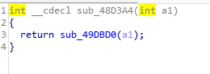

发现调用函数`sub_49DBD0`，进入该函数。

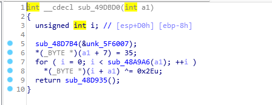

我们可以看到`a1`被修改， 具体操作为在与`a1`首地址偏移距离为7的字节处，根据上面的分析这里应该是"A"，修改为 ascii 的 35，也就是‘#’ ， 然后又把 `a1 `的所有字符和 `0x2E `异或， 最后返回 `sub_48D935`， 但是` sub_48D935` 并没有对 `a1` 的操作， 所以暂时可以忽略不计。回溯到 `dword_5F3088`， 这是线索的核心， 单击它， 右键选中 Jump to xref， 获取其他调用处的线索  

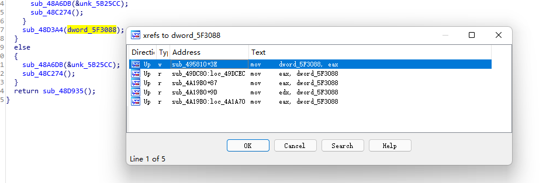

`sub_4A19B0`是我们反汇编得到的c代码本身，所以可以忽略，剩下两个`sub_495810`和`sub_49DC80`值得研究。首先进入`sub_495810`

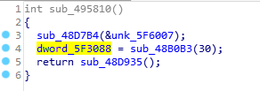

对`dword_5D3088`进行了一次赋值，深入这个赋值函数发现是不断嵌套，参数都是`a1`。

然后是`sub_49DC80`

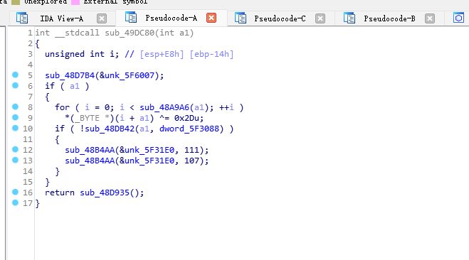

首先利用a进行了判断，后续的操作是每个字符和`0x2D`异或，然后进行一个判断，如果使得`sub_48DB42`返回值是0，则进行一个循环，其中111和107是o和k，并且`unk_5F31E0`之前被用作输出，所以大胆猜测这是满足条件后的ok，用于提示输入正确。所以最后只需要找到a1的实际值，就能通过异或运算得到最终的flag。

在`sub_49DC80`处右键点击jump to xref，可以发现是`sub_48DACA`调用了这个函数。

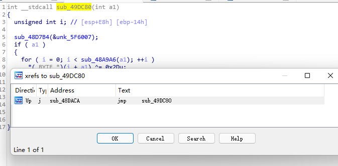

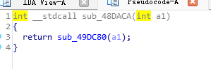

再往上找一层，可以找到`sub_49CEB0`

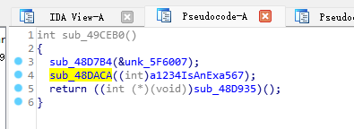

可以看到`a1234IsAnExa567`就是a1，然后双击得到对应的字符串。

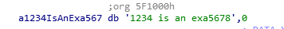

也就是字符串`1234 is an exa5678`

接下来就是对这个串进行处理，首先是和0x2E异或，然后偏移7的位置处修改为#，之后与0x2D异或，所以我们需要的操作就是把这个串和0x2E异或，再和0x2D异或，然后单独处理偏移为7的地方（第8个字符），把这个字符单独变成'A'即可。写成python代码如下

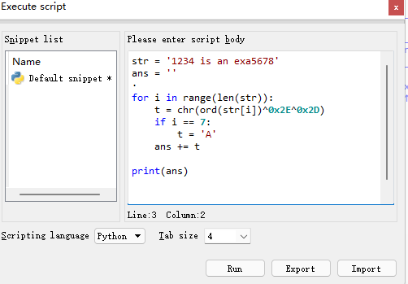

得到输出结果是：

`2107#jpAbm#f{b654;`

验证如下：

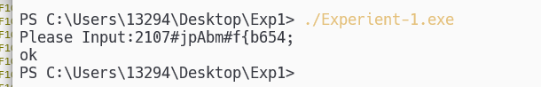