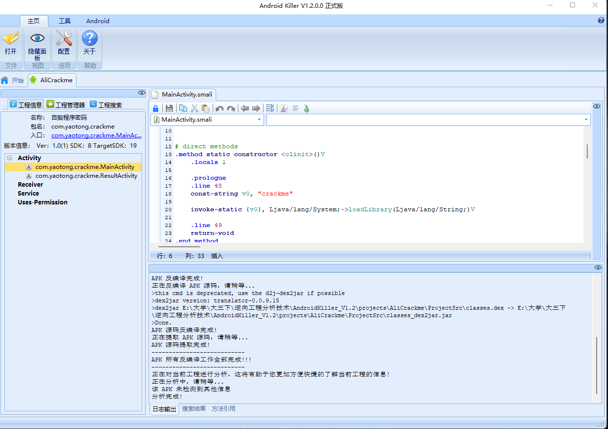
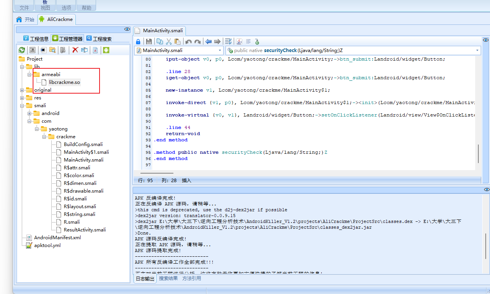
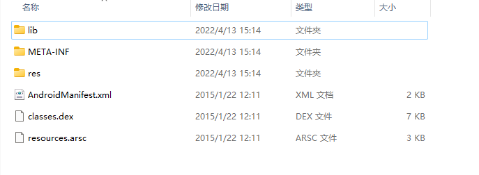
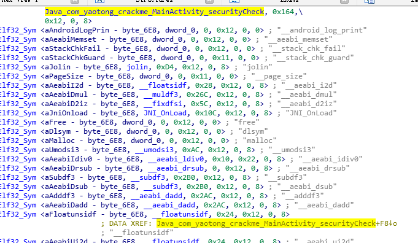
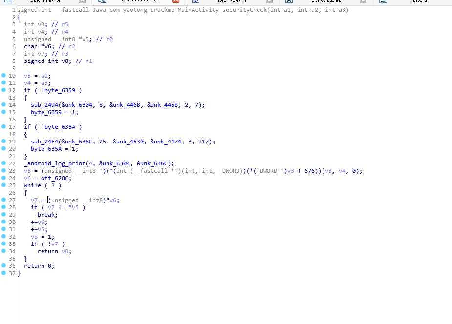
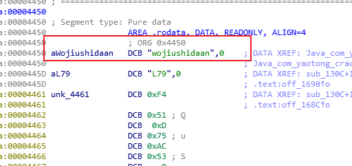

# 使用AndroidKiller打开apk

点击入口，可以直接跳转到入口的 smali 代码，分析代码，根据老师上课所讲，关键代码并不会放在其中，所以优先关注到了 securityCheck 函数，因为该文件中没有他的声明，其他函数类似于信息显示的功能，再关注到其前缀 native,所以更加确定该函数位于.so 文件中也就是外部链接库中，可以找到在工程管理器的 lib 目录下。  

# 获取.so 文件信息  

Apk 文件的本质其实就是压缩文件，可以同理与 Macos 下的 dmg 安装包文件，可以解压，为了获取.so 文件，将 apk 后缀修改为 zip 后缀，使用 Bandzip 解压即可获得以下文件内容：  

所以直接进入lib目录下找到.so文件，利用IDAPRO打开，点击Search->Text，输入 securityCheck，从而直接搜索到该函数，结果如下：  

双击进入该函数，按下 F5 直接反汇编，获得代码如下：  

根据代码进行初步分析，由易到难，可以直接看懂的函数有_android_log_print，应该用于输出程序界面的信息，剩下的函数都没什么头绪了。接下来由上至下分析两个 if 判断中并没有获取什么信息， v5 也过于复杂暂时跳过，看到一个 while（1）的无线循环在死循环中把 v6 值赋予 v7，并与 v5 进行比较后双方均向后移位。所以可以推测是进行字符串比对，若碰到了不同的就break 然后 retu1rn 0 了，如果一直相同就会 return v8 也就是 1。由于 v6 是个常量，所以合理猜测 v5 那一行及其复杂的代码就是输入，因为我实在是没什么头绪分析那一段代码。（虽然后续找到了方法，但是此处就不写了，追求鲁老师教的一句话“不求甚解”，在后续分析中给出解释）那么地址“off_628C”处的字符串应为正确答案即 flag。然后找到该地址的内容  

